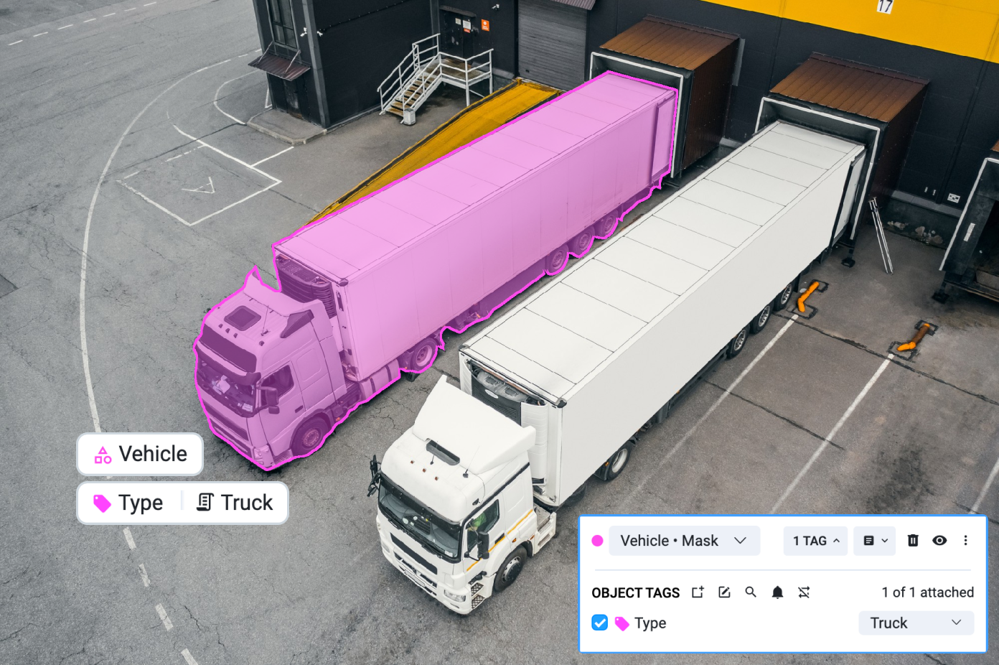
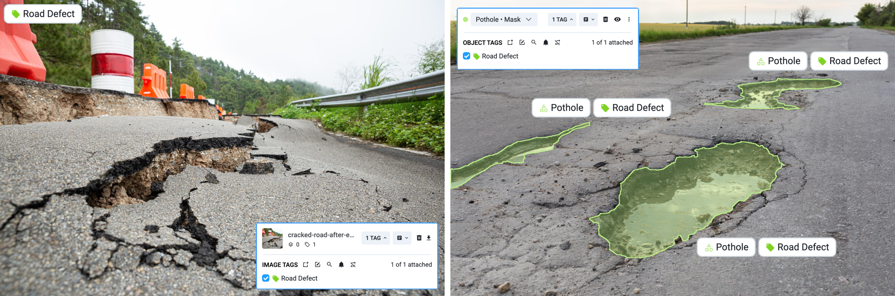
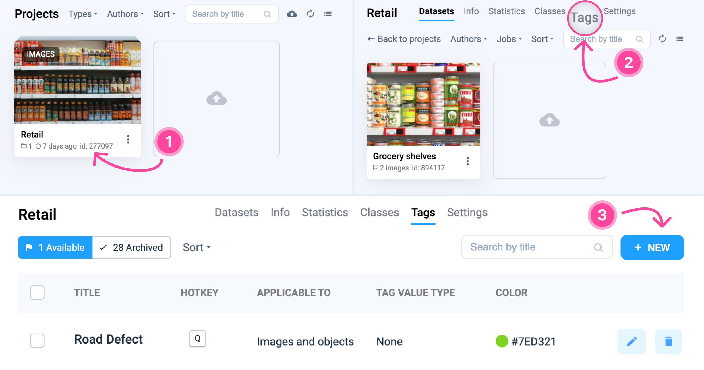
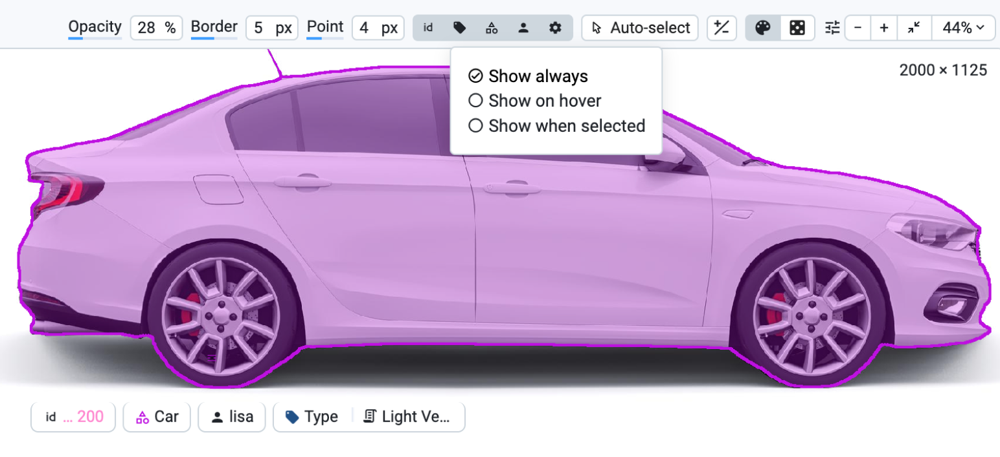

# Tags

Sometime you need more than a bunch of marked pixels on an image. You may need to associate some extra information with annotations or files. For example, you may want to label what type of defect on a road is that or point out that this image should be selected for training. To structure this, you can define a Tag.

A Tag defines a name, possible values for a tag instance and what types of things it can be attached to. Usually, you can't attach a particular Tag to a particular object multiple times.

## Key features of Tags:

1. **Data Annotation:** Tags help annotate images by associating specific information with objects or areas within an image.
2. **Classification Tool:** Tags enable grouping of images or objects based on their characteristics, facilitating classification tasks.
3. **Data Search:** Tags reflect key characteristics, allowing users to search for and navigate to relevant data easily. They help refine queries and focus searches, particularly in large and complex datasets.
4. **Neural Network Training:** Tags are used in training neural networks to understand patterns and make accurate predictions. They assist in data annotation, dataset splitting, and performance assessment.
5. **Data Organization:** Tags improve data organization and streamline workflows across various industries, such as healthcare and agriculture.

## Classification Task in Supervisely

For a practical demonstration, watch our 3-minute video tutorial on using tagging tools in the Supervisely platform, which covers:

* Creating tags of different types
* Manual and automated annotation
* Assigning tags to images and objects
* Using a ready-to-use ecosystem of apps for computer vision classification tasks



## Tags & Classes: Distinctions 

Although both tags and classes are used to identify objects, they serve distinct purposes:

* **Classes:** Represent clear categories that an object belongs to, such as "car", "truck", or "bus" for vehicles.
* **Tags:** Provide specific information about objects or images, such as context or properties. Tags are more flexible and can include details not tied to formal classifications.

## Types of Tag Values

1. **None (Tag without Value):** Used to flag specific properties. For example, a tag "train" might mark data for neural network training.
2. **Text Tag:** Contains textual descriptions or comments about the object or image.
3. **Number Tag:** Represents numeric properties, useful for regression tasks (e.g., size, weight).
4. **One of:** Indicates that the value must be one of a predefined set, such as colors (Red, Blue, Green).

<figure><figcaption></figcaption></figure>

## Image Tags vs. Object Tags

**Image Tags:** Apply to images and provide information like category, properties (resolution), geographic details, and content.

**Object Tags:** Apply to objects within images, detailing characteristics (e.g., "broken" equipment), state (e.g., "ripe" fruit), and localization (e.g., "anterior" placenta).

<figure><figcaption></figcaption></figure>

 

<figure><figcaption></figcaption></figure>

Some tags can be applied to both images and objects. Such Tags may describe both image characteristics and individual objects at the same time, providing comprehensive labeling.

<figure><figcaption></figcaption></figure>

## Hotkey

Optionally, you can assign a Hotkey for a tag to quickly select it during labeling. You can only set a single latin character (because other combinations may be unavailable).

## Filtering

Tags can be later used to filter out images or objects in the labeling interface or define a labeling jobs to annotate files that are marked with a particular tags

## How to Use Tags in Supervisely

### Creating Tags

1. **Select Project:** Choose the project you want to work with.
2. **Access Tags Tab:** Click the Tags tab at the top of the interface.
3. **Create New Tag:** Click the + New button to start creating a tag.

<figure><figcaption></figcaption></figure>

**Specify Parameters:**

* Name the tag
* Create a hotkey for quick assignment
* Select a color
* Define the application scope (Images, Objects, or both)
* Choose possible value types

<figure><figcaption></figcaption></figure>

### Applying Tags

1. **Select Image or Object:** Choose the item you want to tag.
2. **Assign Tag:** Use the drop-down list to select and apply the tag.
3. **View/Edit Tags:** You can view and edit applied tags and create new ones from the Image Labeling Toolbox.

### Multiple Tags Mode

To apply the same tag multiple times:

1. **From the Project:** Go to Settings > Tags and find Multiple Tags Mode.
2. **From the Image Labeling Toolbox:** Click on the Tag icon, hover over 🔁, and click the blue link Setting to enable Multiple Tags Mode.

### Visualization Settings

Adjust how tags are displayed:

* **Always:** Tags are visible directly on images or objects.
* **Show on Hover:** Tags display only when hovering over the annotated object.
* **Show When Selected:** Tags appear only when the object is selected.

Additional options include displaying the object class name and the author of the label.

<figure><figcaption></figcaption></figure>

To learn more about the practical uses of tags and explore advanced tools, check out our in-depth blog post: [Mastering Image Tagging](https://supervisely.com/blog/mastering-image-tagging/). This guide provides valuable insights and real-world examples to help you maximize the potential of tagging in your projects.



## Examples

* "probability" (of "Number" type) — automatically attached to the generated labels during inference
* "to\_train" (of "None" type) — can used for filtering to automatically move those images to the training set
* "bad\_one" (of "None" type) — especially with a hotkey attached, can be used to quickly mark images that needs to be re-labeled
* "color" (of "String" type) — describes some information about an object
