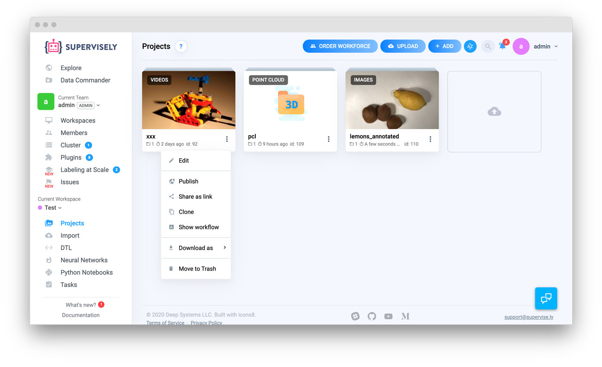

# Projects

You can think of a Project as a superfolder with data and meta information.

## Projects List

At the "Projects" page you can view all projects you have in the current [workspace](../collaboration/README.md).

Please note the ⋮ ("three dots") icon in the bottom right corner of a project. From here (we call it a "content menu") you can run many important actions: like clone, download or delete a project.  

## How to create a Project

Wait, there is no "Create" button on this page. So how do I create one?

### Import Data

Upload images or videos or other files from your computer at the "Import" page. You will be asked to provide a name for a Project — and after successful import, you will have one.

### Grab a sample for Explore

At the Explore page we have a selection of sample projects — if you don't have data on your computer, you can start with this.

### Add using API

If you want to automate the process of adding new data, it's a way to go! We have a powerful API, SDK and an infrastructure like build-in Python Notebooks that lets you start in no time. 

## Project Type

When you create a Project, you must specify what type of data would be stored in that project. At the moment we support:

- Images
- Videos
- Point Clouds

You can see a project type in the top left corner of a project card.


Some features are unsupported for Videos and Point Clouds projects.  
  


When you upload data at the Import page, project type will be automatically set by the plugin.

