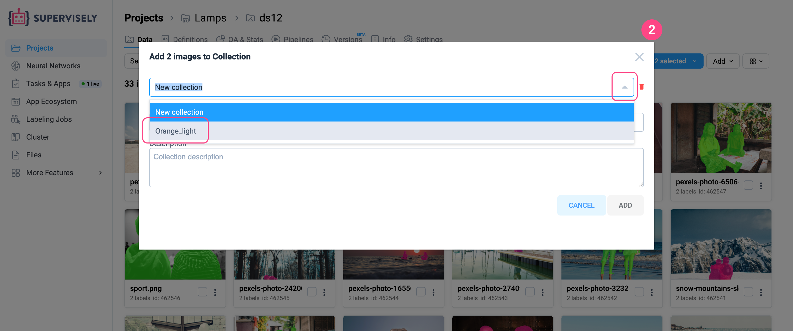
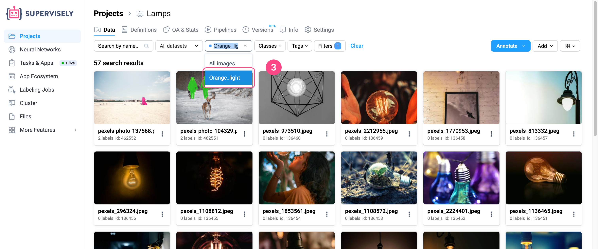
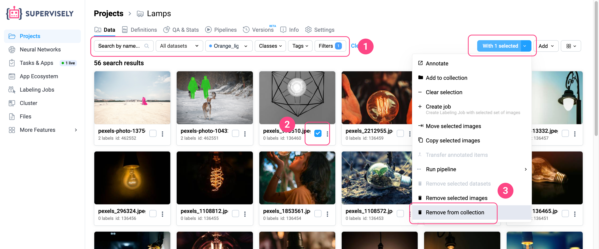

# Collections

Collections are custom groups of images, videos, or other items within a single Supervisely project. They serve as flexible selections of data, independent of dataset structure, and are often used for filtering, reviewing, or as a source for annotation queues.

## Key concepts

- A collection is always linked to a specific **project**.
- Each collection contains only **one data type** — images, videos, or point clouds — consistent with the project type.
- Collections are **independent of datasets**. A collection can include items from different datasets within the same project.
- You can **add or remove** items from a collection at any time.
- Internally, a collection is just a **list of item IDs**, along with a name and optional description.

## Step 1. Creating collection

For creating collection open any dataset and switch to a flat list view (like _**Gallery Expanded**_ or _**Table Expanded**_) at first.

<figure><figcaption></figcaption></figure>

  
1. If you want to create collection from all dataset items do not select any items, just click the _**Arrow**_ to the right of the _**Annotate**_ button and select option _**Add to collection**_.

    <figure><figcaption></figcaption></figure>

      
    If you want to create collection from several items, select the desired items **using filters** (1.1) or/and manual (1.2) selection and click the _**With (number) selected**_ button and select option _**Add to collection**_ (1.3).

    <figure><figcaption></figcaption></figure>

      
2. A modal window will appear. Give a name for new collection and press _**Add**_ button.

    <figure><figcaption></figcaption></figure>

    You can also add descriptions when creating a collection for better organization.

3. From this moment, your newly created collection will be available in the list of collections.

    <figure><figcaption></figcaption></figure>


**Note:** Creating or editing collections is available only in flat views. Dataset (hierarchical) view does not support this feature.


## 2. Adding items to collection

You can add items to an existing collection from any dataset inside one project. For example, let's go to a different dataset and:

1. Select the desired items **using filters** (1.1) or/and manual (1.2) selection. Click the _**With (number) selected**_ button and select option _**Add to collection**_ (1.3).

<figure><figcaption></figcaption></figure>

2. A modal window will appear. Select an existing collection from the list and press _**Add**_ button.

<figure><figcaption></figcaption></figure>

3. Now, while in any dataset, you can select the desired collection from the filter bar, and you’ll see that you are taken directly to the selected collection.

<figure><figcaption></figcaption></figure>

## 3. Deleting items from collection

For deleting items from collection just select the desired items using **filters** (1) or manual selection (2). Click the _**With (number) selected**_ button and select option _**Remove from collection**_ (3).

<figure><figcaption></figcaption></figure>


**Note:** The **Remove selected items** option located above means deleting the items from the dataset where they were originally located.


## Annotating collections

Collections provide a powerful way to organize and manage subsets of data across different datasets. Once you’ve grouped items into a collection, you can send them for annotation with full flexibility and control.

There are two main ways to annotate collections:

#### 1. Direct annotation inside the collection:

Open a collection, browse through items, and annotate them just like in any regular dataset. All changes will be saved directly to the original dataset the item belongs to.

<figure><figcaption></figcaption></figure>

#### 2. Labeling Queue source

Create a **Labeling Queue** based on a collection:
Use a collection as the data source when setting up a **Labeling Queue**. This allows you to assign specific items from the collection to annotation teams or individuals.

Collections maintain a dynamic link to their items. Any annotations made within a collection are instantly reflected in the dataset of origin.

For example, to create a Labeling Queue based on an existing Collection:

1. Go to **Labeling Job** from the main menu,

2. Select the **Queue** tab,

3. In the **Data to Annotate section**, choose Collection as the source and then select the specific collection you want to use.

<figure><figcaption></figcaption></figure>

You can create queues based on a collection even if the collection hasn’t been created yet.

**Example workflow:**

1. Create an empty collection inside a new or existing project.
2. Create a Labeling Queue that pulls data from this collection.
3. As you import new data or identify specific items for annotation, add them to the collection.
4. The queue will automatically reflect the collection's contents.


Note: This setup allows dynamic control over labeling pipelines, especially useful when data arrives in batches or needs manual pre-selection.


 Note: Collections do not duplicate data — they act as smart references to existing items across multiple datasets. 

## Data filtering

Collections are ideal for creating reusable subsets of data. For example, after training a model, you might group all false positives into a collection for further analysis or re-labeling.

**Benefits:**

- Simplifies repeated access to specific groups of items
- No need to store or pass item ID lists in code
- Easily maintain and update the selection over time

## API support

Collections are fully accessible through the Supervisely API. You can:

* Create or delete collections
* Add or remove items
* Retrieve collection metadata
* Use collections as filters in listing endpoints (e.g., "images.list", "videos.list", etc.)

## Limitations

- Collections are limited to a **single project**.
- Only one **data type per collection** is supported.
- There’s currently no dedicated collections page — access and management is done through flat views or Labeling Queue creation.