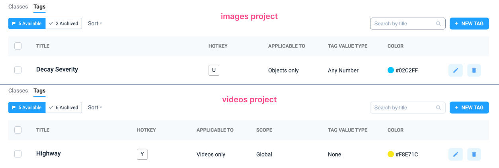

# Definitions

The **Definitions** tab consists of two main categories:

1. **Classes** - management object classes.&#x20;
2. **Tags** - management of tags for data annotations.

### Definitions tab functions

* **Adding a new classes and tags**: you can create a new class or tag by clicking the `+ NEW CLASS` or `+ NEW TAG` button and filling in the required fields.
* **Editing**: each class and tag can be edited by changing its parameters such as name, colour, scope and value type.
* **Archiving**: if a class or tag is not needed temporarily, it can be archived so that it is not displayed in the list of active elements but remains in the project. Archived classes and tags can be restored at any time.
* **Sorting**: Sort classes and tags to quickly find the elements you need.
  * **Newest (default)** — displays the most recently created items first.
  * **Oldest** — displays the oldest items first.
  * **Name (A-Z)** and **Name (Z-A)** — sorts items alphabetically in ascending or descending order.
  * **Shape (A-Z)** and **Shape (Z-A)** — **(for classes only)** sorts items by shape type in ascending or descending order.

<figure><figcaption></figcaption></figure>

 

<figure><figcaption></figcaption></figure>

## Classes & Tags: distinctions 

Although both tags and classes are used to identify objects, they serve distinct purposes:

* **Classes:** Represent clear categories that an object belongs to, such as "car", "truck", or "bus" for vehicles.
* **Tags:** Provide specific information about objects or images, such as context or properties. Tags are more flexible and can include details not tied to formal classifications. For example, the tag "Traffic Density" can have values "High" or "Low" indicating the level of traffic density, and the tag "Action" can signify the actions of an object (e.g. "Stopped" or "Moves").

An image or an object can have multiple tags assigned, while each object usually belongs to a single class, i.e. classes are used to explicitly categorize objects. Tags can be more personalized and focused on specific characteristics and attributes. Tags typically add context and descriptive attributes not necessarily related to the formal classification of an object.


Tags provide a more flexible and free way to describe, while classes provide a formalized structure for training models.


## Classes

**Classes** are object categories used to annotate images and video by creating shapes on objects. Each class represents an object type, and each annotated object in an image or video frame has exactly one class associated with it.

* **TITLE** — the name of the class. The name should be unique and clearly describe the object, for example, "Person," "Car," or "Tree."
* **SHAPE** — the annotation shape for the class. Available options include [Bounding Box](../../labeling/labeling-tools/bounding-box-rectangle-tool.md), [Mask](../../labeling/labeling-tools/mask-pen-tool.md), [Polygon](../../labeling/labeling-tools/polygon-tool.md), [Keypoints](../../labeling/labeling-tools/graph-keypoints-tool.md), [Points](../../labeling/labeling-tools/point-tool.md), [Line](../../labeling/labeling-tools/polyline-tool.md), Cuboid 2D, Alpha Mask, and Any Shape.
* **COLOR** — the color assigned to the class, displayed on the screen to visually differentiate the annotation.
* **HOTKEY** — a shortcut key assigned to the class for quick annotation during labeling.

<figure><figcaption></figcaption></figure>

### How to create a new class

1. Click on the `+ NEW CLASS` **button** to start creating a new class.
2. Set a **unique title** for the class to clearly identify it.
3. Add a **description (optional)** and assign a [**hotkey**](#user-content-fn-1)[^1] for quick selection during labeling.
4. Choose the **Shape** for the class (e.g., Bounding Box to label an object with rectangular frame).


**Note**: Some shapes are only applicable to specific labeling tools (e.g., Cuboid 2D is relevant for Point Cloud and Point Cloud Episodes).


5. Generate or choose a **color** for the class to visually differentiate it from other classes.

<figure><figcaption></figcaption></figure>

## Tags

**Tags** serve as data annotation and classification tool. These attributes, assigned to images/videos or labeled objects, make it simple to sort things and give important information about what's in an image.

* **TITLE** — the name of the tag. Like classes, tags should have unique names, for example, "Highway", "Traffic Density", "Action".
* **APPLICABLE TO** — the scope of the tag's application (e.g., video only, objects only, videos and objects).
  *   **Image Tags:** Apply to images and provide information like category, properties (resolution), geographic details, and content.

      **Object Tags:** Apply to objects within images, detailing characteristics (e.g., "broken" equipment), state (e.g., "ripe" fruit), and localization (e.g., "anterior" placenta).
  * Some tags can be applied to **both images and objects**. Such Tags may describe both image characteristics and individual objects at the same time, providing comprehensive labeling.
* **SCOPE** (**for videos project)** — the tag’s range of application:
  * **Global** — the tag applies to the entire video or object.
  * **Frame-based** — the tag applies only to specific frames in the video.
  * **Global and Frame-based** — allows you to use a tag for the entire video or object as well as for individual frames at the same time. This means that you can set a global tag for the entire video or object, denoting a permanent property, and apply it to individual frames to label temporary changes or events.
* **TAG VALUE TYPE** — the type of value associated with the tag:
  * **None (Tag without Value):** Used to flag specific properties. For example, a tag "train" might mark data for neural network training.
  * **Text Tag:** Contains textual descriptions or comments about the object or image.
  * **Number Tag:** Represents numeric properties, useful for regression tasks (e.g., size, weight).
  * **One of:** Indicates that the value must be one of a predefined set, such as colors (Red, Blue, Green).
* **COLOR** — the color displayed on the screen to make the tag easily identifiable.

<figure><figcaption></figcaption></figure>

### How to create a new tag

1. Click on the `+ NEW TAG` **button** to start creating a new tag.
2. Set a **unique title** for the tag to clearly identify it.
3. Assign a **hotkey (optional)** for quick selection during labeling.
4. Choose or generate a **color** for the tag to visually distinguish it from other tags.
5. Select **"Applicable to"** to define whether the tag will be used for:
   * Images and objects
   * Images only
   * Objects only
6. Define the **tag’s value type**:
   * **None**: a tag without a value.
   * **Text**: allows adding a text description or comments.
   * **Number**: represents numerical properties.
   * **Single choice (One of)**: select one option from a predefined set.
7. Additional **Scope** option for video projects:
   * **Global and Frame-based**: tag can be applied globally or to specific frames.
   * **Frame-based**: tag is applied only to specific frames.
   * **Global**: tag applies to the entire video or object as a whole.
8. Click **Save** to complete the creation of the new tag.

<figure><figcaption></figcaption></figure>

### Multiple tags mode

To apply the same tag multiple times:

1. **From the Project:** Go to Settings > Tags and find Multiple Tags Mode.
2. **From the Image Labeling Toolbox:** Click on the Tag icon, hover over 🔁, and click the blue link Setting to enable Multiple Tags Mode.

To learn more about the practical uses of tags and explore advanced tools, check out our in-depth blog post: [Mastering Image Tagging](https://supervisely.com/blog/mastering-image-tagging/). This guide provides valuable insights and real-world examples to help you maximize the potential of tagging in your projects.



[^1]: You can only set a single latin character (because other combinations may be unavailable).
