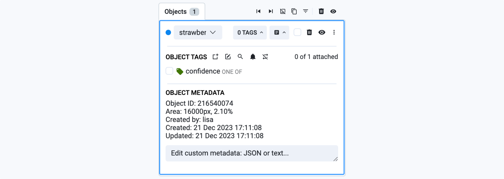
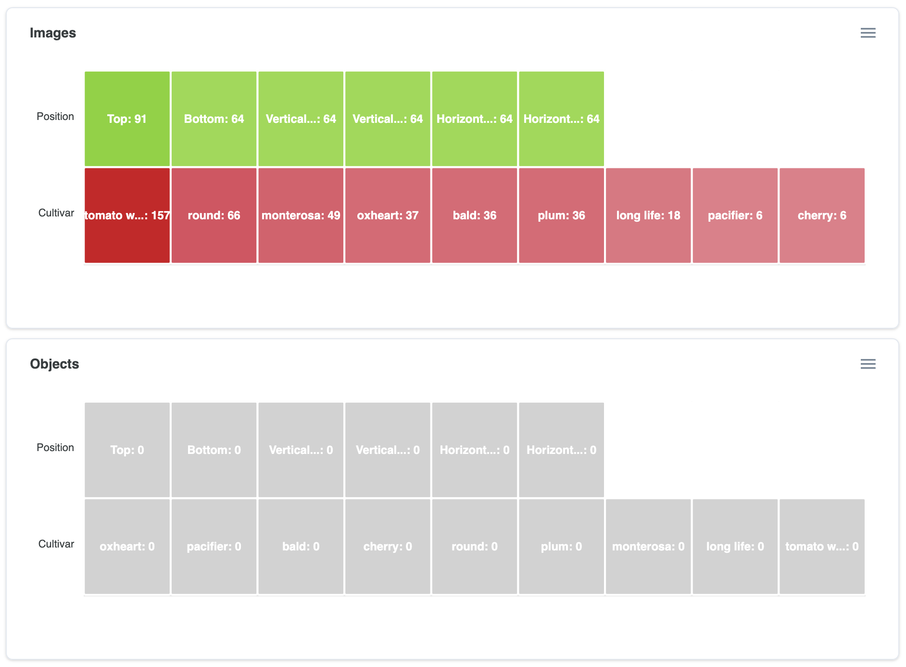

# Quality Assurance & Statistics

Supervisely is excited to introduce advanced interactive statistics designed to power dataset analysis and ensure efficient quality assurance (QA) for your custom computer vision training datasets. In this detailed guide, you will:

* Explore statistical insights and learn how to engage with them to optimize your data validation process.
* Detect hidden anomalies, errors, and annotation outliers.
* Improve data acquisition methods, draw the right conclusions on annotation distributions.
* Enhance neural network performance and much more.

<figure><figcaption></figcaption></figure>

**Discover the best interactive dataset statistics such as:**

1. [Class balance:](quality-assurance-and-statistics.md#class-balance) Find out the distribution of classes in your dataset.
2. [Co-occurrence matrix:](quality-assurance-and-statistics.md#co-occurrence-matrix) Explore the relationships between classes.
3. [Image statistics:](quality-assurance-and-statistics.md#per-image-statistics) Get detailed information about image characteristics and its objects.
4. [Object distribution: ](quality-assurance-and-statistics.md#object-distribution-heatmap)Analyze the localization of objects in images with their properties.
5. [Class sizes:](quality-assurance-and-statistics.md#object-class-sizes-and-overall-properties) Analyze the sizes of objects of all annotation classes in your dataset.
6. [Spatial heatmap:](quality-assurance-and-statistics.md#spatial-heatmap) Visualize the most frequent spatial location of objects and placement patterns in images.
7. Object statistics: Compare the characteristics of individual objects.
8. Other statistical measures: Explore additional properties and metrics specific to your dataset.

***

## Class Balance

A proper understanding of the class distribution in your dataset is essential for effective model training and evaluation. Class distribution analysis highlights the prevalence and rarity of different annotation classes, enabling you to address class imbalance directly impacts the performance and generalization capacity of neural networks.

Class imbalance occurs when some classes are over-represented while others are under-represented in the dataset. This imbalance can lead to biased model training, where the neural network performs better on common classes and poorly on rare ones. By analyzing and adjusting the class distribution, you can ensure balanced learning and robust model performance.

Class imbalance table helps you to adjust and modify data sampling algorithms during training to automatically normalize classes distribution.

* Click on any row to explore all images containing objects of the selected class.
* Use the search function to quickly filter and find specific classes.
* Sort by specific columns to identify the rarest or most frequent classes.

<figure><figcaption></figcaption></figure>

**Components**:

The class statistics table provides a comprehensive overview of the dataset. Here’s a breakdown of each column in the table:

**Class**: Lists the annotation classes present in the dataset. Datasets can contain a large number of classes, in some cases 1000+. To view all available classes, just scroll the rows.

**Images**: Shows the total number of images containing at least one object of the given class.

**Objects**: Presents the total number of objects of the corresponding class in the dataset.

**Average Count on Image**: Provides the average number of objects per image for a specific class, excluding images without such objects.

**Area on Image**: Indicates the average image area occupied by objects of the given class, excluding images without such objects.

## Co-Occurrence Matrix

The Co-Occurrence Matrix is an analytical tool that reveals how frequently pairs of classes appear together in the same images within a dataset. It provides insights into potential interactions and correlations between classes, which can be crucial for understanding the dataset's structure and improving model performance.

In image datasets, certain classes may co-occur frequently, indicating a semantic or contextual relationship. For instance, in a dataset of animal images, classes like "cat" and "dog" might appear together often due to their common domestic environment.

In case of analyzing custom neural network performance, this matrix is called **confusion matrix** - where the rows are actual classes in the ground truth data and the columns are predicted classes. The Confusion Matrix compares the actual classes (ground truth) with the predicted classes by the model. For example, a cell at the intersection of the actual class "cat" (row) and the predicted class "dog" (column) with a value of 7 indicates that the model misclassified 7 "cat" objects as "dog".

* Click on any cell in the matrix to access corresponding annotated images containing objects from both classes. This feature facilitates understanding of class interactions by allowing users to explore visual examples of identified relationships.

<figure><figcaption></figcaption></figure>

**Components**:

**Matrix Cells:** Each cell in the matrix represents the co-occurrence of two classes. The number within the cell indicates the number of images containing objects of both classes simultaneously.

**Tooltip Explanations:** Hovering over a cell reveals a tooltip explanation, making it easy for new users to interpret the matrix values and draw right conclusions.

## Per Image Statistics

Analyzing images in the dataset based on the number of annotations for each class provides valuable insights into the distribution and characteristics of object instances. By examining the annotations per image across various classes, users can identify anomalies, edge cases, and patterns that may influence model performance and dataset quality.

* Sort the table by any column to identify anomalies or edge cases, such as images with a high number of annotations of specific class or unusual object distributions.
* Quickly locate specific images or classes of interest within the dataset.
* Clicking on any row in the table allows users to preview the selected image with labels, allowing them to instantly locate an object or class of interest in the dataset.

<figure><figcaption></figcaption></figure>

**Components**:\
\
The `Images` table provides detailed information about each image contained in the dataset:

**Image** - Each image is identified by a unique name or identifier.

**Split** - Images are categorized based on the dataset split they belong to, such as training, validation, or test.

**Dimensions** - Height and width dimensions of each image are provided in pixels, aiding in understanding the scale and resolution of the dataset.

**Object Information** - Detailed statistics on objects within each image are listed. This includes for every class in a dataset the number of objects presented on the image and the total area covered by those objects.

## Object Distribution Heatmap

The Object Distribution Heatmap offers an interactive visualization of how objects are frequently presented across images for every class in the dataset. This heatmap chart exposes the images with unusual number of objects, facilitating detailed exploration and analysis of class annotations.

For example, let's consider the row for class `train` (Y axis) and the column 3 objects (X axis). The cell on the intersection has the value 2 which means that there are only **2 images with 3 objects of class `train` simultaneously** in our training dataset.

Once user hovers the mouse cursor over the cell, the helpful tooltip appears on the screen supporting users in interpretability and understanding of the selected value.

Clicking on that cell would display a list of all images in your dataset that contain only 3 objects labeled as `train`. This functionality enables users to quickly identify images with the exact number of object for a particular class.

* Clicking on a cell in the heatmap displays a list of images containing the specified number of objects for the selected class. This feature allows users to explore specific object distributions and analyze the corresponding images in detail in a thumbnail preview mode or open them in the image annotation toolbox.
* Users have the option to download the heatmap chart in various formats, including `SVG`, `PNG`, and `CSV`, for further analysis or documentation purposes.

<figure><figcaption></figcaption></figure>

**Components**:

The heatmap chart presents the following axes:

**Vertical Y Axis (Classes):** Lists the classes presented in the dataset.

**Horizontal X Axis (Number of Objects):** Represents the number of objects on the image (e.g., 0, 1, 2, 3 objects, etc...).

## Object Class Sizes and Overall Properties

The Class Sizes table provides detailed size properties of objects for each class in the dataset, offering insights into their dimensions and size variations. Users can interact with the table to examine various size metrics and view images with annotations of selected classes, facilitating comprehensive analysis and fast data understanding.

* Clicking on a row allows users to view images with all object annotations of the selected class, simplifying visual examination, analysis or correction.
* Sortable columns enable users to identify classes with the smallest or largest objects, as well as understand size differences between classes.

<figure><figcaption></figcaption></figure>

**Components**:

The table presents the following properties for each class

**Class:** Name or identifier of the class.

**Object Count:** Total number of objects of the class in dataset.

**Avg Area %:** Average object area as a percentage of total image area.

**Max Area %:** Maximum object area as a percentage of total image area.

**Min Area %:** Minimum object area as a percentage of total image area.

**Height (Min/Max/Avg):** Object height presented as number of pixels and percentage of image height. There are three different columns for minimum, maximum, and average values.

**Width (Min/Max/Avg):** Object width presented as number of pixels and percentage of image width. There are three different columns for minimum, maximum, and average values.

### Class Area Sizes in Treemap view 

The Class Area Sizes Treemap offers an alternative visualization method for understanding the properties of object sizes for all classes in the dataset. This interactive chart presents class area sizes in a 2D layout, allowing users to explore the relative proportions of object areas for each class and helps to perform fast visual analysis and inspection.

* Hovering on rectangles show the tooltip for easier understanding.
* Users can download the Treemap chart in various formats, including `SVG`, `PNG`, and `CSV`, for further analysis, sharing or documentation purposes.

<figure><figcaption></figcaption></figure>

**Components**:

The Treemap chart presents the following components:

**2D Layout:** Classes are represented as rectangles, with larger rectangles indicating classes with greater average object area sizes.

**Color Coding:** Each class rectangle is color-coded for easy identification.

**Tooltip Information:** Hovering over a class rectangle displays additional information, such as the class name and average objects area size.

## Spatial Heatmap

The heatmaps below show the average spatial location of all objects for each class. These visualizations help to understand how objects are distributed on the images highlighting most common and rare object locations. It helps to analyze the placement of objects in a dataset.

These statistics are mostly relevant for spatial datasets for such Computer Vision tasks as object detection, semantic segmentation, instance segmentation, panoptic segmentation, etc. For example,m as you can see on the image below, objects of class `airplane` are mostly located in the center of the image. Knowing that information will help data scientists to configure custom data augmentations to train the model that will be robust to `airplane` locations, and as a result will be able to predict airplanes on any position, not only in the center of the image.

* Hovering on heatmap provides detailed insights into spatial object distribution.
* Export options allows downloading of heatmaps for detailed study and presentations.

<figure><figcaption></figcaption></figure>

## Objects Properties

The Objects table contains all objects and their geometrical properties. Users can preview images with specific label by clicking on a object's row, utilize search and pagination features for navigation, and identify outliers by sorting by specific column.

* Clicking on a row opens the related image, allowing users to visually inspect annotations and object properties.
* Use the search function to quickly locate specific objects or classes of interest in a dataset.
* Sortable columns allow users to identify outliers or patterns in object characteristics, such as extreme height or width values. For example, user can find and inspect the largest and the smallest objects in the entire dataset.

<figure><figcaption></figcaption></figure>

**Components**:

The table presents the following information for each object:

**Object ID:** Unique identifier assigned to each object.

**Class:** Indicates the class (category) to which the object belongs.

**Image Name:** By selecting a row, users have access to the associated image, with a preview of the image annotations.

**Image Size:** Displays the dimensions of the image in height and width, and allows to compare the object size with respect to the size of the image.

**Height (%/px):** Indicates the object's height relative to the image height, expressed as a percentage or pixels.

**Width (%/px):** Specifies the width of the object relative to the width of the image, expressed as a percentage or pixels.

**Area:** Shows the area occupied by the object, expressed as a percentage. This metric provides insight into the extent of coverage in the image.

## Image Tags Co-Occurrence

The co-occurrence matrix for [image and object tags and attributes](https://supervisely.com/blog/mastering-image-tagging/) provides a rich analytical view of the relationships between different tags and attributes associated with both images and objects in a dataset. It provides a comprehensive overview into how different tags and attributes tend to co-occur, shedding light on potential correlations and trends in the data.

Also it help to find the images that have both tab "A" and "B". It help on analyzing datasets for image and object classification Computer Vision task. In you work in the settings of classical classification, you may find the mistakes in your datasets - co-occurence matrix has to be diagonal. For the multi-label classification it uncovers the correlation between all tag pairs. Find the example below for the [MVTec Logical Constraints Anomaly Detection dataset](https://datasetninja.com/mvtec-loco-ad).

* Each cell in the matrix represents the co-occurrence of two tags or attributes. The numeric value in the cell indicates the number of images in which the pair of tags (attributes) co-occur.
* Hovering over a cell provides a tooltip that shows the degree of co-occurrence between the tags (total number of images).
* Clicking on any cell in the matrix allows users to view corresponding images containing the selected pair of attributes.

<figure><figcaption></figcaption></figure>

## Objects Tags Co-Occurrence

The objects tags co-occurrence matrix provides a detailed analytical view of the relationships between various tags associated with objects in a dataset. It offers a comprehensive understanding of how different tags tend to co-occur, revealing potential correlations and trends in the data.

This tool is particularly useful when analyzing datasets for object classification tasks in computer vision. In classical classification settings, errors in your datasets can be identified if the co-occurrence matrix is diagonal. For multi-label classification tasks, the matrix helps uncover correlations between all pairs of tags. For example, in the MVTec Logical Constraints Anomaly Detection dataset, each cell in the matrix represents the co-occurrence of two tags. The numeric value in the cell indicates the number of images in which the pair of tags co-occur.

* Hovering over a cell provides a tooltip that shows the degree of co-occurrence between the tags (total number of images).&#x20;
* Clicking on any cell in the matrix allows users to view the corresponding images containing the selected pair of tags.

## Class To Tags Co-Occurrence

The class and tag association statistic provides a comprehensive view of the associations between different classes, their objects and tags assigned to the objects. This matrix shows the big picture on which tags are commonly associated with objects of specific classes, allowing users to understand the semantic relationships between the object classes and the descriptive attributes assigned to them.

In Computer Vision datasets for object multi-label classification tasks objects on images may have more than one tag assigned, certain tags may frequently co-occur with particular classes, indicating the descriptive attributes commonly associated with those classes. For example, in a dataset of live-stock images, the class `cow` may be associated with tags such as `age`, `size`, `health condition` and `pose type` which reflect the typical characteristics of the cows for animal health and well-being monitoring systems.

Class and tag co-occurrence matrix provides a powerful way to explore relationships between objects and the attributes assigned to them.

## Categorical Tags Distribution

In Supervisely, you can create [categorical (OneOf) key-value tags](https://supervisely.com/blog/mastering-image-tagging/#types-of-tag-values) and use them in various Computer Vision tasks, such as image retrieval and classification. These tags have the defined set of possible values. For every tag in the dataset, categorical tag distribution chart shows the number of objects and images, that contain this tag with its specific value. This chart provides a clear view of how frequently different values of the categorical tags occur in the dataset. All cells are clickable and the corresponding images with their annotations will be opened in dialog window in thumbnails preview mode.

Analyze occurrences of categorical key-value tags (OneOf) assigned to images or objects. The row for every tag includes it’s all possible values and shows the number of images or objects containing corresponding tag with this specific value.&#x20;

Note that you can always change the applicability of tags (images or objects) in the `Tags` tab.

<figure><figcaption></figcaption></figure>

## Other Statistic

Additionally, apart from the tables mentioned earlier, data scientists can easily spot some basic stats for training data, covering Datasets, Images, Image Tags, Object Tags, Objects, and Object Area. These basic statistics shows general characteristics of the data and annotations.

<figure><figcaption></figcaption></figure>

## Actions with the filtered data 

These quality assurance tools can be used as a specific advanced visual filters allowing users to quickly explore and subsample data with very specific properties. With dataset filters, statistics and quality assurance tools users can easy manipulate the data, performing different actions on images and their annotations in Supervisely Computer Vision Platform: **copy, more, delete, create labeling jobs, search similar images or assign tags and attributes**. Supervisely is designed as a full-stack solution, thus the combination of:

* [conditional dataset filters](https://supervisely.com/blog/advanced-dataset-filters/)
* [labeling toolboxes](https://supervisely.com/blog/releasing-new-image-annotation-tool/)
* [QA tools](https://supervisely.com/blog/dataset-quality-assurance-and-interactive-statistics/)
* [node-based pipelines](https://ecosystem.supervisely.com/apps/data-nodes),
* [SDK & APIs](https://developer.supervisely.com/)

streamline data management and labeling workflows, facilitate user collaboration and boost the speed of the data labeling, data review and model training loops. As a result, custom pipelines for Active Learning and Continuous Model Improvement can be organized smoothly.

## Example apps:

*   [Classes stats for images.](https://app.supervisely.com/ecosystem/apps/classes-stats-for-images?id=16) Data Exploration for Segmentation and Detection tasks is underestimated by many researchers. The accuracy of your models highly depends on how good you understand data.

    This app "Classes Stats for Images" generates report with detailed general and per image statistics for all classes in images project. It allows to see big picture as well as shed light on hidden patterns and edge cases
* [Labeling Jobs Stats.](https://app.supervisely.com/ecosystem/apps/labeling-jobs-stats?id=20) Report provides both high-level and detailed statistics for all labeling jobs in a team.
*   [Object Size Stats.](https://app.supervisely.com/ecosystem/apps/object-size-stats?id=18) Data Exploration Tools provide deep understanding of your data and are crucial for building high quality models (better you understand data, more accurate models are).

    This app generates report with detailed statistics for objects (Bitmap / Rectangle / Polygon, objects of other shapes are ignored) in images project. It allows to see big picture as well as shed light on hidden patterns and edge cases
* [Labeling Events Stats.](https://app.supervisely.com/ecosystem/apps/labeling-events-stats?id=23) Supervisely stores full activity log almost for every action. This app uses activity log to restore all labeeling actions in team (table can be huge) and performs some basic aggregations shown on the screenshot below. All tables can be sorted by any column.
* [Project 3D statistics.](https://app.supervisely.com/ecosystem/apps/project-3d-stats?id=202) Application generates report with detailed general and per pointcloud statistics for all classes in pointcloud and episodes project.
