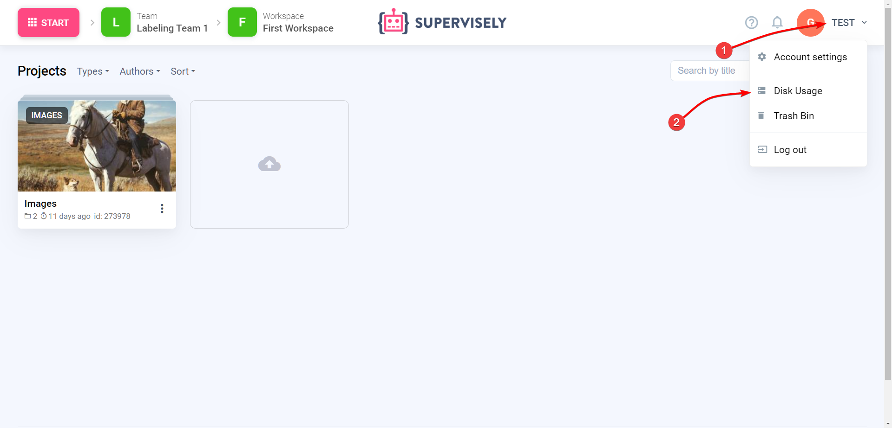
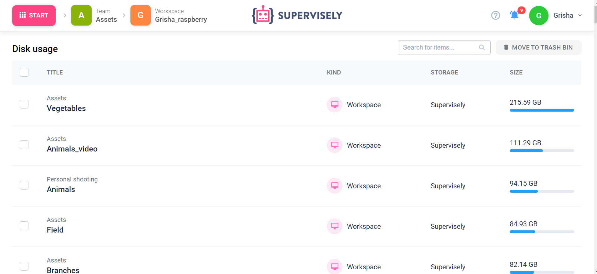
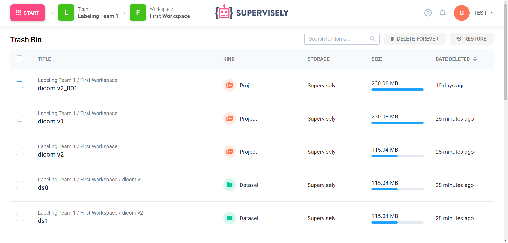
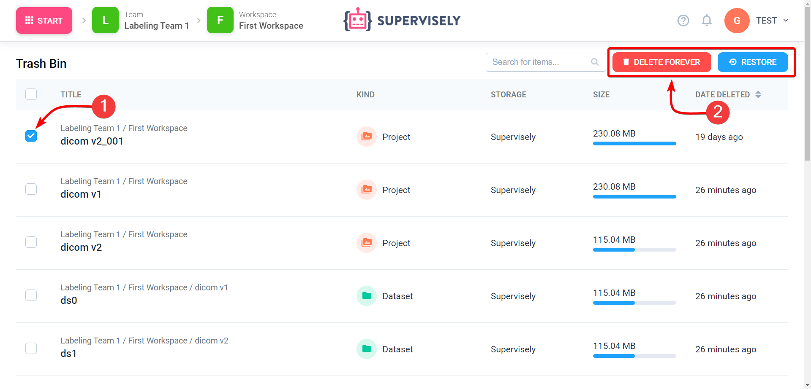

# Storage

### Disk usage

To view disk usage in current team you can visit "Disk usage" page.

Here you can see Projects, Models and Python Notebooks from all Workspaces in current Team.

### Cleanup

When you remove Projects, Models and Python Notebooks they will be moved to Trash Bin.

.png>)

All removed Projects, Models and Python Notebooks from current Team are located here.

To delete or restore an item you need to select it by clicking the check mark next to it. Then click "Delete forever" or "Restore"

