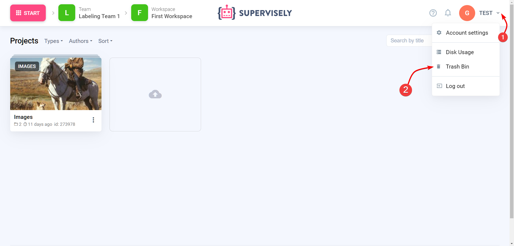

# Storage

One of the important clarifications. [Team Files](../team-files/README.md) is an exception and it needs to be cleared specifically from Team Files and the deleted files will not go to the trash bin and they cannot be recovered.

### Disk usage

To view disk usage in current team you can visit "Disk usage" page.

Here you can see Projects from all Workspaces in current Team.

### Cleanup

When you remove Projects they will be moved to Trash Bin.

All removed Projects from current Team are located here. 

To delete or restore an item you need to select it by clicking the check mark next to it. Then click "Delete forever" or "Restore"

