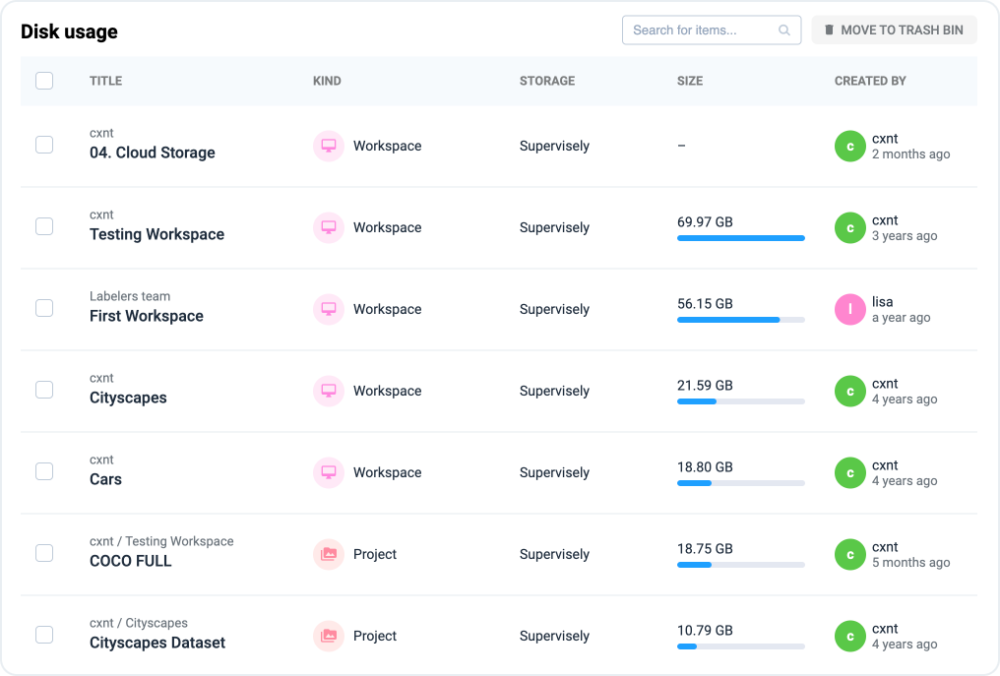

# Data usage & Cleanup

One of the important clarifications. [Team Files](../team-files/) is an exception and it needs to be cleared specifically from Team Files and the deleted files will not go to the trash bin and they cannot be recovered.

### Disk usage

To view disk usage in current team you can visit **Disk usage** page.

<figure><figcaption></figcaption></figure>

Here you can see Projects from all Workspaces in current Team.

<figure><figcaption></figcaption></figure>

### Cleanup

When you remove Projects they will be moved to Trash Bin.

<figure><figcaption></figcaption></figure>

All removed Projects from current Team are located here.

<figure><figcaption></figcaption></figure>

To delete or restore an item you need to select it by clicking the check mark next to it. Then click `Delete forever` or `Restore`

<figure><figcaption></figcaption></figure>
