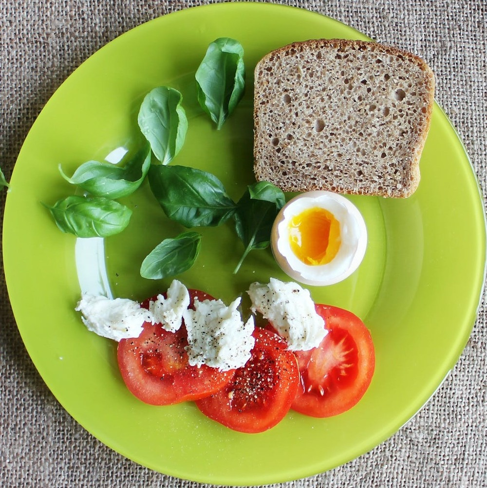

# Supervisely Annotation Format

Supervisely json-based annotation format supports such figures:

* rectangle

* line (polyline)

* polygon

* point

* bitmap

Annotations are stored separately for each image.

Let's consider the following example:




##  Json for the whole project

Each project has predefined objects classes and tags. File ```meta.json``` contains this information.

```json
{
    "tags": ["vegetable", "fruit", "other", "breakfast", "lunch", "dinner"],
    "classes": [
        {
            "title": "tomato",
            "shape": "bitmap",
            "color": "#F6FF00"
        },
        {
            "title": "egg",
            "shape": "polygon",
            "color": "#00FF06"
        },
        {
            "title": "bread",
            "shape": "rectangle",
            "color": "#FF0000"
        },
        {
            "title": "basil",
            "shape": "line",
            "color": "#FF00B1"
        },
        {
            "title": "mozzarella",
            "shape": "point",
            "color": "#0030FF"
        }
    ]
}
```

Fields description:

* "tags" - list of strings - all possible tags that can be assigned to images or objects

* "classes" - list of objects - all possible object classes. Each object has the following fields:
    - "title" - string - the unique identifier of a class

    - "shape" - string - one of ["bitmap", "polygon", "rectangle", "line", "point"]

    - "color" - string - hex color code


## Json for an image

For each image we keep a json file with annotations. Let's consider the structure of this file with the following example:

```json
{
    "description": "tasty food",
    "name": "tomatoes-eggs-dish-the-green-plate-51163",
    "size": {
        "width": 2100,
        "height": 1500
    },
    "tags": ["lunch"],
    "objects": [...]
}
```

Fields description:

* "description" (optional) - used to store the text we want to assign to the image. For example, it can be useful if you are going to build an image captioning system
* "name" - image basename (filename without extension)
* "size" - is equal to image size. Mostly, it is used to get the image size without the actual image reading to speed up some data processing steps.
    - "width" - image width in pixels
    - "height" - image height in pixels
* "tags" - list of strings that will be interpreted as image tags.
* "objects" - list of objects, which format will be described below

## Figures: the elements of "objects" list

### Rectangle

```json
{
  "description": "",
  "tags": []
  "bitmap": null,
  "classTitle": "bread",
  "points": {
    "exterior": [
      [
        1075,
        298
      ],
      [
        1517,
        681
      ]
    ],
    "interior": []
  }
}
```

Fields description:

* "description" - string - text description of an object

* "tags" - list of strings - object tags

* "bitmap" always equals to null

* "classTitle" - string - the title of a class. It is used to identify the class shape from file ```meta.json```

* "points" - object with two fields:

    - "exterior" - list of two lists with two numbers (coordinates) ```[[left, top], [right, bottom]]```

    - "interior" - always an empty list for this shape


### Line

```json
{
    "description": "",
    "tags": [],
    "bitmap": null,
    "classTitle": "basil",
    "points": {
        "exterior": [
            [
                834,
                848
            ],
            [
                941,
                791
            ]
        ],
        "interior": []
    }
}
```

Fields explanation:

* "description" (optional) - string - the text description of object

* "tags" - list of strings - object tags

* "bitmap" always equals to null

* "classTitle" - string - the title of a class. It is used to identify the class shape from file ```meta.json```

* "points" - object with two fields:

    - "exterior" - list of points (```x``` and ```y``` coordinates), e.g. ```[[x1, y1], [x2, y2], [x3, y3], [x4, y4], ...]```

    - "interior" - always an empty list for this shape


### Polygon

```json
{
    "description": "",
    "tags": ["other"],
    "bitmap": null,
    "classTitle": "egg",
    "points": {
        "exterior": [ 
            [1126, 753], [1123, 775], ..., [1136, 721], [1126, 753]
        ],
        "interior": []
    }
}
```

Fields description:

* "description" (optional) - string - the text description of an object

* "tags" - list of strings - object tags

* "bitmap" always equals to null

* "classTitle" - string - the title of a class. It is used to identify the class shape from file ```meta.json```

* "points" - object with two fields:

    - "exterior" - list of points (```x``` and ```y``` coordinates), e.g. ```[[x1, y1], [x2, y2], [x3, y3], [x4, y4], ...]```. The object contour is defined with these points

    - "interior" - list of elements that has the same structure like the "exterior" field. In other words, this is the list of polygons that define object holes.


### Point

```json
{
    "description": "",
    "tags": [],
    "bitmap": null,
    "classTitle": "mozzarella",
    "points": {
        "exterior": [
            [
                1004,
                999
            ]
        ],
        "interior": []
    }
}
```

Fields description:

* "description" (optional) - string - the text description of an object

* "tags" - list of strings - object tags

* "bitmap" always equals to null

* "classTitle" - string - the title of a class. It is used to identify the class shape from file ```meta.json```

* "points" - an object with two fields:

    - "exterior" - list of single points (```x``` and ```y``` coordinates)

    - "interior" - always an empty list for this shape


### Cuboids

You can annotated 2D cuboids on images.

```json
{
  "description": "",
  "tags": [],
  "classTitle": "Cuboid",
  "faces": [
    [
      0,
      1,
      2,
      3
    ],
    [
      0,
      4,
      5,
      1
    ],
    [
      1,
      5,
      6,
      2
    ]
  ],
  "points": [
    [
      277,
      273
    ],
    [
      840,
      273
    ],
    [
      840,
      690
    ],
    [
      277,
      690
    ],
    [
      688,
      168
    ],
    [
      1200,
      168
    ],
    [
      1200,
      522
    ]
  ]
}
```

Fields description:

* "description" (optional) - string - the text description of an object

* "tags" - list of strings - object tags

* "classTitle" - string - the title of a class. It is used to identify the class shape from file ```meta.json```

* "points" - an array of points that form the cuboid. There are always 7 points in cuboid. Each Point is presented as an array of X and Y coordinates, i.e. [277, 690] means X is 277 and Y is 690, calculationg from the top left corner of the image.

* "faces" - an array of faces that indicates how points from the `points` array are connected. There are always 3 faces in cuboid. In the example above, you can see that face number 3 that consists of points 1, 2, 5, 6 with coordinates [840, 273], [840, 690], [1200, 168], [1200, 522]. Check the image below:


### Bitmap

```json
{
    "description": "it looks very good",
    "tags": ["vegetable"],
    "bitmap": {
        "origin": [
          1177,
          931
        ],
        "data": "eJwBvwJA/YlQTkcNC ... AEDm2GYAAAJn"
    },
    "classTitle": "tomato",
    "points": {
        "exterior": [],
        "interior": []
    }
}
```

Fields description:

* "description" - string - the text description of an object

* "tags" - list of strings - object tags

* "bitmap" - an object with two fields: 
    - "origin" - points (```x``` and ```y``` coordinates) of the top left corner of a bitmap, i.e. the position of the bitmap within the image
    - "data" - string - encoded representation of a string

* "classTitle" - string - the title of a class. It is used to identify the class shape from file ```meta.json```

* "points" - an object with two fields:

    - "exterior" - always an empty list for this shape

    - "interior" - always an empty list for this shape

A few words about "bitmap" -> "data". 

You can use this two python methods to convert a base64 encoded string to numpy and vice versa.


You can use this two python methods to convert base64 encoded string to numpy and vice versa.


```python
def base64_2_mask(s):
    z = zlib.decompress(base64.b64decode(s))
    n = np.fromstring(z, np.uint8)
    mask = cv2.imdecode(n, cv2.IMREAD_UNCHANGED)[:, :, 3].astype(bool)
    return mask

def mask_2_base64(mask):
    img_pil = Image.fromarray(np.array(mask, dtype=np.uint8))
    img_pil.putpalette([0,0,0,255,255,255])
    bytes_io = io.BytesIO()
    img_pil.save(bytes_io, format='PNG', transparency=0, optimize=0)
    bytes_enc = bytes_io.getvalue()
    return base64.b64encode(zlib.compress(bytes_enc)).decode('utf-8')
```
