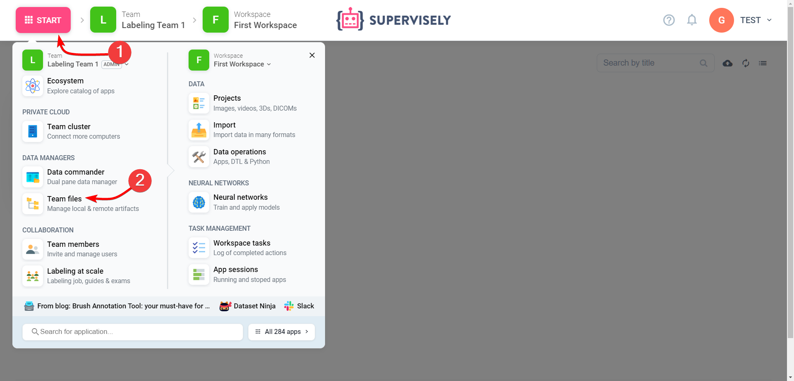
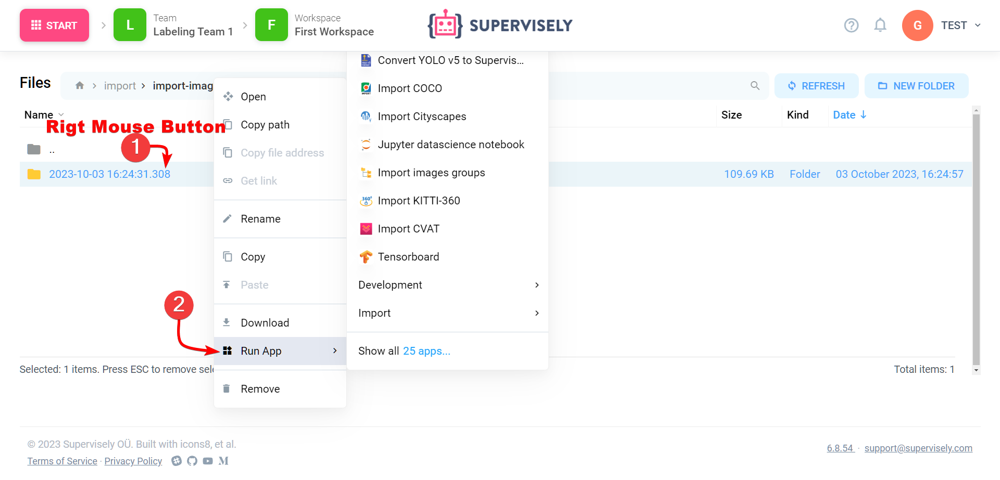

# Team Files

Within our platform, each team is provided with its dedicated data storage. This feature serves as a convenient and secure repository designed for storing and organizing all the necessary files and information your team requires. Whether it's project-related documents, datasets, data import history, or neural network training history, your team's "Team Files" section provides a centralized and easily accessible resource.

In "Team Files," your team has a dedicated space, . It's the central hub for your team's digital assets, providing the necessary infrastructure for productive teamwork.

One of the main functions of Team Files is collecting information from applications including data import history and neural network training history launched by team members

## Context menu of files in Team Files

You can right-click on a file or folder. From here (we call this the "context menu") you can perform many important actions related to files: for example: clone, save a file path to launch an application, launch an application so that they immediately download the selected file, download locally or delete files.

## Key Benefits of "Team Files"

* Efficient Data Management: "Team Files" simplifies data organization and management. Your team can neatly categorize, store, and retrieve files without the hassle of searching through scattered resources.

* Enhanced Collaboration: Collaborating within a team becomes more streamlined, as members can easily access and share project-specific resources. This is particularly valuable for real-time collaboration on tasks and projects.

* Data Security: Your team's data is kept secure within "Team Files." With robust access controls and permissions, you have peace of mind knowing that sensitive information is protected.

* Version Control: The platform includes version control features, allowing your team to track changes and revisions to documents, ensuring transparency and accountability.

* Flexible Access: Team members can access "Team Files" from anywhere with an internet connection.

