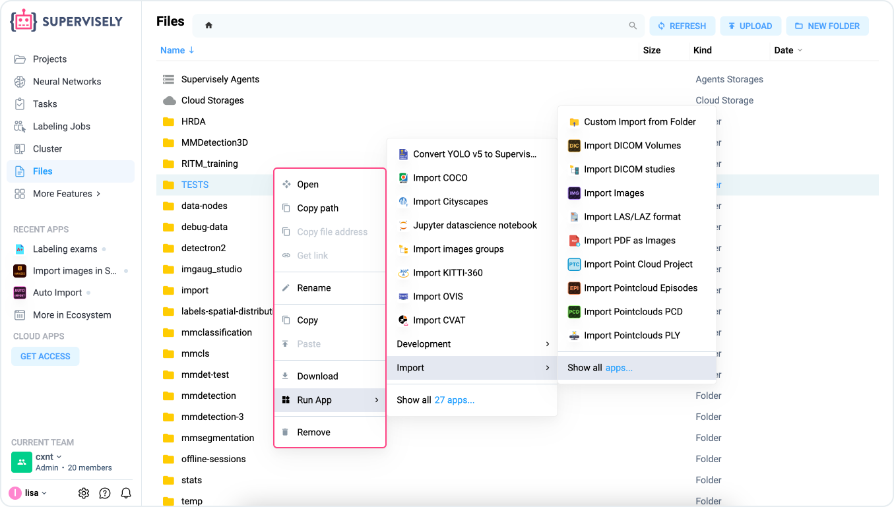

# Team Files

In our platform, each project has its own data storage area known as **Team Files**. This feature serves as a convenient and secure repository for storing and organizing all the necessary files and information your team requires. Whether it's project-related documents, datasets, data import history, or neural network training history, the Team Files section provides centralized and easy access to resources.&#x20;


The security of your team's data is paramount; Team Files keeps it secure with robust access controls and permissions, ensuring that sensitive information is protected.


It is a key tool for managing and organizing files and data within the team workspace. It also manages artifacts generated by applications, users, and processes on the platform and collects information from applications, including data import history and neural network training history initiated by team members.

<figure><figcaption>
Team Files page
</figcaption></figure>

***

### Data Storage

Team Files allows users to store various types of files - images, videos, annotations, neural network models, reports and more. This makes it convenient to work on projects and applications, as all necessary data is stored in one accessible location for the whole team.

***

### File Organization

Team Files supports creating folders for structuring data. You can organize files into logical structures (e.g., by projects or data types), which makes managing large amounts of data easier. For example, you can create a folder for a specific project where all images, annotations, and models related to that project will be stored.

#### Context menu of files in Team Files

You can right-click on a file or folder. From here (we call this the "context menu") you can perform many important actions related to files, for example: clone, save a file path to launch an application, launch an application so that they immediately download the selected file, download locally or delete files.

<figure><figcaption>
Folder context menu
</figcaption></figure>

***

### Collaboration

Team Files provides team members with access to all files, which is critical for collaboration and makes it easy to work together on tasks and projects in real time. Any team member can:

* Upload and download files.
* Organize the data structure.
* Use the files in their applications.
* Easily access and share project-specific resources.

***

### Application Artifacts

Many applications in the Supervisely Ecosystem generate artifacts, such as:

* Neural network model checkpoints after training.
* Reports on data processing results.
* Additional files used by applications for various tasks.

These artifacts are automatically stored in Team Files, making it easy to access them for analysis, reuse or loading into other projects.

***

### System Directories

Team Files contains important system directories that help you manage temporary files and offline sessions:

* **/tmp/supervisely/export:** This directory stores temporary files created during the export process. Once you have exported data, these files will remain here so that you can access them later. These files allow for a smooth export process without affecting the main data storage.
* **/offline-sessions:** This directory stores the settings (UI) for all sessions of all applications, including NN trainings and ML pipelines. It is particularly relevant for stopped applications, as it allows you to reopen a previously saved session and view their configurations. To ensure continued access to your sessions and their settings, don’t delete this directory, or you’ll lose progress.

***

### SDK Integration

Team Files is integrated with the Supervisely SDK, allowing users to automate file management tasks. You can programmatically:

* Create folders.
* Upload and download files.
* Organize and manage data using Python scripts.

***

### Version Control

The platform includes version control features, allowing your team to track changes and revisions to documents, ensuring transparency and accountability.

***

## Limits

Supervisely’s tiered file limits offer a range of options that can accommodate everything from hobby projects to enterprise-level workflows, ensuring that teams of all sizes have the resources they need to manage and store their data.

### General file types covered by limits

The file limits in each plan apply to a wide variety of files you upload or generate, including:

* **Images**: Datasets used for image classification, object detection, or segmentation tasks.
* **Videos**: Files for video annotation or tracking.
* **Annotations**: JSON, XML, or other format annotations generated or imported for labeling tasks.
* **Models and Artifacts**: Neural network checkpoints, reports, and other output files generated from training or processing tasks.

### **Community Free plan**

The Community Free plan provides a limit of **10,000 files**. This includes images, videos, annotations, and any other files that you upload or generate within the platform.&#x20;

This limit is ideal for small-scale projects, individual developers, or teams just getting started with AI and machine learning experiments.

### **Pro plan**

For teams that require more extensive file storage, the Pro plan offers a limit of **50,000 files**. If your team grows or your projects scale beyond that, you have the flexibility to extend this limit to **100,000 files**. This is particularly useful for teams working with larger datasets, such as those involved in computer vision tasks like object detection, image segmentation, or video analysis

### **Enterprise plan**

For organizations that handle extensive data, the Enterprise plan offers **unlimited storage**. This plan is designed for large enterprises, research institutions, or AI development teams that manage massive datasets on a regular basis.&#x20;

For detailed information on features and limitations, visit our [Pricing](https://supervisely.com/pricing/) page.


