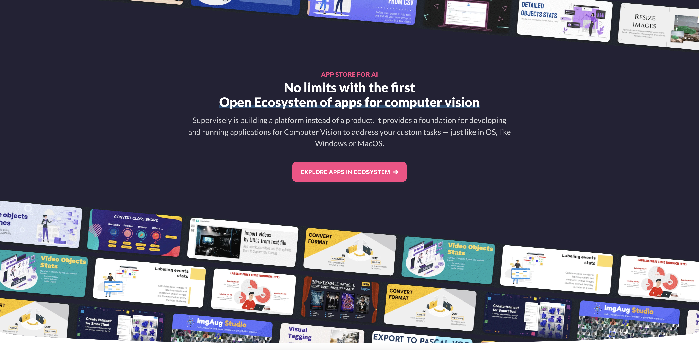

# 🚀 Ecosystem of Supervisely Apps

Before we dive into the world of annotation, dataset management and neural networks, it is important to understand how Supervisely is different from other similar solutions.

The main issue with most solutions on the market is that they build as products. It's a black box developed by some company you don't really have an impact on. As soon as your requirements go beyond basic features offered and you want to customize your experience, add something that is not in line with the software owner development plans or won't benefit other customers, you're out of luck.

That is why Supervisely is building a platform instead of a product.

You can think of Supervisely as an Operating System available via your web browser to help you solve computer vision tasks. The idea is to unify all the relevant tools within a single Ecosystem of Supervisely Apps: machine learning tools, UI widgets and services that may be needed to make the AI development process as smooth and fast as possible.

## Ecosystem

<figure><figcaption></figcaption></figure>



The simplicity of creating Supervisely Apps has already led to the development of [hundreds of applications](https://ecosystem.supervisely.com/), ready to be run within a single click in a web browser and get the job done.

Label your data, perform quality assurance, inspect every aspect of your data, collaborate easily, train and apply state-of-the-art neural networks, integrate custom models, automate routine tasks and more - like in a real AppStore, there should be an app for everything.

## Customization



Feel free to join the development of Supervisely and start building your own Supervisely Apps. You can integrate your favorite GitHub repository, machine learning model, create an import or export of a custom data format or anything in between!

We welcome you at our [Developer Portal](https://developer.supervisely.com/) where you can find all the necessary information and examples on how to develop and integrate your own Supervisely Apps.

Got any questions or suggestions? Feel free to chat with us in our [Supervisely Slack.](https://supervisely.com/slack)
