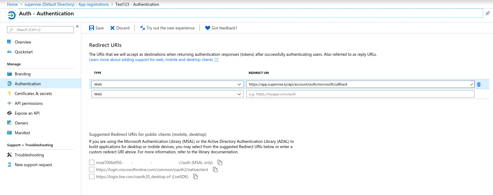

## OpenID authorization

1\. Open terminal and go to the Supervisely configs folder

```sh
$ cd $(sudo supervisely where)
```

2\. Create `openid.yml` file with external service credentials  

```yaml
<provider_name>:
  metadata_url: <metada_url>
  client_id: <client_id>
  client_secret: <client_secret>
  
  # optional
  http_proxy: <proxy url>
  https_proxy: <proxy url>
  icon: <url> / <base64> / <svg> (login button icon)
  login_label: <login_label> (login button label)
  extra_scope: <array> (list of additional scopes) # deprecated, use extra_settings.scope
  extra_settings: # <optional object if specific settings are required>
    scope: <array> (list of additional scopes)
    token_endpoint_auth_method: <string>
    acr_values: <string>
```

3\. Create `docker-compose.override.yml` file

```yaml
version: '2.4'

services:
  api:
    environment:
      DOMAIN: <https_instance_domain>
    volumes:
    - <path_to_folder>/openid.yml:/openid.yml:ro
```

>Notice: if you update the `openid.yml` file later then you need to execute `sudo supervisely restart api` instead of `up -d`

4\. Execute following command

```sh
$ sudo supervisely up -d
```

5\. Go to your authorization service and add new redirect (callback) URI `<https_instance_domain>/api/account/auth/<provider_name>/callback`
where:
  - https_instance_domain - domain, that you specified in `docker-compose.override.yml`
  - provider_name - name, that you specified in `openid.yml`

#### Authorization through Microsoft Azure Active Directory
First you need to [register app](https://docs.microsoft.com/en-us/azure/active-directory/develop/quickstart-register-app) and [configure web API access](https://docs.microsoft.com/en-us/azure/active-directory/develop/quickstart-configure-app-access-web-apis).

On [Add redirect URI(s) step](https://docs.microsoft.com/en-us/azure/active-directory/develop/quickstart-configure-app-access-web-apis#add-redirect-uris-to-your-application) add new URI `<https_instance_domain>/api/account/auth/microsoft/callback`



###### openid.yml
```yaml
microsoft:
  metadata_url: https://login.microsoftonline.com/568427e8-****-****-****-************/.well-known/openid-configuration
  client_id: 7006e956-****-****-****-************
  client_secret: j2Hy-***************************
```

###### docker-compose.override.yml
```yaml
version: '2.4'

services:
  api:
    environment:
      DOMAIN: https://app.supervisely.com
    volumes:
    - <path_to_folder>/openid.yml:/openid.yml:ro
```

## LDAP authorization

1\. Open terminal and go to the Supervisely configs folder

```sh
$ cd $(sudo supervisely where)
```

2\. Create `docker-compose.override.yml` file

```yaml
version: '2.4'

services:
  api:
    environment:
      LDAP_SERVER_URL: <server_url>
      LDAP_BIND_DN: <bind_dn>
      LDAP_DN_CREDENTIALS: <password_for_bind_dn>
      LDAP_SEARCH_FILTER: <search_filter>
      LDAP_SEARCH_BASE: <search_base>
```

3\. Execute the following command

```sh
$ sudo supervisely up -d
```

###### docker-compose.override.yml example

```yaml
version: '2.4'

services:
  api:
    environment:
      LDAP_SERVER_URL: ldap://example:389
      LDAP_BIND_DN: cn=root
      LDAP_DN_CREDENTIALS: secret
      LDAP_SEARCH_FILTER: (uid={{username}})
      LDAP_SEARCH_BASE: dc=example, dc=org
```
