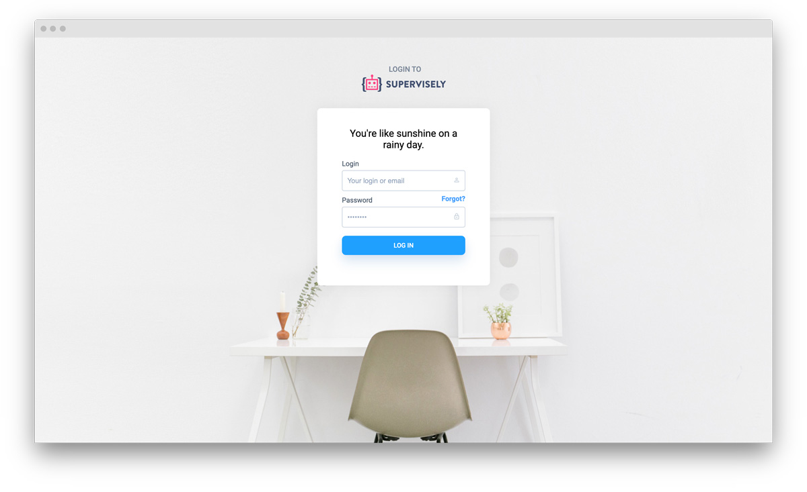

Follow these simple steps to install a new instance of Supervisely to your server.

## Pre-requirements

Before you start the installation of Supervisely to your host, please make sure your server meets the hardware & software requirements below.

### Hardware

| Component | Minimum    | Recommended | Videos                    |
|-----------|------------|-------------|---------------------------|
| CPU       | 4          | 8           | 8+                        |
| RAM       | 8Gb        | 32Gb        | 32Gb+                     |
| Disk      | 100Gb SSD  | 200Gb SSD   | 200Gb SSD + Cloud storage |

Choose the disk size according to your needs. There is also an option to attach any S3 compatible storage to distribute the data in your cloud.


Make sure you are using SSD disk for OS, docker data and `DATA_PATH/db`. Otherwise, the performance will be significantly lower



If you don't have enough free space on a system drive, but you have another one mounted, you can change the place where the data is stored by changing `DATA_PATH` in `.env` file.

Please check [this article](../data-folder/README.md) for more details.



Never set `DATA_PATH` pointing to a network share (NFS/SMB/ESB/etc), because it affects the performance significantly. Set `DATA_PATH` pointing to an actual directory on your local disk and then mount `storage` subfolder of `DATA_PATH` directory as a network share - this way "hot" subfolders like `db` or `proxy_cache` will be on a local disk and image / videos storage on a network share.


### Network

By default Supervisely exposes 2 ports on its host. Both ports are configurable.

`PROXY_PORT` is used for the HTTP server. Default to `80`


if you're using Supervisely's built-in HTTPS then port 443 will be exposed as well


`NET_SERVER_PORT` is used for WireGuard communication between the server and the Apps. Default to `51822`


Make sure that the agent can reach the WireGuard server via `{SERVER_ADDRESS}:{NET_SERVER_PORT}`. Otherwise the GUI Apps won't work


You can find the configuration file `.env` in the Supervisely workdir:
```bash
cd $(sudo supervisely where)
```

After changing the values you have to redeploy Supervisely services:
```bash
sudo supervisely up -d
```

#### GPU instance deployment

If you plan to use Smart Tool (AI powered semantic segmentation) or Neural Networks (human-in-the-loop) you will need a server with GPU. The requirements are as follows:

 - GPU Memory: 8 GB or more (GeForce GTX 1080, Tesla K80, Tesla P100)

You can install Supervisely and run GPU computations on different machines using agents (see [cluster](../../customization/agents/README.md)).

#### AWS & cloud providers

We recommend to use the following EC2-instances for deployment in AWS:

- 1 × m5.2xlarge — the platform itself
- 1 × p2.xlarge — (for Neural Network Module only)

### Software

To run Supervisely you will need Linux OS with kernel 3.10 or newer. The following configuration is recommended:

- OS: Ubuntu 18.04 or later
- NVIDIA graphics driver: 460.27.03 or later (for Neural Network module only)
- nvidia-docker2 (for Neural Network module only)

All pre-requirements can be automatically installed via `supervisely-cli` utility for Ubuntu 18.04 and later. In case of a different Linux distribution, you can install Supervisely and pre-requirements manually, but we won't be able to provide installation support.

## Installation

When all requirements above have been installed, you can deploy Supervisely. Please follow those steps one by one. Read each step carefully and complete it fully before going to the next step.

### Step 1. Get your unique key from us

Before the installation we will send you a license key and a `supervise-cli` installation command. Please run it on the machine where you want to install Supervisely.

### Step 2. Install pre-requirements

Run `sudo supervisely install-all` in your terminal. We will detect the necessary dependencies and install them. The following software may be installed:

- [Docker CE](https://docs.docker.com/engine/installation/)
- [Docker Compose](https://github.com/docker/compose/releases)
- [NVIDIA Driver](https://github.com/NVIDIA/nvidia-docker/wiki/Frequently-Asked-Questions#how-do-i-install-the-nvidia-driver) (for Training Module)
- [NVIDIA Container Runtime](https://github.com/NVIDIA/nvidia-docker#quickstart) (for Training Module)

If you don't have NVIDIA drivers, you will be asked if you need to install it. Choose `y` if you have GPU on your server. Your computer will be rebooted during the installation of the NVIDIA driver.

In case `install-all` doesn't support your OS, you can install the dependencies manually.
This script should work on most of the Linux distributions:

```bash
curl -fsSL https://get.docker.com | sh
```

### Step 3. Run the installation command

Run `sudo supervisely init "<your license key>"`. If this is your first time running this command, you will see three prompts, asking you to choose where to store the CLI configuration file (first prompt), Supervisely configuration files (second prompt) and backups (the last prompt).

```bash
[0] /opt/supervisely
[1] /supervisely
[2] /root/.supervisely
[3] /root/.supervisely
[4] /root/.config/supervisely

Couldn't find Supervisely config. Please choose the new location:
```

You can select one of the suggested options or enter your custom location. If you are not sure which option to choose, you can select the default (`/opt/supervisely`).

You can always check where your configuration and backups locations are stored using `supervisely where` command.

### Step 4. Wait for the installation to complete

Now, the CLI will automatically do the following steps, required to set your Supervisely instance:

1. Download docker-compose configuration files
2. Login to our docker registry
3. Pull and run docker containers
4. Initilize the database and download some sample data
5. Install the license key
6. Deploy the default Supervisely Agent

### Step 5. Start using Supervisely!

Now you can refresh the current page. You will see the login box:



Enter the default credentials: login and password `admin`. Now you are in. Welcome!


We strongly advice you to complete [the post-installation steps](../post-installation) after the initial setup.


## Troubleshooting

#### I open "http://localhost" but see an error

Database is still initializing. Wait a minute and try again.

#### I try to login but see "You have no permissions for this action. Please, contact administrator."

One of our internal services haven't got the license key. Refresh the page and try again.

#### My "admin / Main Node" agent is stuck in "Waiting" status

It seems the agent has tried to wait for Supervisely to start. Restart agent manually: `sudo supervisely deploy-agent`.

#### When i deploy an agent i see a "runtime" error

Nvidia container runtime has not been installed. Try to run command `docker run --runtime=nvidia --rm nvidia/cuda nvidia-smi` to see if it works.

If you don't want to run train & inference tasks, please remove checkbox "Use nvidia runtime" under advances settings in the new node modal window and run the deploy command again.
