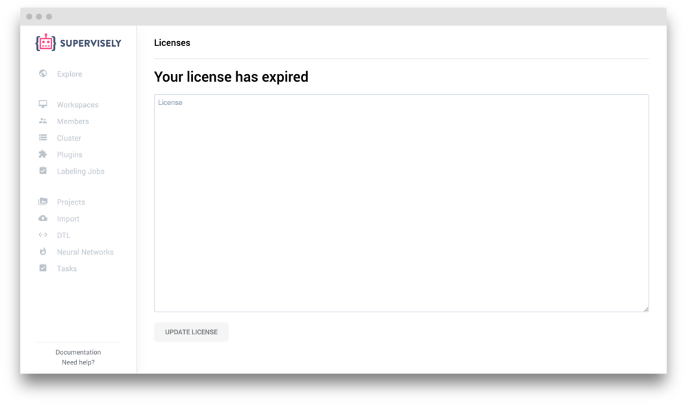

Follow these simple steps to install a new instance of Supervisely to your server.

## Pre-requirements

Before you start installation of Supervisely to your host, please make sure your server meets the hardware & software requirements below.

### Hardware

The minimum hardware requirements are as following:

 - CPU: 4 vCPUs / cores
 - Memory: 8 GB RAM
 - Hard drive: 100 GB storage or more

Choose the hard drive size according to your needs. There is also an option to attach any S3 compatible storage to distribute the data in your cloud.


If you don't have enough free space on a system drive, but you have mounted another one, you can change the place where the data is stored by changing `DATA_PATH` in `.env` file


#### GPU instance deployment

If you plan to use smart tool (AI powered semantic segmentation) or neural networks (human-in-the-loop) you will need a server with GPU. The requirements are as following:

 - GPU Memory: 8 GB or more (GeForce GTX 1080, Tesla K80, Tesla P100)

You can install Supervisely and run GPU computations on different machines using agents (see [cluster](../../customization/agents/overview/index.md)). 

#### AWS & cloud providers

We recommend to use the following EC2-instances for deployment in AWS:

- 1 × m5.2xlarge — the platform itself
- 1 × p2.xlarge — (for Training Module)

### Software

To run Supervisely you will need Linux OS with kernel 3.10 or newer. Debian-based distributions are preferable: Ubuntu 18.04, 16.04, 14.04, Debian Jessie. All other pre-requirements can be installed via `supervisely-cli`.

## Installation

When all requirements above have been installed, you can deploy Supervisely.

### Step 1. Get your unique key from us

Before the installation we will send you a `license.key`, a unique installation key and command to install `supervise-cli`. Please run it on the machine where you want to install Supervisely and make sure `sudo supervisely` gives you help information.

### Step 2. Install pre-requirements

Run `sudo supervisely install-all` in your terminal. We will detect the necessary dependencies and install them. The following software may be installed:

- [Docker CE](https://docs.docker.com/engine/installation/)
- [Docker Compose](https://github.com/docker/compose/releases)
- [CUDA 9.0 & Nvidia Driver](https://github.com/NVIDIA/nvidia-docker/wiki/Frequently-Asked-Questions#how-do-i-install-the-nvidia-driver) (for Training Module)
- [NVIDIA Container Runtime](https://github.com/NVIDIA/nvidia-docker#quickstart) (for Training Module)

If don't have NVIDIA drivers and CUDA, you will be asked if you need to install it. Choose `y` if you have GPU on your server. Your computer will be rebooted during the installation of the NVIDIA driver.

### Step 3. Download configuration

We have sent you installation key that looks like "hdhUssJskOskAA". Run `sudo supervisely auth <installation key>` to authenticate yourself. Now, run `sudo supervisely update` to download the latest version of Supervisely. We will ask you to provide a directory to store configuration in. Be default, we use `/opt/supervisely` folder. You can always check where is your configuration directory using `supervisely where` command. 

### Step 4. Edit configuration

Open file `/opt/supervisely/.env`. There are some configuration variables in it that you might want to change. Look for `<please, insert the value here>` - you need to provide values here explicitly because we don't know those values in advance.

Here are some variables that you can find here:

- `SERVER_ADDRESS` - Public or local network address of the server where you deploy Supervisely. That value will be used by *agents* to connect to the cluster. Example: *192.168.1.42* or *supervisely.intranet*. If you have a very restrictive network environment with firewall, you can use `ip addr list docker0` to get your docker0 IP address - it is some kind of `localhost` for docker. 
- `STORAGE_ACCESS_KEY` - Access key for S3 integration (optional)
- `STORAGE_SECRET_KEY` - Secret key for S3 integration (optional)

### Step 5. Login to Docker registry

Run `sudo supervisely login` to login to our private docker registry. We provide the necessary credentials in `.env` file so you don't have to input anything.


If you see "syntax error", you forgot to set one of the variables in `.env`. Please go back to the previous step to edit the required variables. 


You should see "Login Succeeded" in your terminal.

### Step 6. Run Supervisely

Now it's time to start the Supervisely instance. Run `sudo supervisely up -d`. We will pull docker images from registry and run every service defined in `docker-compose.yml` in detached mode.

This can take a while.

### Step 7. Enter license key

When the script has finished, you can open Supervisely in your web browser. Go to `http://localhost` page. You will see the following:

Enter your license key from the file `license.key` here and press "Update license".

You should see a "Success" message - your license has been updated.

### Step 8. Start using Supervisely!

Now you can refresh the current page. You will see the login box:

Enter the default credentials: login and password `admin`. Now your are in. Welcome!


We strongly advice you to complete [post-installation steps](../post-installation) after the initial setup.


## Troubleshooting

#### I open "http://localhost" but see an error

Database is still initializing. Wait a minute and try again.

#### I try to login but see "You have no permissions for this action. Please, contact administrator."

One of our internal services haven't got the license key. Refresh the page and try again.

#### My "admin / Main Node" agent is stuck in "Waiting" status

It seems the agent has tried to wait for Supervisely to start. Restart agent manually: `sudo supervisely restart agent`. 

#### When i deploy an agent i see a "runtime" error

Nvidia container runtime has not been installed. Try to run command `docker run --runtime=nvidia --rm nvidia/cuda nvidia-smi` to see if it works.

If you don't want to run train & inference tasks, please remove checkbox "Use nvidia runtime" under advances settings in the new node modal window and run the deploy command again.

#### Import fails with `FINAL_ACTION_ERROR`

Please make sure that you have drag-and-dropped a folder and not the files.

#### There are no or just a few models in Model Zoo

The models are still downloading. It can take a while, just wait some time and refresh the Models list.
