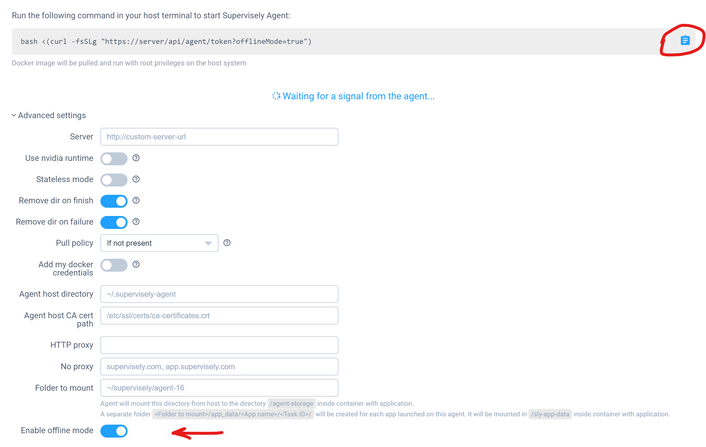

Sometimes you may want to use Supervisely without internet connection. In this case you can tweak offline mode for different Supervisely components.

## Offline mode for Supervisely CLI

To enable offline mode for Supervisely CLI you need to run the following command:

```bash
supervisely enable-offline-mode
```

If you want to disable it instead:

```bash
supervisely disable-offline-mode
```

## Offline mode for Supervisely instance

To enable offline mode for Supervisely instance you need to run the following commands:

```bash
cd $(sudo supervisely where)
sudo nano .env
```

Set `OFFLINE_MODE` to `true` and save the file.

```bash
OFFLINE_MODE=true
```

Now you need to deploy the changes:

```bash
sudo supervisely up -d
```

If you want to disable it instead, just set `OFFLINE_MODE` to `false` and deploy the changes the same way.

## Offline mode for Supervisely Agents

To enable offline mode for Supervisely Agents you need to open the Supervisely page in your browser, go to `Team Cluster` -> 3 dots button -> Instructions -> Advanced Settings and select `Enable offline mode`.



After that use the blue clipboard button to copy the command and then run it in your terminal on the server where the agent is running.

If you want to disable it instead, just deselected the option and redeploy the agent the same way.
