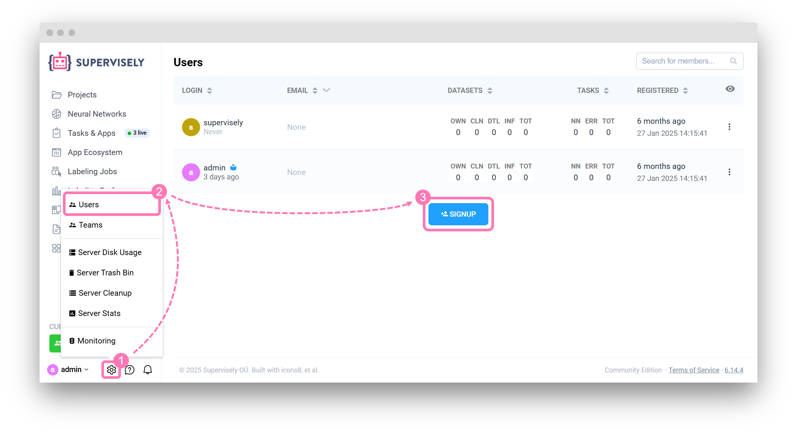

# Post-installation

## Change the default password

We strongly recommend you to change the default password. To do it, please click on the user in the bottom left corner, click "Account settings" and navigate to "Change password".

<figure><figcaption></figcaption></figure>

## Create new users

By default we create two users: "admin" (to administrate the instance) and "supervisely" (to share demo projects and models in Explore).

We strongly advice you to keep admin account clean from models and projects and create separate teams and users for security reasons - if you would perform all the work in admin's team you may accidentally end up with overpopulated team with full access to everything.


### Create new users with admin account

To create new users using an instance admin account:

  1. Click the gear icon to the right of your username in the lower left corner. 
  2. Select "Users" from the dropdown menu. 
  3. On the Users page, scroll all the way down and click the "Signup" button.

<figure><figcaption></figcaption></figure>

> For more details on managing users, see the [Users Management](../../collaboration/admin-panel/users-management.md) section.

### Invite new members to a team

To add new members to a team, navigate to the "CURRENT TEAM" section in the bottom left corner. Here, you can view and manage all users associated with your team.

To invite a new user to a specific team:

  1. Select the desired team from the list.
  2. Click "Manage members" from the dropdown menu.
  3. Click the "Invite" button in the upper right corner.
  4. Enter the user’s login and assign a role.
  5. Confirm the invitation.

The invited user will receive a notification.

<figure><figcaption></figcaption></figure>


## Configure your instance

A good idea would be to check the "Instance Settings" page located in the admin's user menu. You will find tons of options you might like to configure, for example, enable HTTPS support or disable signup page:

<figure><figcaption></figcaption></figure>

### Server Configuration&#x20;

The **Server Configuration** section includes the necessary settings for the proper functioning of a server instance. The key components are:

* **Core Instance Settings** — Critical parameters required for the Supervisely instance. Edit with extreme caution, as incorrect values may bring the instance down, requiring manual `.env` file adjustments.
* [**Applications Autostart Settings**](./#configuring-automatic-launch-of-system-applications) — Configures the automatic start of applications on the instance, enabling required applications to launch automatically upon system startup.
* **Server Address** — The public or local network address of the server where Supervisely is deployed. This address must be accessible by the machines running agents. Note: `localhost` is not a valid option here.
* **Server Port** — The port used by Supervisely, with defaults of HTTP (80) and HTTPS (443) if HTTPS is configured. This can be changed if another application uses the same ports or if a reverse-proxy is configured. Ensure that ports 80 and 443 are enabled in the firewall or AWS security group.
* **CDN Domain** — The network address of the server where Supervisely stores data. It should be publicly accessible or accessible within the local network.
* **Data Folder** — The folder where Supervisely stores temporary and, if remote storage is not configured, permanent files. If this location is changed, existing files need to be moved to the new location. Avoid setting it to a network share (NFS or SMB), as this significantly impacts performance.
* **Disable Plugins** — A flag to disable plugins. The default is set to OFF.
* **Enable Apps Background Updates** — Enables background updates for applications. If disabled, applications are only updated when the instance itself is upgraded.
* **Public API Pagination Limit** — Sets the number of items returned by the Public API per page. The default value is 500.
* **Docker Compose Project** — The Docker Compose `COMPOSE_PROJECT_NAME` variable. Ensure it is unique across your server.
* **Postgres Memory** — The shared memory size allocated for Postgres.

#### Configuring automatic launch of system applications

To setup system applications to start automatically with the instance, you can add their configuration in the settings file. Use the following format:

```json
{
  // application slug
  "supervisely-ecosystem/render-previews-app": [
    // Each object in the array represents a separate session of the application
    {
      "isShared": true,                 // (optional) Default is false. If true, the application will be shared across the entire instance
      "nodeId": null,                   // Agent ID. You can specify a specific agent to run the application
      "skipVersionUpdates": false,      // (optional) Default is false. If true, disables automatic application restarts to newer versions
      "state": {}                       // (optional) Application launch parameters. You can pass settings here that are usually filled in the modal window during launch
    },
    {
      "nodeId": 1                       // Example of a second session of the same application
    }
  ]
}
```

**Field Explanations:**

* `isShared`: Makes the application accessible across the entire instance.
* `nodeId`: Specifies the agent ID for running the application. Leave it as `null` to assign a random agent.
* `skipVersionUpdates`: Disables automatic restart of the application to a newer version.
* `state`: Parameters for launching the application, similar to those filled out when launching through the interface.
* `disabled`: if set to true, the system application will not be launched automatically. Use this parameter if you need to [disable a system application](#disable-system-application).

**Example**

To add the "Render Previews" application with auto-launch and two sessions on the instance, use the following configuration:

```json
{
  "supervisely-ecosystem/render-previews-app": [
    {
      "isShared": true,
      "nodeId": null,
      "skipVersionUpdates": false,
      "state": {}
    },
    {
      "nodeId": 1
    }
  ]
}

```

##### Disable system application

If you need to disable some of the system apps, you can use the following config:

```json
{
  "supervisely-ecosystem/deploy-clip-as-service": [
    {
      "isShared": false,
      "nodeId": null,
      "disabled": true // Prevents the application from launching automatically.
    }
  ],
  "supervisely-ecosystem/render-previews-app": [
    {
      "isShared": false,
      "nodeId": null,
      "disabled": true // Prevents the application from launching automatically.
    }
  ],
  "supervisely-ecosystem/quality-assurance-for-image-annotations": [
    {
      "isShared": false,
      "nodeId": null,
      "disabled": true // Prevents the application from launching automatically.
    }
  ]
}
```

At the moment, there are three system apps available:
- "supervisely-ecosystem/deploy-clip-as-service" - [CLIP Service](https://ecosystem.supervisely.com/apps/deploy-clip-as-service)
- "supervisely-ecosystem/render-previews-app" - [Render previews GUI](https://ecosystem.supervisely.com/apps/render-previews-app)
- "supervisely-ecosystem/quality-assurance-for-image-annotations" - [On-the-Fly Quality Assurance](https://ecosystem.supervisely.com/apps/quality-assurance-for-image-annotations)

***

### Default agent options

The **Default Agent Options** define the configuration and behavior of agents when they are deployed for the first time. These settings will not affect agents that have already been deployed; if you want changes to apply to an existing agent, you need to **re-deploy it** from the **Cluster page** using the "Instructions" button.

Here’s an overview of each default option:

***

**Environment Settings**

Environment variables are passed to agents automatically during deployment. These variables can influence how the agent behaves and interacts with the system.

***

**CA Certificates**

Manage certificates for secure connections. Ensure that the agent can communicate with Supervisely over HTTPS if certificates are required.

***

**Stateless Mode**

* **Description**: In this mode, agents do not store cached data to the disk, which helps conserve disk space.
* **Default Value**: **OFF**
* **Use Case**: Enable when running in environments with limited storage space or when caching is not required.

***

**Enable Nvidia Runtime**

* **Description**: Activates GPU support for agents, which is necessary for tasks involving neural networks.
* **Default Value**: **ON**
* **Use Case**: Essential for tasks requiring high computational power, such as training or running deep learning models.

***

**Additional Docker Registry**

* **Description**: Specifies a private Docker registry to pull custom plugins or applications.
* **Use Case**: Use this when your organization has proprietary plugins stored in a private Docker registry.

***

**Additional Docker Login**

* **Description**: Username used to authenticate with the additional Docker registry.
* **Example**: `lisa`

***

**Additional Docker Password**

* **Description**: Password for authenticating with the additional Docker registry.
* **Note**: Passwords are masked (e.g., `••••••••••••••••••`) for security.

***

**Host Folder**

* **Description**: A folder where the agent keeps cache files. This is useful for temporary storage during tasks like imports or training.
* **Use Case**: Ensure the specified folder has sufficient disk space.

***

**Cleanup Failed Import Tasks**

* **Description**: The time after which the system will automatically clean up failed import tasks.
* **Default Value**: **`1d`** (1 day)
* **Format**: Time should be specified in formats like `"12h"` (12 hours) or `"1d"` (1 day).

***

**Cleanup Completed Import Tasks**

* **Description**: The time after which the system will automatically clean up completed import tasks.
* **Default Value**: **`1h`** (1 hour)
* **Format**: Time should be specified in formats like `"12h"` (12 hours) or `"1d"` (1 day).

***

### Labeling Settings

The **Labeling Settings** section controls various aspects of the annotation process to enhance the labeling experience. Below is a detailed explanation of each option:

**Annotation Image Quality**

* **Description**: Defines the JPEG compression level for images displayed in labeling tools.
* **Default Value**: **100** (highest quality).
* **Setting to `0`**: Ensures that the original image is always used, which may be necessary for detailed or high-precision annotation tasks.
* **Use Case**: Adjust to a lower value (e.g., 70-80) for faster loading times when working with large datasets or slower network connections.

***

**Labeling Idle Timeout (seconds)**

* **Description**: Determines how often the system checks for user activity (e.g., cursor movement) during labeling.
* **Default Value**: **30 seconds**.
* **Use Case**: Helps track whether the labeler is actively working or idle, which is useful for team management and activity monitoring.

***

**Track Frames Limit**

* **Description**: Specifies the maximum number of frames available per track in video labeling.
* **Default Value**: **500 frames**.
* **Use Case**: This limit ensures optimal performance and responsiveness when working with long videos or dense tracks. Adjust the limit for specific projects if needed.

***

**Default Image Preview Quality**

* **Description**: Controls the default JPEG quality for previewing images during labeling.
* **Default Value**: **100** (highest quality).
* **Use Case**: Lowering the quality can speed up image loading for previews in large projects, especially when detailed analysis isn’t required.

***

**Default Image Labeling Toolbox**

* **Description**: Sets the default toolbox configuration for labeling images.
* **Default Value**: **Any** (no specific toolbox is enforced).
* **Use Case**: Choose a specific toolbox to streamline the labeling workflow for certain types of image projects.

***

**Default Video Labeling Toolbox**

* **Description**: Sets the default toolbox configuration for labeling videos.
* **Default Value**: Not explicitly defined.
* **Use Case**: Specify a preferred video toolbox to ensure consistency in annotation workflows for video projects.

***

### Authorization Settings

The **Authorization Settings** section controls who can log in to Supervisely and how authentication is managed. This includes support for external identity providers, password policies, and user access restrictions. Here's a detailed breakdown of the settings:

***

**OpenID Authorization**

* **Description**: Allows integration with an OpenID provider for single sign-on (SSO) authentication.
* **Default Status**: Disabled (No OpenID credentials provided).
* **Use Case**: Configure OpenID to allow users to log in using third-party identity providers like Google or Azure AD.

***

**LDAP Authorization**

LDAP (Lightweight Directory Access Protocol) settings enable authentication using an organization’s directory service.

* **Server URL**:
  * The URL of the LDAP server.
  * **Example**: `ldap://example:389`
  * **Use Case**: Needed for connecting Supervisely to your LDAP server.
* **Bind DN**:
  * The Distinguished Name (DN) of the account used to authenticate against the LDAP directory.
  * **Example**: `cn=root`
* **DN Credentials**:
  * Password associated with the Bind DN.
  * **Example**: `secret`
* **Search Filter**:
  * Specifies how to locate users in the LDAP directory.
  * **Example**: `(uid={{username}})`
  * **Use Case**: Use placeholders like `{{username}}` to dynamically query the directory for the logging-in user.
* **Search Base**:
  * Defines the root point in the LDAP directory tree where searches begin.
  * **Example**: `dc=example, dc=org`

***

**Use Strong Password**

* **Description**: Enforces strong passwords for built-in Supervisely accounts.
* **Default Status**: **OFF** (disabled).
* **Strong Password Min Length**:
  * Minimum password length required if strong passwords are enabled.
  * **Default Value**: 10 characters.
* **Use Case**: Enable for enhanced security to reduce the risk of weak passwords.

***

**Disable Built-in Logins**

* **Description**: Disables Supervisely’s native login system to allow only LDAP or OpenID authentication.
* **Default Status**: **OFF** (disabled).
* **Use Case**: Enable if you want to centralize login management through LDAP or OpenID only.

***

**Enable Reservation of Seats by Team**

* **Description**: Changes how reserved seats are allocated, from individual users to entire teams.
* **Default Status**: **OFF** (disabled).
* **Use Case**: Enable this option to manage user seat reservations on a team basis, particularly useful for large organizations.

***

**Authenticate Only Existing Users**

* **Description**: Controls whether new accounts are automatically created during SSO login.
* **Default Status**: **OFF** (new accounts are auto-created).
* **Use Case**: Enable this option to restrict login access to pre-approved users, requiring manual user account setup for Supervisely.

***

**Token Lifetime**

* **Description**: Determines how long login tokens remain valid before requiring re-authentication.
* **Default Value**: **7 days**.
* **Format**: Specify in formats like `"12h"` (12 hours) or `"1d"` (1 day).
* **Use Case**: Shorten token duration for enhanced security or extend for convenience in long-running sessions.

***

### Miscellaneous Settings

The **Miscellaneous Settings** category includes options that don’t fit into specific categories but provide important functionality for security, notifications, and file upload verification. Here’s an explanation of each setting:

***

**Disable Python Scripts & Notebooks**

* **Description**: Disables the functionality to run Python scripts and Jupyter notebooks within Supervisely.
* **Default Status**: **ON** (disabled).
* **Use Case**: Enable this setting to enhance security by preventing execution of potentially harmful or unauthorized Python scripts and notebooks, especially in shared or sensitive environments.

***

**Show Notifications**

* **Description**: Toggles system notifications for various events, such as:
  * **"New job assigned"**: Alerts users when a new task or job is assigned to them.
  * **"New labeling exam assigned"**: Notifies labelers about assigned exams.
* **Default Status**: **ON** (enabled).
* **Use Case**: Keep this enabled to ensure users are aware of important updates and tasks. Disable it if you prefer a distraction-free environment or use external notification systems.

***

**Uploading Verification URL**

* **Description**: Sends an HTTP request with the content of each file being uploaded. The server hosting the provided URL must return an HTTP status **200 OK** to allow the file to be uploaded.
* **Use Case**: This setting is useful for implementing additional verification or validation steps during the upload process, such as:
  * Checking file type, size, or content for compliance with organizational rules.
  * Blocking unwanted or unverified files from being uploaded to Supervisely.

***

### Cloud Credentials

The **Cloud Credentials** section is where you manage access to cloud storage services (AWS, Google Cloud, Azure, or server file systems) to facilitate remote data import into Supervisely. Here's an overview of this functionality:

***

#### **Purpose of Cloud Credentials**

Cloud credentials allow Supervisely to connect to external cloud services or remote file systems securely. Once set up, they enable seamless import of datasets or files directly from supported cloud providers or your server file system without requiring manual uploads.

***

#### **Key Features**

1. **Supported Providers**:
   * **AWS (Amazon Web Services)**: Access S3 buckets for importing data stored in Amazon’s cloud.
   * **Google Cloud**: Connect to Google Cloud Storage buckets.
   * **Azure**: Access data stored in Microsoft Azure Storage.
   * **Server File System**: For remote imports from file systems on network servers or similar setups.
2. **Flexibility**:
   * No credentials are mandatory unless you need to access data stored remotely.
   * Supports various use cases, such as:
     * Centralized storage of datasets for collaborative work.
     * Importing large files directly from the cloud without local downloads.

***

#### **How to Configure Cloud Credentials**

1. **AWS Example**:
   * Add the following details:
     * **Access Key ID**: Your AWS access key.
     * **Secret Access Key**: Your AWS secret key.
     * **Region**: The region where your S3 bucket is hosted (e.g., `us-east-1`).
     * **Bucket Name**: The name of the S3 bucket you want to access.
2. **Google Cloud Example**:
   * Provide:
     * **Service Account Key JSON**: Upload the JSON file containing credentials for the Google Cloud service account.
3. **Azure Example**:
   * Add:
     * **Storage Account Name**: The name of your Azure Storage account.
     * **Access Key**: The key to authenticate access to Azure Storage.
4. **Server File System Example**:
   * Specify:
     * **Server Address**: The IP or hostname of the server.
     * **Path**: The directory path to the folder containing the files.
     * **Login Credentials**: User account details, if required.

***

#### **Use Case Scenarios**

* **Large Dataset Imports**:
  * Instead of uploading files manually, link your cloud storage to Supervisely and import data directly.
* **Collaboration**:
  * Teams working across different locations can upload datasets to a shared cloud storage for easy access and import.
* **Automated Workflows**:
  * Use cloud storage as a central repository for data pipelines, where files are automatically synced and imported into Supervisely.

***

#### **What Happens If No Credentials Are Provided?**

* By default, Supervisely cannot access any cloud storage.
* All uploads must be done manually using local files.
* To enable remote imports, credentials must be added for the desired provider.

***

### HTTPS Configuration

The **HTTPS** section in Supervisely allows you to configure secure communication for your server using HTTP over SSL/TLS. Here's an explanation of the available options:

***

**Disabled (Default)**

* **Description**: HTTPS is turned off, and the server communicates over regular HTTP.
* **Use Case**: Suitable for private networks where security is not a concern or when testing in a controlled environment.

***

**Let’s Encrypt**

* **Description**: Automatically acquires a free SSL/TLS certificate from Let’s Encrypt.
* **Requirements**:
  * A **publicly accessible server address** is required.
  * Supervisely will handle certificate renewal automatically.
* **Use Case**: Ideal for servers exposed to the public internet that need a secure connection with minimal setup effort.

***

**Custom Certificates**

* **Description**: Allows you to provide your own SSL/TLS certificates, using `.pem` files for configuration. This option works best for private networks or custom setups.
* **Fields**:
  * **Path to fullchain.pem file**: Specify the path to the file containing the full certificate chain (including all intermediate and root certificates).
  * **Path to privkey.pem file**: Specify the path to the file containing the private key associated with the certificate.
* **Use Case**:
  * You are operating in a **private network** where self-signed certificates are used.
  * Your organization provides certificates through a custom Certificate Authority (CA).

***

Every kind of potentially long operation (like Import or Training) is performed on so-called [agents](../../getting-started/connect-your-computer/). Before you can use Supervisely, you should deploy at least one.

During the installation we automatically deploy a default "Main Node" agent via `supervisely deploy-agent` so you don't have to do anything. But, if you don't have a GPU device on your machine with Supervisely, you may want to deploy an additional agent on AWS or some computer with a videocard.

Go to "Cluster" page and click `Add agent`. Execute command from popup window on your server in terminal (you can use the same machine where Supervisely is deployed).

The status of deployed agent should change from "Waiting" to "Running". Now you can start using all features of Supervisely!


Choose "Share with all users" from agent context menu if you want any user of your instance to perform tasks on it.



If you see at Cluster page that your Main Node is in Waiting status, it means that it could not be connected to Supervisely. Please check `SERVER_ADDRESS` variable in your `.env` file. Agent should be able to make outbound connections to that IP or Host. As a quick solution you can find your `docker0` ip address that act as `locahost` for Docker: run `ip addr list docker0` and use it in `SERVER_ADDRESS`. It should look like `172.17.0.1` or something. Run `supervisely deploy-agent` to apply your changes. Main Node at Cluster page should change status to "Running"


## Import your own dataset

Go to the Import page, make sure preset "Supervisely / Images" is selected and drag-and-drop a folder with some images. Enter a name for the new project, wait till the files are uploaded and click "Import". New import task has been started and you will see your new project on the Projects page after it's finished.


If you see message like above at Import page, there could be two reasons: 1). You are logged-in as "admin" user. We do not automatically add any apps to admin team. You can do it manually from Explore section, but we suggest to create new user instead. 2). Another reason is that you don't have active agents at Cluster page. Check "Main Node is in Waiting status" section above.

