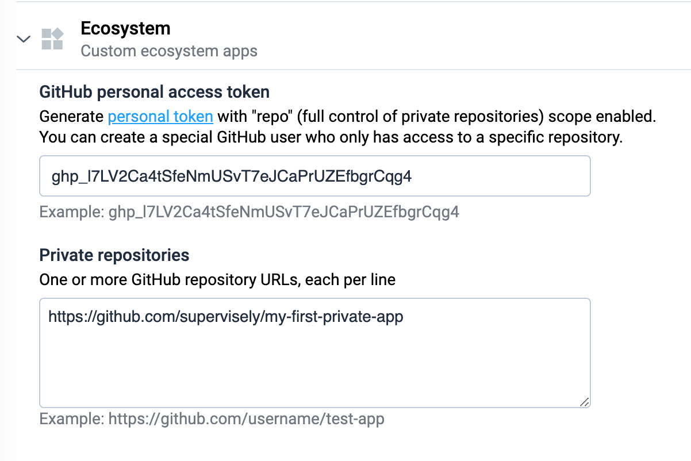

You can extend existing library of ready Supervisely Apps available at Ecosystem page with new applications, only available at your Supervisely instance. This tutorial will show you how to create and deploy new private applications as private GitHub repositories.

## Step 1. Generate new personal token

To access private GitHub repositories, you will need to generate a personal token. Please note, that this token will provide your Supervisely instance a read access to all repositories, available for this GitHub account — you may want to create a dedicated GutHub account for a single Supervisely App repository.

Open GitHub → Settings → Developer settings → [Personal access tokens](https://github.com/settings/tokens) and click Generate new token.

Select "repo" access scope and click "Generate token" button. Save generated token — you will need it later.


## Step 2. Create GitHub repository

Let's create a new GitHub repository that we will use to deploy a new Supervisely application.  Create a [new private GitHub repository](https://github.com/new): do not forget to choose "Private" visibility option.
  

  

You can create a public repositry alright — you will still need a personal token and further steps are gonna be the same.

  
## Step 3. Make it a Supervisely App repository

In this tutorial we will use [While(true) app](https://github.com/supervisely-ecosystem/while-true-script) code-base as a starting point — it's a bare minimum sample application that, basically, just runs an infinite loop.
  
We will download it's source code, extract it, create a new repository and initialize it:
  
```
wget -O while-true-app.zip  https://github.com/supervisely-ecosystem/while-true-script/archive/refs/heads/master.zip
unzip while-true-app.zip
cd while-true-script-master/
git init
git add .
git commit -m "first commit"
git branch -M main
git remote add origin https://github.com/supervisely/my-first-private-app.git # Your actual repository name here...
git push -u origin main
```

You will find a few files in your new application:
  
- `config.json` describes your app name, type, etc.
- `requirements.txt` list python packages you will need
- `README.md` in markdown format
- `src/main.py` your entry-point python file
  
Let's leave it as is for now
  
## Step 4. Setup GitHub repository in Supervisely
  
Login as an admin user to your Supervisely instance and select "Instance settings" in admin's user menu.
  
Scroll to Ecosystem section and provide your personal access token and repository name here. Click "Save" at the bottom to update your instance settings.
  


## Step 5. Check your first application
  
Now, open Ecosystem page in the left menu and choose "Private Apps" in the right menu. You should see here your new application after a minute. Add it to your team and try it out!
  
Next time you push a new update to your repository, do not forget to open application in Ecosystem and click "Refresh" button to update it.

## Optional: Releases
  
Supervisely Apps support multiple versions via GitHub releases — this is a convenient feature once you are ready to mark your first version as a release. Just go to Releases section of your GitHub repository, click "Create a new release" button and choose a "v1.0.0" tag — next time you refresh your app in Ecosystem, you will see your release and will be able to switch between them.

  
