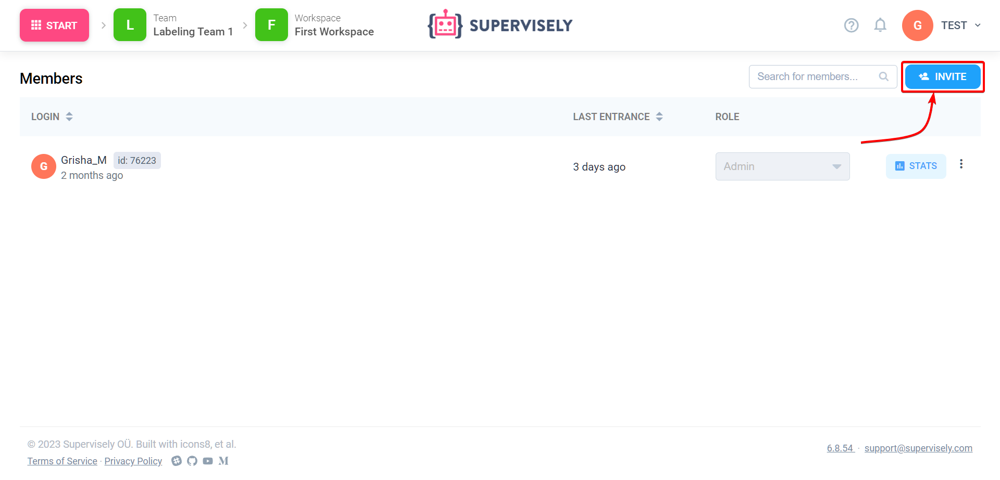

# How to invite team members


This 5-minute tutorial is a part of introduction to Supervisely series. You can complete them one-by-one, separately, or jump the rest of the documentation at any moment.

- [How to import](Getting-Started-Import-an-images.md)
- [How to annotate](Getting-Started-Annotate.md)
- [How to invite team members]**(you are here)**
- [How to connect agents](connect-your-computer/README.md)




If you want to learn more about collaboration, team members, labeling jobs and much more, then you need to go to [this section.](../collaboration/teams.md)


We have now learned how to [upload](Getting-Started-Import-an-images.md) and [annotate](Getting-Started-Annotate.md) datasets — that’s great! But when it comes to a more realistic scenario of creating a computer vision dataset, you will need more than just you alone. You will need a team of people working together on the same data. So, let’s invite one!

First, login to Supervisely and click the “Start” button. Select “Team members” — you will see the list of users who are members of the current [team](../collaboration/teams.md) (which you can find right next to the “Start” button). Presumably, it’s just you alone now. Let’s fix that!

Click the “Invite“ button at the top right corner. You will need to enter a login of an existing user and a role in the current team you want them to have. [Roles](../collaboration/members.md) can be used to limit which actions the user can perform in your team. You, as an admin of the team, can do anything, delete things, invite and pick other users — but, say, a user with the “labeler” role can do none of the above: they can only label existing images.

Once you clicked “Add to team”, depending on your Supervisely settings, will send an invitation e-mail or add the user immediately (only available on the Enterprise Edition).

Now, when the invited user will login to Supervisely, they will be able to switch between any team they are a member of.

**Friendship is magic! 🤝** 
