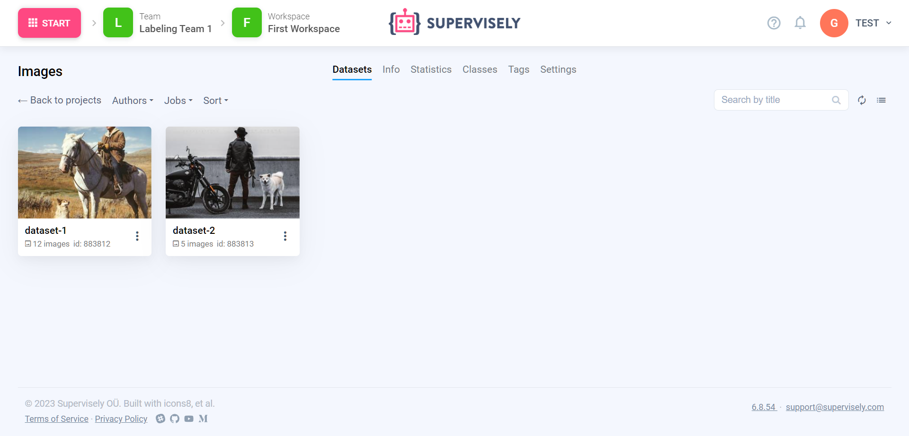
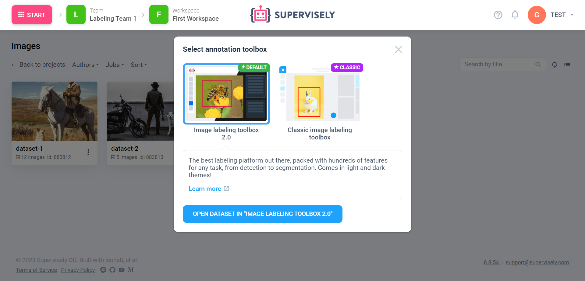
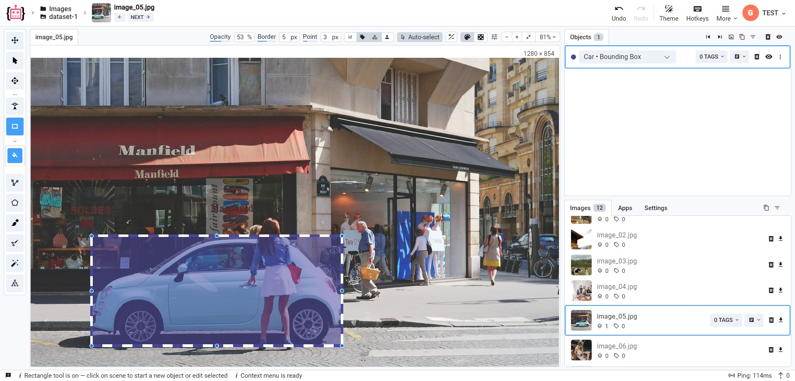

# How to annotate


This 5-minute tutorial is a part of introduction to Supervisely series. You can complete them one-by-one, in random order, or jump to the rest of the documentation at any moment.

- [How to import](How-to-import.md)
- How to annotate **(you are here)**
- [How to invite team members](Invite-member.md)
- [How to connect agents](connect-your-computer/README.md)
- [How to train models](how-to-train-models.md)




You can learn more about Labeling, such as labeling of videos and 3D point clouds, using AI-assisted labeling and more in [this section.](../labeling/Labeling-toolbox.md)


Once you [uploaded your first images](How-to-import.md), let’s annotate it.

Click on the project you’ve just created. You will open the list of datasets (subfolders) inside your project (you can learn more on data organization [here](../data-organization/overview.md)). Depending on if you have uploaded a set of folders with images or just images directly, there could be one or more datasets. Don’t worry — you can move and copy images between datasets (and even projects) using the [Data Commander.](../data-organization/data-commander/README.md) But why are there projects and datasets, what’s the difference?

At the top of this page you will find more tabs, such as classes and tags. There you can define a meta information, shared across all of the datasets inside a particular project. Let’s focus on [classes](../data-organization/project/classes/classes.md) first.

A class allows you to define a type of your annotations. Every annotation object must have exactly one class. For example, you can define a class “Car” and limit it the shape “bounding box”: now, if you define a [labeling job](../labeling/jobs/README.md) and assign your [team member](../collaboration/members.md) to annotate a bunch of images with “Cars”, they will only be able to place bounding boxes and mark them as “Cars” (unless you configure more classes, of course).

Now, let’s go to the classes tab and click the “New” button. Let’s enter some title to it, select a shape (let’s select “bounding box” for this one) and click “Save”.


You can select “Any Shape” — that will allow to mark annotations of any shape with this class, so can have both “bounding box” and “mask” marked as this class at the same time. Be worried, that could potentially create issues when you try to train a neural network.


Awesome! Now, switch back to the Datasets tab and click on any dataset. You will see a dialog window that will ask you to choose a labeling toolbox (yeah, we have many!). Choose an “Image labeling toolbox 2.0”. A new tab should appear with your dataset in the labeling toolbox.


You can open only a single dataset or a portion of it in a labeling toolbox.



You can switch the dark theme to light or back at any time.


From the left toolbar select a tool that corresponds to your class shape, in our case, Bounding Box Tool to create bounding boxes. You can hover your cursor over the particular tool button and check the description.

Now, let’s hover the cursor over any object on your image and make two clicks to form a rectangle around it. You will see a new object in the right sidebar at the Objects tab. Done!

You can also check our blog post on how to label with bounding boxes:



You rock! Now, you can explore other labeling tools (such as [polygons](https://supervisely.com/blog/how-to-use-polygon-anotation-tool-for-image-segmentation/), masks or skeleton shapes), more advanced tools, such as video or 3D point clouds — or continue our journey and see how [collaboration](../collaboration/members.md) works in Supervisely.
