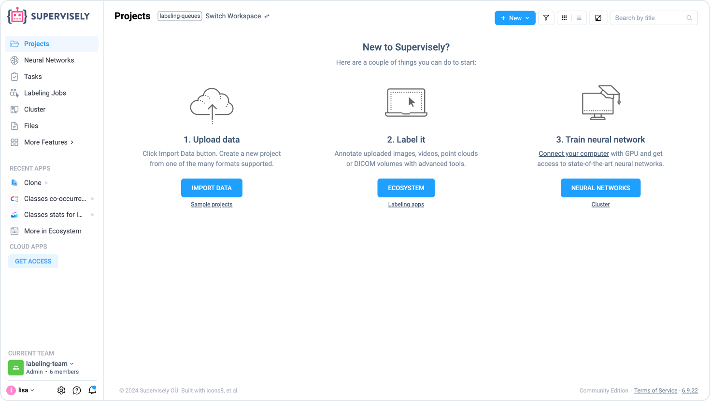

# How to import


This 5-minute tutorial is a part of introduction to Supervisely series. You can complete them one-by-one, in random order, or jump to the rest of the documentation at any moment.

* How to import **(you are here)**
* [How to annotate](How-to-annotate.md)
* [How to invite team members](Invite-member.md)
* [How to connect agents](connect-your-computer/)
* [How to train models](how-to-train-models.md)



You can learn more about Import, such as importing different formats, import from the cloud or adding data to existing datasets in [this section.](broken-reference)


### Supported formats and modalities

<strong>Image Datasets</strong>

* Auto-detect annotations in [Supervisely](https://github.com/supervisely-ecosystem/import-wizard-docs/blob/master/converter\_docs/images/supervisely.md), [COCO](https://github.com/supervisely-ecosystem/import-wizard-docs/blob/master/converter\_docs/images/coco.md), [YOLO](https://github.com/supervisely-ecosystem/import-wizard-docs/blob/master/converter\_docs/images/yolo.md), [Pascal VOC](https://github.com/supervisely-ecosystem/import-wizard-docs/blob/master/converter\_docs/images/pascal.md), [Cityscapes](https://github.com/supervisely-ecosystem/import-wizard-docs/blob/master/converter\_docs/images/cityscapes.md), [Images with PNG masks formats](https://github.com/supervisely-ecosystem/import-wizard-docs/blob/master/converter\_docs/images/masks.md).&#x20;

<!---->

* Import images for [Multiview](https://github.com/supervisely-ecosystem/import-wizard-docs/blob/master/converter\_docs/images/multiview.md), [Multispectral](https://github.com/supervisely-ecosystem/import-wizard-docs/blob/master/converter\_docs/images/multispectral.md), [Medical 2D (single)](https://github.com/supervisely-ecosystem/import-wizard-docs/blob/master/converter\_docs/images/medical\_2d.md) labeling.&#x20;

<!---->

* Upload images as [links from CSV or TXT files](https://github.com/supervisely-ecosystem/import-wizard-docs/blob/master/converter\_docs/images/csv.md) or [convert PDF pages to images](https://github.com/supervisely-ecosystem/import-wizard-docs/blob/master/converter\_docs/images/pdf.md).

<!---->

* Images in any directory structure without annotations.

<!---->

* **Supported image formats:** `.jpg`, `.jpeg`, `jpe`, `.bmp`, `.png`, `.webp`, `.mpo`, `.tiff`, `.nrrd`, `.jfif`, `.avif`, `.heic`.

<strong>Video Datasets</strong>

* Auto-detect annotations in [Supervisely](https://github.com/supervisely-ecosystem/import-wizard-docs/blob/master/converter\_docs/videos/supervisely.md), DAVIS (coming soon), MOT (coming soon) formats.&#x20;

<!---->

* Videos in any directory structure without annotations.

<!---->

* **Supported video formats:** `.avi`, `.mov`, `.wmv`, `.webm`, `.3gp`, `.mp4`, `.flv`. ⚠️ All videos will be converted to `.mp4` format during import.

<strong>Point Cloud Datasets</strong>

* &#x20;Auto-detect annotations in [Supervisely](https://github.com/supervisely-ecosystem/import-wizard-docs/blob/master/converter\_docs/point\_cloud/supervisely.md) format.

<!---->

* &#x20;Point clouds in any directory structure without annotations in `PCD`, `LAS`, `LAZ`, `PLY` formats.

<strong>Point Cloud Episode Datasets</strong>

* Auto-detect annotations in [Supervisely](https://github.com/supervisely-ecosystem/import-wizard-docs/blob/master/converter\_docs/point\_cloud\_episodes/supervisely.md) format.&#x20;
* Point cloud episodes without annotations in `PCD` format.

<strong>Volume Datasets</strong>

* Auto-detect annotations in [Supervisely](https://github.com/supervisely-ecosystem/import-wizard-docs/blob/master/converter\_docs/volumes/supervisely.md) format.

<!---->

* Volumes in any directory structure without annotations in `DICOM`, `NRRD` formats.

You can always use applications to import different formats and modalities from our [Ecosystem](https://ecosystem.supervisely.com/):

[Import Images](https://ecosystem.supervisely.com/apps/import-images) | [Import Videos](https://ecosystem.supervisely.com/apps/import-videos-supervisely) | [Import Pointclouds](https://ecosystem.supervisely.com/apps/import-pointcloud-pcd) | [Import Pointcloud Episodes](https://ecosystem.supervisely.com/apps/import-pointcloud-episode) |  [Import DICOM Volumes](https://ecosystem.supervisely.com/apps/import-dicom-volumes) | [Import COCO Keypoints](https://ecosystem.supervisely.com/apps/import-coco-keypoints) | [Import Volumes in Supervisely format](https://ecosystem.supervisely.com/apps/import-volumes-with-anns) | [Import KITTI-360](https://ecosystem.supervisely.com/apps/import-kitti-360/supervisely\_app) | [Import Multispectral Images](https://ecosystem.supervisely.com/apps/import-multispectral-images) | and [many other formats](https://ecosystem.supervisely.com/import).

🪄 Here we will look at the fastest and easiest import option!

***

Let's start our journey with Supervisely by uploading our very first image. Of course, like we said before, you can import more complex dataset formats like [COCO](https://github.com/supervisely-ecosystem/import-wizard-docs/blob/master/converter\_docs/images/coco.md), or modalities, such as DICOM, connect a S3 cloud and much more, but let’s begin with a simple one.

We assume that you have already created an account in Supervisely. If not, you can create a free account in our Community Edition [here.](https://app.supervisely.com/signup)

First thing you will see after you login to Supervisely, is your [Projects](../data-organization/project/projects.md) page where you can find your data. But there is nothing here yet — let’s fix that!

<figure><figcaption></figcaption></figure>

1. Click the `Import Data` button. Enter a unique name for the project, keeping in mind that it must be unique in the workspace and case-sensitive. You can also add a description of the project to provide additional information or to track project updates.
2. Next, select the `Project type` by defining the content modality: images, videos, point clouds, or DICOM 3D volumes.&#x20;


Note that you can't mix multiple content types in the same project, and this setting can't be changed later.


3. Choose one of the available interfaces for labeling images (or other data modality). Our interfaces are designed for different industries and annotation scenarios.
4. After completing all required fields and selecting options, click `Create` to complete the project and begin uploading data.

<figure><figcaption></figcaption></figure>

5. In the modal window, drag and drop one or more images in one of the supported formats, such as `.jpg`, `.jpeg`, `.mpo`, `.bmp`, `.png`, `.webp`, `.tiff`, `.tif`, `.nrrd`, `.jfif`, `.avif`, `.heic`, `NIfTI`, `DICOM` . You can also check out the supported annotation formats.&#x20;

🤗 Congratulations, the hardest part is over!

<figure><figcaption></figcaption></figure>

You will be redirected to the Tasks page where you can watch the progress of the application (your files are actually being uploaded to your [Team Files](https://docs.supervisely.com/data-organization/team-files)).&#x20;

You can click **three dots (⋮)** icon and check the application logs.

<figure><figcaption></figcaption></figure>


🤓 **Nerd alert! Skip this section if you aren't interested how Supervisely works inside.**

So what is going on here? First, Supervisely will choose one of the connected Agents and ask it to run the “Auto Import'' application. It will spawn a Docker container that will download the GitHub repository with the application code and run python code written with Supervisely SDK.

It will pull your images uploaded to the Team Files in the modal window, convert them, if needed (this particular application maybe does little, but others, like Import COCO format, will transform a lot) and use API to create a Project and add images to it.


Once the import is finished, you will see the link to your new project in the `Output` column of the table.

<figure><figcaption></figcaption></figure>

All set! Now, in the [next section](How-to-annotate.md), let’s annotate your uploaded images.
