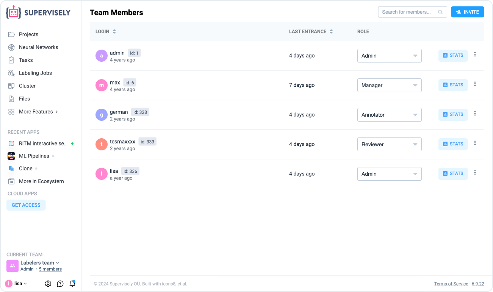

# How to invite team members


This 5-minute tutorial is a part of introduction to Supervisely series. You can complete them one-by-one, in random order, or jump to the rest of the documentation at any moment.

* [How to import](How-to-import.md)
* [How to annotate](How-to-annotate.md)
* How to invite team members **(you are here)**
* [How to connect agents](connect-your-computer/)
* [How to train models](how-to-train-models.md)



If you want to learn more about collaboration, team members, labeling jobs and much more, then you need to check [this section](../collaboration/teams.md).


We have now learned how to [upload](How-to-import.md) and [annotate](How-to-annotate.md) datasets — that’s great! But when it comes to a more realistic scenario of creating a computer vision dataset, you will need more than just you alone. You will need a team of people working together on the same data. So, let’s invite one!

First, login to Supervisely and click `Current Team members` — you will see the list of users who are members of the current  [team](../collaboration/teams.md) (which you can find right under the `Team` drop-down list). Presumably, it’s just you alone now. Let’s fix that!

<figure><figcaption></figcaption></figure>

Click the `Invite` button at the top right corner. You will need to enter a login of an existing user and a role in the current team you want them to have. [Roles](../collaboration/members.md) can be used to limit which actions the user can perform in your team. You, as an admin of the team, can do anything, delete things, invite and pick other users — but, say, a user with the “labeler” role can do none of the above: they can only label existing images.

Once you clicked  `Add to team`, depending on your Supervisely settings, will send an invitation e-mail or add the user immediately (only available on the Enterprise Edition).

Now, when the invited user will login to Supervisely, they will be able to switch between any team they are a member of.

Friendship is magic! 🤝

Once you have your datasets uploaded and labeled together with your team, it’s time to do something cool — train some neural networks! But, before that, we need a way to deploy training applications on a computer with GPU: and here when you will need an [agent](connect-your-computer/).
