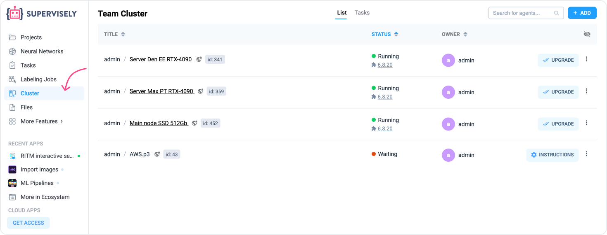

# How to connect agents


This 5-minute tutorial is a part of introduction to Supervisely series. You can complete them one-by-one, in random order, or jump to the rest of the documentation at any moment.

* [How to import](How-to-import.md)
* [How to annotate](How-to-annotate.md)
* [How to invite team members](Invite-member.md)
* How to connect agents **(you are here)**
* [How to train models](how-to-train-models.md)


Supervisely Agent is a tiny docker container that allows you to connect your computational resources (cloud server or PC) to the platform. You can run any task from web interface (for example Neural Network training/inference/deploy). Running tasks with GPU will enhance performance and efficiency for your computer vision and deep learning projects.

After you run Agent on your computer, Agent will automatically connect your server to Supervisely platform. You will see this information on the "Team Cluster" page.

<figure><figcaption></figcaption></figure>


Only you and your team members have access to your agents. So only tasks that you explicitly started yourself run on them. We will never use your nodes for our own benefit or the benefit of other users.


<table data-view="cards"><thead><tr><th></th><th></th><th data-hidden data-card-target data-type="content-ref"></th></tr></thead><tbody><tr><td><strong>Installation Linux</strong></td><td>Everything you need to know about deploying Supervisely agent on Unix-based operating systems.</td><td><a href="connect-your-computer/unix-based/unix-based.md">unix-based.md</a></td></tr><tr><td><strong>Installation Windows</strong></td><td>Everything you need to know about deploying Supervisely agent on Windows WSL.</td><td><a href="connect-your-computer/windows-wsl/windows-wsl.md">windows-wsl.md</a></td></tr><tr><td><strong>Installation AMI AWS</strong></td><td>If, for some reason, your computer doesn't meet the requirements, hardware (no GPU) or software (no CUDA or nvidia-docker), there is a quick way to try training &#x26; inference with Supervisely on Amazon EC2.</td><td><a href="../agents/ami/">ami</a></td></tr><tr><td><strong>Installation Kubernetes</strong></td><td>Follow these steps to deploy Supervisely in Kubernetes cluster</td><td><a href="../enterprise/kubernetes/installation.md">installation.md</a></td></tr></tbody></table>
