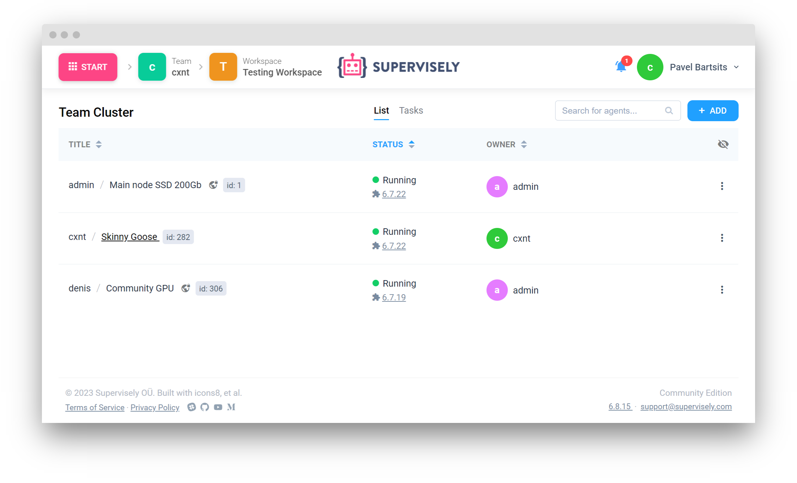

# How to connect agents


This 5-minute tutorial is a part of introduction to Supervisely series. You can complete them one-by-one, separately, or jump the rest of the documentation at any moment.

- [How to import](../How-to-import.md)
- [How to annotate](../How-to-annotate.md)
- [How to invite team members](../Invite-member.md)
- How to connect agents **(you are here)**



Supervisely Agent is a tiny docker container that allows you to connect your computational resources (cloud server or PC) to the platform. You can run any task from web interface (for example Neural Network training/inference/deploy). Running tasks with GPU will enhance performance and efficiency for your computer vision and deep learning projects.

After you run Agent on your computer, Agent will automatically connect your server to Supervisely platform. You will see this information on the "Team Cluster" page.

 Only you and your team members have access to your agents. So only tasks that you explicitly started yourself run on them. We will never use your nodes for our own benefit or the benefit of other users. 

## Installation instructions for different operating systems:

* [Unix-based](unix-based/unix-based.md)
* [Windows WSL](windows-wsl/windows-wsl.md)

## Agent

Learn how Supervisely agent works and how to maintain it in the [Agent](agents/README.md) section.

* [About Supervisely Agent](agents/README.md)
* [Adding, Restarting, and Deleting Nodes](agents/add_delete_node/add_delete_node.md)
* [How the Agent Works](agents/agent/agent.md)
* [Agent Storage](agents/agent-storage/agent-storage.md)
* [Leveraging Amazon AMI for Agent Deployment](agents/ami/README.md)
* [Efficient Cleanup and Resource Management](agents/clean_up/clean_up.md)
* [Custom Docker Registry Integration](agents/custom-docker-registry/README.md)
* [Management](agents/manage/manage.md)
* [Status, and Troubleshooting](agents/status_and_troubleshooting/status.md)
