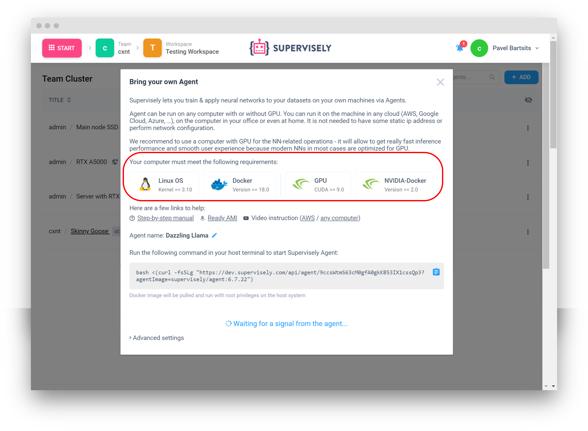
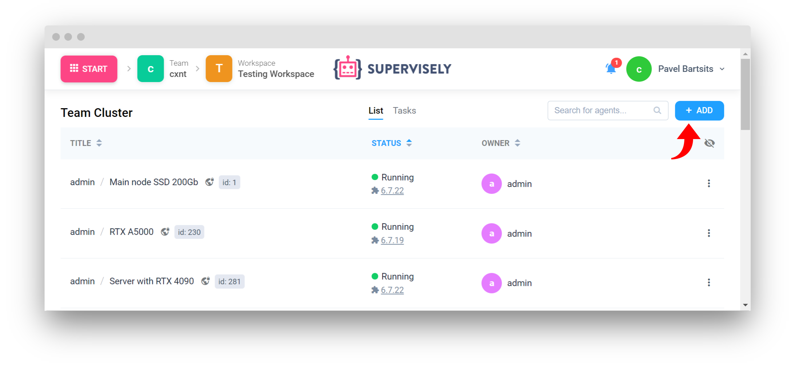
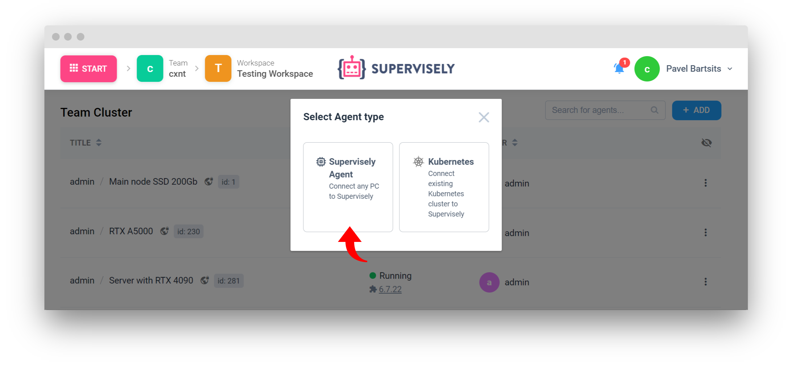
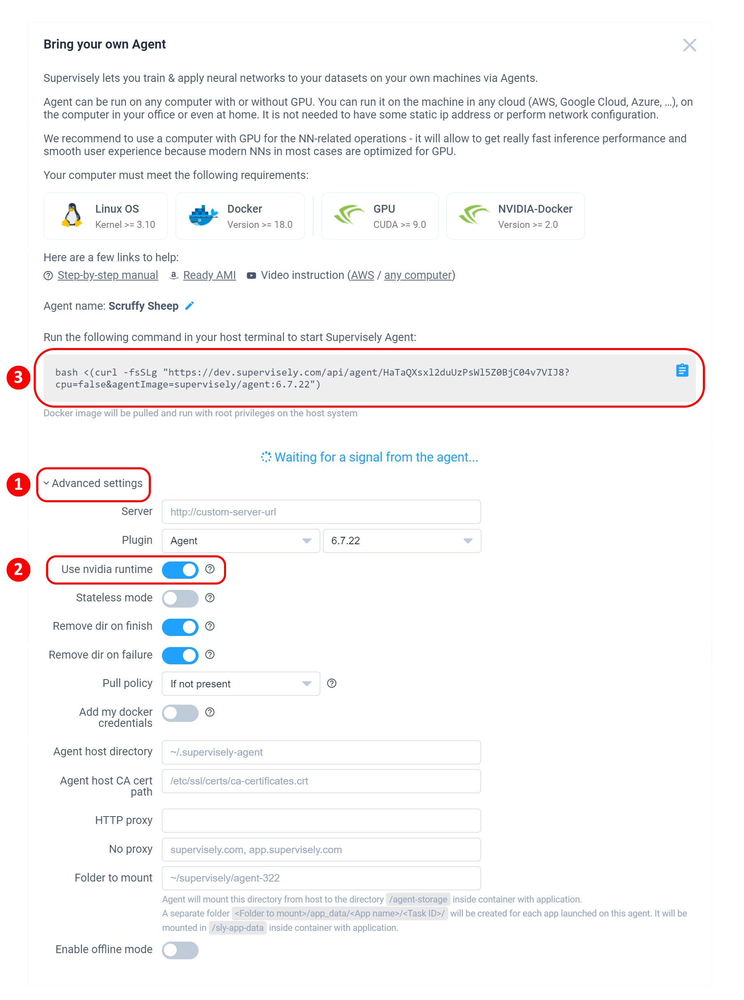
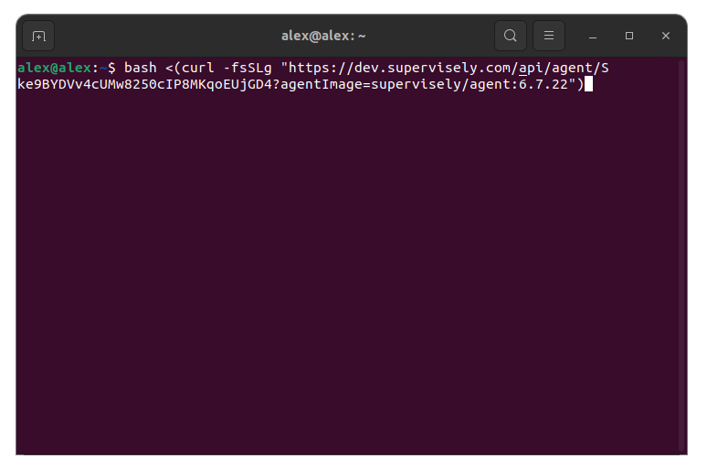
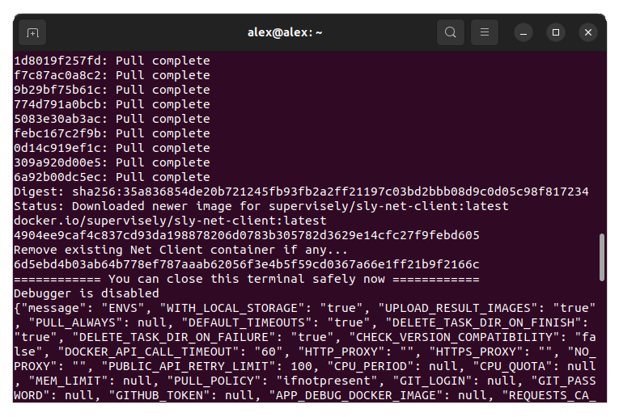

# Unix-based

This guide aims to lead you through the step-by-step process for establishing and configuring the Supervisely agent within your unix-based operating system environment.


Video guide


## Prerequisites

* Unix-based OS (Linux, MacOS)
* [Docker](https://docs.docker.com/engine/install/) (Version 18.0 or higher)
* [CUDA](https://developer.nvidia.com/cuda-downloads) (Version 9.0 or higher)
* [NVIDIA Docker](https://docs.nvidia.com/datacenter/cloud-native/container-toolkit/latest/install-guide.html)

**Make sure that the computer you want to use in Supervisely meets the above requirements.**

## Deploy Supervisely Agent

Deploy Supervisely Agent with GPU support on Linux.

Open Supervisely instance and go to the Start -> Team Cluster page and press "Add" button

Select "Supervisely agent".

In the modal window go to "advanced settings" and check "Use nvidia runtime" option to enable GPU support.

Copy the command to the terminal and run it.

Wait until the Docker image is pulled and you see the message: "You can close this terminal safely now".

That's it! Now your agent is deployed and running.
