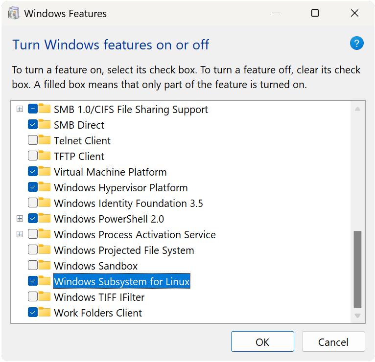
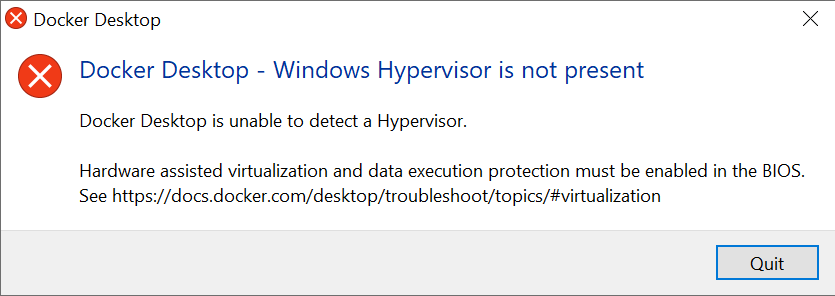
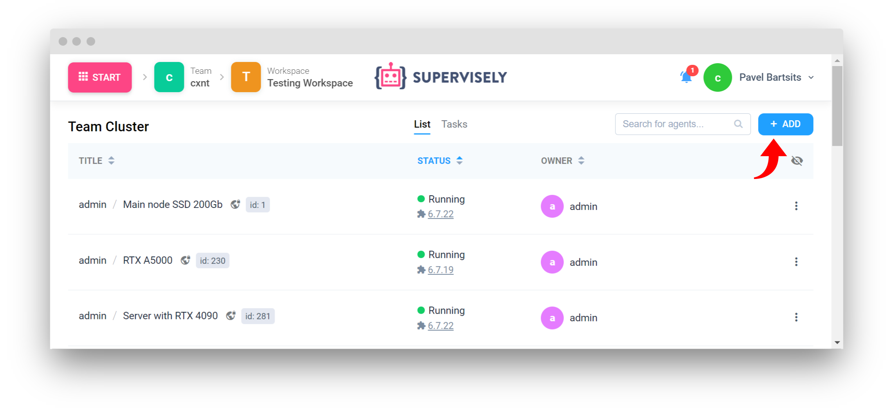
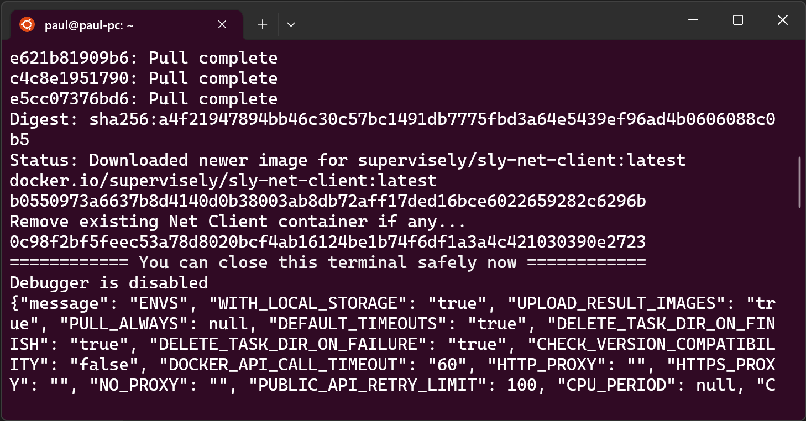

# Windows


## Deploy Supervisely agent with GPU on Windows WSL

This tutorial explains how to deploy the Supervisely agent with GPU support on Windows Subsystem for Linux (WSL). Whether you prefer following a video tutorial or a text-based guide, we've got you covered. In this guide, we'll walk you through the process step by step.

If you're a visual learner and prefer to watch along, check out our comprehensive video guide on deploying the Supervisely agent with GPU on Windows WSL. This guide will take you through each step visually, making it easier to follow along and set up the environment correctly.

**Machine Specs used in video guide:**

* **Operating System:** Microsoft Windows 10 Enterprise (10.0.19045 Build 19045)
* **GPU:** NVIDIA GeForce RTX 4090
* **GPU Driver Version:** 536.67
* **UBUNTU:** 22.04.2 LTS
* **Docker Desktop Version:** 4.20.1 (110738)


Video guide


If you prefer written instructions and a more detailed breakdown, here's how you can deploy the Supervisely agent with GPU on Windows WSL:

**Machine Specs used in text guide:**

* **Operating System:** Microsoft Windows 11 Pro (10.0.22621 Build 22621)
* **GPU:** NVIDIA GeForce RTX 3080 Ti (Laptop)
* **GPU Driver Version:** 536.67
* **UBUNTU:** 22.04.2 LTS
* **Docker Desktop Version:** 4.1.1 (69879)

## Table of Contents

* [Prerequisites](windows-wsl.md#prerequisites)
* [How to install](windows-wsl.md#how-to-install)
* [Step 1. Turn on WSL](windows-wsl.md#step-1.-turn-on-wsl)
* [Step 2. Install Windows Terminal](windows-wsl.md#step-2.-install-windows-terminal)
* [Step 3. Install Ubuntu](windows-wsl.md#step-3.-install-ubuntu)
* [Step 4. Install NVIDIA GPU Driver](windows-wsl.md#step-4.-install-nvidia-gpu-driver)
* [Step 5. Docker Desktop](windows-wsl.md#step-5.-docker-desktop)
* [Step 6. Install NVIDIA Container Toolkit](windows-wsl.md#step-6.-install-nvidia-container-toolkit)
* [Step 7. Deploy Supervisely Agent](windows-wsl.md#step-7.-deploy-supervisely-agent)

### Prerequisites

* Windows 10 Home, Pro or Enterprise (64-bit edition). Version 1903 or higher, with Build 18362 or higher.

or

* Windows 11 Home, Pro or Enterprise (64-bit edition).

and

* [Windows Terminal](https://www.microsoft.com/store/productid/9N0DX20HK701) installed.
* [Ubuntu 22.04.2](https://www.microsoft.com/store/productid/9PN20MSR04DW?ocid=pdpshare) installed.
* [WSL 2](https://docs.microsoft.com/en-us/windows/wsl/install-win10) installed and running.
* [NVIDIA GPU Driver](https://www.nvidia.com/Download/index.aspx?lang=en-us) installed.
* [Docker Desktop](https://www.docker.com/products/docker-desktop) installed and running.

### How to install

### Step 1. Turn on WSL

Use windows search to find "Turn Windows features on or off" and open it.


Scroll down and locate "Windows Subsystem for Linux", check the box and **restart your computer**. If the box is already checked proceed to the next step.



### Step 2. Install Windows Terminal

Open Microsoft Store and find **Windows Terminal** and press **Get**.


### Step 3. Install Ubuntu

Open Microsoft Store and find **Ubuntu 22.04.2** and press **Get**.


### Step 4. Install NVIDIA GPU Driver

Go to [NVIDIA](https://www.nvidia.com/Download/index.aspx?lang=en-us) site and download the latest driver for your GPU.

Fill the form and press **Search**.


Press **Download** button and install the driver.


### Step 5. Docker Desktop

Download [Docker Desktop](https://www.docker.com/products/docker-desktop) and install it.

If you have problems running Docker Desktop, check out the possible problems when running Docker Desktop just below.

<details>

<summary>Possible problems when running Docker Desktop</summary>

**Docker Desktop - WSL Kernel version too low**


Open Windows Terminal and run the following command:

```bash
wsl --update
```

**Docker Desktop Windows Hypervision is not present**



Restart you computer and go to BIOS settings and enable Virtualization.

**Docker Desktop Resources - You don't have any WSL 2 distros installed**


In this case you need to update your WSL distro to version 2.

Open Windows Terminal and run the following commands:

1. Get name of your WSL distro

```bash
wsl -l -v
```

Output:

```
  NAME                   STATE           VERSION
* Ubuntu-22.04           Running         1
  docker-desktop-data    Running         2
  docker-desktop         Running         2
```

2. Update your WSL distribution to version 2

```bash
wsl --set-version Ubuntu-22.04 2
```

Output:

```
Conversion in progress, this may take a few minutes.
The operation completed successfully.
```

3. Set default WSL version to 2

```bash
wsl --set-default-version 2
```

Output:

```
The operation completed successfully.
```

</details>

Open Docker Desktop and go to **Settings -> Resources -> WSL integration**. Check "Enable integration with my default WSL distro" and "Ubuntu 22.04" and press **Apply & Restart** as shown below.


Open Docker Desktop and go to **Settings -> Docker engine** and add runtime to the docker config file as shown below and press Apply & Restart:

```json
{
  "default-runtime": "nvidia",
  "runtimes": {
    "nvidia": {
      "path": "nvidia-container-runtime",
      "runtimeArgs": []
    }
  }
}
```

Or you can copy and paste merged config file from here:

```json
{
  "builder": {
    "gc": {
      "defaultKeepStorage": "20GB",
      "enabled": true
    }
  },
  "experimental": false,
  "features": {
    "buildkit": true
  },
  "runtimes": {
    "nvidia": {
      "path": "/usr/bin/nvidia-container-runtime",
      "runtimeArgs": []
    }
  }
}
```


### Step 6. Install NVIDIA Container Toolkit

Open Ubuntu terminal via Windows terminal


Install [NVIDIA Container Toolkit](https://docs.nvidia.com/datacenter/cloud-native/container-toolkit/latest/install-guide.html#step-1-install-nvidia-container-toolkit) repository for your distribution by running the following command:

```bash
distribution=$(. /etc/os-release;echo $ID$VERSION_ID) \
      && curl -fsSL https://nvidia.github.io/libnvidia-container/gpgkey | sudo gpg --dearmor -o /usr/share/keyrings/nvidia-container-toolkit-keyring.gpg \
      && curl -s -L https://nvidia.github.io/libnvidia-container/$distribution/libnvidia-container.list | \
            sed 's#deb https://#deb [signed-by=/usr/share/keyrings/nvidia-container-toolkit-keyring.gpg] https://#g' | \
            sudo tee /etc/apt/sources.list.d/nvidia-container-toolkit.list
```

Update the APT repository cache and install the `nvidia-container-toolkit` package:

```bash
sudo apt-get update
sudo apt-get install -y nvidia-container-toolkit
sudo nvidia-ctk runtime configure --runtime=docker
```

**Restart Docker Desktop.**

Enter the following command to verify that the installation was successful:

```bash
sudo docker run --rm --runtime=nvidia --gpus all nvidia/cuda:12.2.0-runtime-ubuntu22.04 nvidia-smi
```


If you have problems running this container, try upgrading [CUDA Toolkit](https://developer.nvidia.com/cuda-downloads) to latest version.


After docker image is pulled, you will see nvidia-smi output.


### Step 7. Deploy Supervisely Agent

Deploy Supervisely Agent with GPU support on Windows WSL.

Open Supervisely instance and go to the **Start -> Team Cluster** page and press "**Add**" button



Select "Supervisely agent".


In the modal window go to "advanced settings" and check "Use nvidia runtime" option to enable GPU support.


Copy the instructions command and run it in the Ubuntu terminal.


After the agent docker image is pulled you will see this message in the terminal. It means that agent is successfully deployed.



Go to the Team Cluster page and open your agent, check that agent is running. That's it! Now you can run GPU tasks on your Windows machine.


