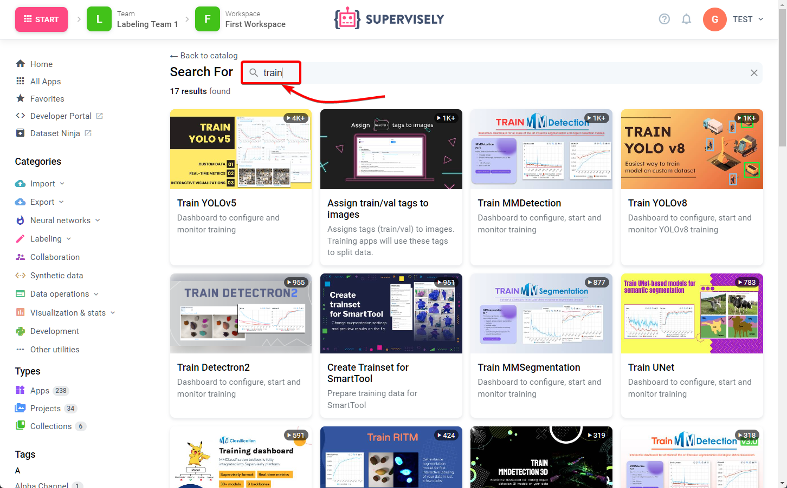
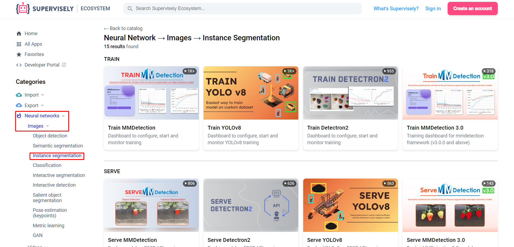

#  How to train models


This 5-minute tutorial is a part of introduction to Supervisely series. You can complete them one-by-one, in random order, or jump to the rest of the documentation at any moment.

- [How to import](How-to-import.md)
- [How to annotate](How-to-annotate.md)
- [How to invite team members](Invite-member.md)
- [How to connect agents](connect-your-computer/README.md)
- How to train models **(you are here)**




If you are interested in learning more about the process of training models, then you need [this section](../neural-networks/custom-nn/custom-nn.md).


After [adding team members](Invite-member.md), you can start solving your problem. But sometimes ready-made neural network models cannot meet your tasks, so let's learn how to train models!

Be in Supervisely and click the "Start" button. Select "[Ecosystem](https://ecosystem.supervisely.com/)" - you will see a list of all our applications.

Type "train" in the search bar and you will see most of our applications related to model training.

You can also select the items you need in the left menu in the neural networks section and see a list of applications in which you will find applications for training

It is worth noting that for any training application you need to have a dataset with labeled training data. You can mark up the data in our [labeling tool box](https://ecosystem.supervisely.com/annotation_tools/image-labeling-tool-v2) completely manually or using corrections after the models work.

Choose the appropriate application depending on which neural network model you are interested in.

By logging into any of these applications, you will see a description and guide on how to use this application. Strictly follow the instructions inside the application you choose and you will be able to train the neural network model of your choice.

We also have video guides or detailed posts on using some learning apps.

- [No-code tutorial: train and predict YOLOv8 on custom data](https://supervisely.com/blog/train-yolov8-on-custom-data-no-code/)
- [Train YOLO v5 in Supervisely](https://www.youtube.com/watch?v=e47rWdgK-_M&t=54s&ab_channel=Supervisely)
- [How to train MMDetection models](https://www.youtube.com/watch?v=aYVutH46-Y4&ab_channel=Supervisely)

Also, you can check the main section of the documentation on neural networks:
 

