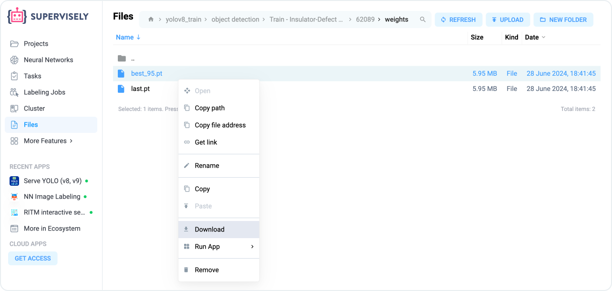

# How to train models


This 5-minute tutorial is a part of introduction to Supervisely series. You can complete them one-by-one, in random order, or jump to the rest of the documentation at any moment.

* [How to import](How-to-import.md)
* [How to annotate](How-to-annotate.md)
* [How to invite team members](Invite-member.md)
* [How to connect agents](connect-your-computer/)
* How to train models **(you are here)**



To learn more about training a model on your custom data and pre-labeling (getting predictions from) your images with the trained models, [watch this video tutorial](https://youtu.be/Rsr8xWJ6s9I?si=6PudzCqY1C-lMcWa).


We will provide a step-by-step guide for training a custom model, using[ YOLO (v8, v9)](https://ecosystem.supervisely.com/apps/yolov8/train) as an example. Supervisely offers a no-code solution for training, deploying and predicting with [YOLO (v8, v9)](https://ecosystem.supervisely.com/apps/yolov8/train) models directly in your web browser, leveraging user-friendly interfaces and integrated tools.

## Step 1. Prepare training data

You have several options for preparing your training data:

* [Upload](How-to-import.md) your images, [label](How-to-annotate.md) them, and then train a custom neural network model.


We recommend starting experiments with several hundred images. Continuously improve your object detection neural network by adding new images, especially those where the model's accuracy is lower.


* Import your [existing training dataset](https://ecosystem.supervisely.com/import) (such as [COCO](https://ecosystem.supervisely.com/apps/import-coco) and [YOLOv5](https://ecosystem.supervisely.com/apps/convert-yolov5-to-supervisely-format)) and try to build neural network model directly on your custom data.
* Pick [ready-to-use data](../data-organization/import/import/Import-sample-dataset.md) we prepared for you and reproduce this tutorial from start to end.

## Step 2. Deploy an agent

Before you start training or running neural networks, you need to connect your PC or a cloud server with a GPU to Supervisely by running a simple command in your terminal. This connection allows you to train neural networks and run inference directly from the Supervisely web interface. You can find detailed instructions on how to do this [here](connect-your-computer/).


Ensure no network configuration is needed, and the connection is secure and private.




## Step 3. Train a model

1. Open the training app from your labeled data project, click the `[⫶]` button → **Neural Networks** → YOLO → [Train YOLO (v8, v9)](https://ecosystem.supervisely.com/apps/yolov8/train).

<figure><figcaption><p>How to run the YOLOv8 training App from your custom training dataset</p></figcaption></figure>

2. Follow the wizard to configure the main training settings, similar to those allowed by the original repository. You can:

* Choose all or a subset of classes for training.
* Define training and validation splits.
* Select one of the available model architectures.
* Configure training hyperparameters, including augmentations.

3. Press the `Train` button and monitor logs, charts and visualizations in real-time.

<figure><figcaption></figcaption></figure>

4. The training process generates artifacts, including model weights (checkpoints), logs, charts, additional visualizations of training batches, predictions on validation data, precision-recall curves, confusion matrices and so on. These artifacts will be automatically saved to your **Team Files**.

<figure><figcaption></figcaption></figure>

## Step 4. Deploy a trained model

Once the model is trained, you probably want to try it on your data and evaluate its performance.

1. Use the [Serve YOLO (v8, v9)](https://ecosystem.supervisely.com/apps/yolov8/serve) app to deploy your model as a REST API service so it can receive images and return predictions in response.
2. Provide the checkpoint (model weights file in `.pt` format) and follow the app's instructions.

<figure><figcaption></figcaption></figure>


In Supervisely you can quickly deploy custom or pretrained neural network models weights on your GPU using the [Serve Supervisely Applications](https://app.supervisely.com/nn/apps) in just a few clicks.


## Step 5. Get predictions

#### Option 1. Integrate model in Labeling Interface

Use the [NN Image Labeling ](https://ecosystem.supervisely.com/apps/nn-image-labeling/annotation-tool)app to apply your model to images or regions of interest during annotation, configure inference settings like confidence thresholds or select all or several model classes.

This approach gives you the ability to automatically pre-label images and then just manually correct model mistakes

<figure><figcaption></figcaption></figure>

#### **Option 2. Apply model to all images at once**

Use the [Apply NN to Images Project](https://ecosystem.supervisely.com/apps/nn-image-labeling/project-dataset) app to pre-label all images in a project. Follow the wizard to configure settings and run batch inference (connect to the model, select model classes, configure inference settings, and preview predictions).&#x20;

The app will iterate over all images in your project, apply your model in a batch manner, and save all predicted labels to a new project.

<figure><figcaption><p>Apply the custom model to all images in your project in a few clicks</p></figcaption></figure>

## Step 6. Export weights

The trained model can be easily exported and used outside the platform. Go to the directory with training artifacts in your **Team Files** and download the model weights in PyTorch (`.pt`) format for external use.&#x20;

<figure><figcaption><p>Just download the trained model and use it outside the Supevisley platform</p></figcaption></figure>

Now you can follow the [YOLOv8 documentation](https://docs.ultralytics.com/modes/predict/) to get predictions on images.&#x20;

Here is a Python example of inference:

```python
from ultralytics import YOLO

# Load your model
model = YOLO("my_checkpoint.pt")

# Predict on an image
results = model("/a/b/c/my_image.jpg") 

# Process results list
for result in results:
    boxes = result.boxes  # Boxes object for bbox outputs
    masks = result.masks  # Masks object for segmentation masks outputs
    keypoints = result.keypoints  # Keypoints object for pose outputs
    
```

You can check the main section of the documentation on neural networks:


[overview.md](../neural-networks/overview.md)

