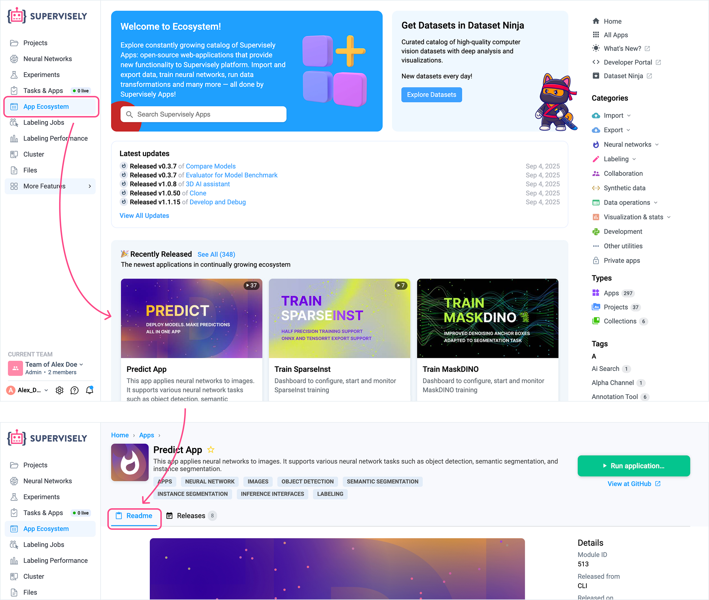

# 🎧 Support

Whether you're using our Community Edition or Enterprise Edition, this page is your starting point for getting help, and resolving issues quickly. If you need immediate assistance, please reach out to our support team.\
**Email:** support@supervisely.com\
**Community Edition Slack:** [Join here](https://supervisely.com/slack)\
**Enterprise Edition Slack:** for our Enterprise customers, we typically set up a private Slack channel for faster, real-time support. If you're an Enterprise user and not yet a member of your dedicated Slack channel, just let us know and we’ll get you added right away.

## Community Edition or Enterprise Edition?

Not sure what edition you're using? No worries—we’ve got you covered.

* If you open Supervisely at `https://app.supervisely.com`, you're using the **Community Edition**.
* If you're accessing it through any other address, you're on the **Enterprise Edition**.

Enterprise users receive **high-priority support**—you can reach out to us directly, and we’ll do our best to resolve your issue as soon as possible.\
If you're contacting us from a personal email address, please mention that you're an Enterprise user to help us prioritize your request.

### Cloud-hosted Enterprise Instances

If your Supervisely server address ends with `enterprise.supervisely.com`, you're using an **Enterprise instance hosted in our Cloud**.\
This means the Supervisely team is actively managing the server, including updates, backups, maintenance, logs, and troubleshooting. You **do not need to collect or send a troubleshooting archive**, just contact us directly, and we’ll take it from there.

## I Have an Issue

If something’s not working as expected in Supervisely, let’s first narrow down what kind of issue you're facing:

1. You're having [trouble with an app from the Supervisely Ecosystem](support.md#issues-with-applications) (or a custom app).
2. You see an [error message in the UI outside](support.md#issues-with-the-platform) of the app (e.g. "Something went wrong").

<figure><figcaption></figcaption></figure>

3. The platform isn’t throwing errors, but it feels [slow or laggy](support.md#slow-performance).
4. Things technically work, but the [behavior seems off or unexpected](support.md#unexpected-behavior).
5. You're running into a technical issue with the [API or SDK](support.md#python-sdk-or-api-issues).
6. You're an Enterprise technical engineer and need [help with deployment](support.md#deployment-issues).

Once you’ve identified the type of issue, scroll down to find the best way to get support.

### Issues with Applications

If you're having trouble with an app from the Supervisely Ecosystem (or a custom app), here are some steps you can take:

1. Check the app's README section and ensure that you followed all setup instructions.

<figure><figcaption></figcaption></figure>

2. If there are some specific error messages while running the app, please download its logs and share it with our support team.

#### How to download application logs?

1. Open the `Tasks & Apps` section in the left sidebar.
2. Check if the needed session is in the `Tasks` tab.

<figure><figcaption></figcaption></figure>

3. Click on the three dots icon and select the `Logs` option.

<figure><figcaption></figcaption></figure>

4. In the opened window, click the `Download Logs` button.

<figure><figcaption></figcaption></figure>

If you didn’t find anything in the **Tasks tab**, then go to the **Apps tab**:

1. Open the `Apps` tab, find the needed application and click on the button under it. Then simply click on the `Open error log`.

<figure><figcaption></figcaption></figure>

2. Click on the `Download Logs` button.

<figure><figcaption></figcaption></figure>

Now, when you downloaded the logs, please share them with our support team for further assistance.

#### Changing the log level of application

In some cases, we'll need additional logs to diagnose the issue. You can change the log level in two ways:

**Option A** — Start a new app session with a different log level

1. Launch the application and click on the `Advanced settings` option.
2. Set the `Log Level` to `Debug` or `Trace` to capture more detailed logs.
3. Start the application.

<figure><figcaption></figcaption></figure>

**Option B** — Re-run the same session with a different log level

1. Open `Tasks & Apps` and find the previous session.
2. Click `Run Again`.
3. In the relaunch dialog, open `Advanced settings` and set the `Log Level` to `Debug` or `Trace`.
4. Start the application.

<figure><figcaption></figcaption></figure>

**What happens next**

* If the app runs with saved inputs, it will automatically repeat the same scenario with the new log level.
* If it does not, it will start with the same parameters as last time and be ready for work.

Now, use the application to reproduce the issue. When finished, please [download the logs](support.md#how-to-download-application-logs) and share them with our support team.

### Issues with the platform

If you encounter an error in the graphical user interface while not using any specific application:

* **Community Edition**: Please contact our support team with a description of the issue.
* **Enterprise Edition**: Before reaching out, if you're not using [Cloud-hosted Enterprise Instance](support.md#cloud-hosted-enterprise-instances), and the [Remote Logs](support.md#enabling-remote-logs) feature is not enabled, please [generate a troubleshoot archive](https://docs.supervisely.com/enterprise-edition/advanced-tuning/generating_ts_archive) and share it with our support team. This helps us resolve your issue faster.

#### Enabling Remote Logs

When something goes wrong, the fastest way for our team to help is by seeing what the system sees.\
Remote logs allow Enterprise customers to securely send system-level logs to the Supervisely team in real time—so we can diagnose and resolve issues without needing a manual troubleshooting archive.

To enable remote log forwarding, run:

```bash
sudo supervisely enable-remote-logs
```

To disable it at any time, use:

```bash
sudo supervisely disable-remote-logs
```

**What's sent? Only error-level system logs.**

Remote logging transmits **only error-level system logs** that are non-sensitive and necessary for technical troubleshooting, such as error traces, service failures, and critical system diagnostics. It does **not include any personal data, customer content, project files, credentials, or identifiable information**.

We take customer privacy seriously. Remote logs are strictly limited to error-level entries required for technical troubleshooting and are handled securely by the Supervisely team. This ensures faster support without compromising your data integrity or confidentiality.

### Slow performance

If you notice that the platform is running slowly, and you're using the Community version of Supervisely, perform a [speed test](https://docs.supervisely.com/enterprise-edition/advanced-tuning/speed_test) and contact our support team with the results.

For Enterprise version of Supervisely, please do the following:

1. Open any Labeling Toolbox (such as Image Labeling Toolbox).
2. Find the Troubleshoot button on the bottom right corner and click it.

<figure><figcaption></figcaption></figure>

3. Perform the Troubleshoot test, save the results (text or screenshot) and share them with our support team.

<figure><figcaption></figcaption></figure>

#### Performing a speed test

If you are using the Community Edition of Supervisely, you can perform a speed test to check your connection to our servers. You can use any online speed test tool, such as [Speedtest.net](https://www.speedtest.net/), and share the results with our support team.\
Note, that the speed test should be performed to specific location that matches the region of the Supervisely instance. For example, for the Community Edition, use a server located in Germany (Falkenstein).

### Unexpected behavior

If you don't see any errors, but it looks like that something is not working as expected, please try the following steps:

1. Ensure that you're using latest version of Chromium-based browser (Google Chrome, Microsoft Edge, etc.).
2. Try the same in the incognito mode with all the extensions disabled.
3. Clear your browser cache and cookies.
4. Try using a different browser or device.

If it did not help, check for errors in the browser's Developer Console by following these steps:

#### Step 1: Open Developer Console

1. Right-click on the page and select "Inspect" (or press Ctrl+Shift+I) to open the Developer Console.

#### Step 2: Check Console Tab for Errors

1. Go to the "Console" tab.
2. Look for any error messages (usually displayed in red).
3. Take a screenshot of any errors you find.

#### Step 3: Check Network Tab for Failed Requests

1. Switch to the "Network" tab in the developer tools.
2. Check the "Disable cache" option (usually located at the top of the Network tab).
3. Clear the current log by clicking the clear button (🚫 icon).
4. Reload the page (press F5 or Ctrl+R).
5. Apply the "Fetch/XHR" filter to show only API requests.
6. Look for any entries marked in red or with error status codes (4xx, 5xx).
7. Click on each failed request to see details.
8. Copy the response content (in JSON format if available) and take screenshots.

#### What to Share with Us

When contacting our team, please include:

* Screenshots from both Console and Network tabs showing any errors
* JSON responses from failed network requests
* A detailed description of the steps that led to the issue
* Screen recording of the issue (if possible)

This information will help us analyze the exact network behavior and pinpoint any failed requests.

### Python SDK or API issues

If you're using our Python SDK or the API directly and encounter an issue, please follow these steps:

1. Ensure you are using the version of SDK that corresponds to your Supervisely instance. You can check the compatibility table [here](https://developer.supervisely.com/getting-started/installation#compatibility-table).
2. Check out the [SDK Reference](https://supervisely.readthedocs.io/en/latest/sdk_packages.html) to make sure you are using the correct methods and parameters.
3. If you're using the API directly check out the following documentation:\
   [Community version API documentation](https://api.docs.supervisely.com/)\
   For Enterprise version, the link to the documentation is: `<your-enterprise-domain>/api-docs/`

After checks, if you still encounter issues, please contact our support team with a detailed description of the problem. We also appreciate if you could provide any relevant logs, error messages or code snippets to help us assist you better.

### Deployment issues

First of all, check out the Enterprise documentation:

* [Installation and post-installation](https://docs.supervisely.com/enterprise-edition/get-supervisely)
* [Advanced tuning](https://docs.supervisely.com/enterprise-edition/advanced-tuning)

If you did not find a solution in the documentation, please contact our support team, and we will do our best to assist you.
