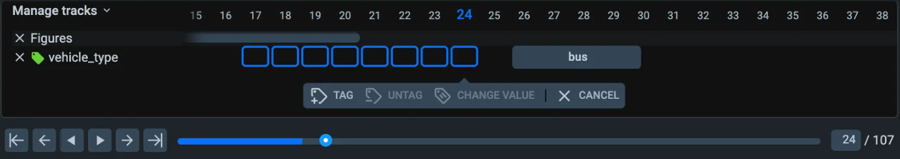

# MULTI-FRAME 3D POINT CLOUDS
## Putting time in perspective
In many task such as autonomous cars localization and mapping (SLAM) and lane detection you have to label not just a single point cloud, but a series of clouds, called episodes. Supervisely provides labeling toolbox specially designed for such a case.

## **Point cloud episodes**
Just like as specially designed [video labeling toolbox](https://supervisely.com/labeling-toolbox/videos/) is remarkably more performant than annotation of separate frames in [image toolbox](https://supervisely.com/labeling-toolbox/images/), specially designed 3D episodes toolbox is surpassingly more excellent in every aspect from playback speed to tracking performance.

## **Timeline panel is your multi-purpose navigation guide**
It’s easy to get frustrated with hundreds of clouds and objects labeled.

Episode timeline panel provides overall structure, answers questions like what is already labeled and simplifies editing tag segments and tracked objects.

https://supervisely.com/blog/3d-object-interpolation-in-point-clouds/.


You can find more information 
[(here)](https://supervisely.com/labeling-toolbox/3d-lidar-sensor-fusion/#episodes)
or in the [blog](https://supervisely.com/blog/3d-object-interpolation-in-point-clouds/)
