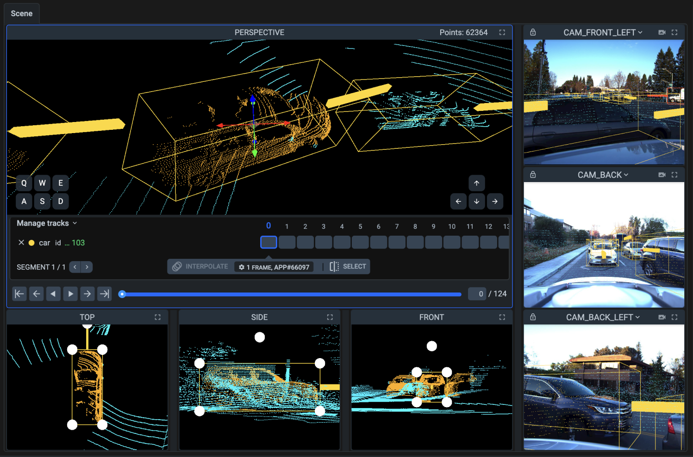

# 3D Point Cloud and Episodes (legacy)

**Difference between 3D Point Cloud and 3D Point Cloud Episodes**

* **3D Point Cloud**: A static representation of a scene captured at a single moment in time.
* **3D Point Cloud Episodes**: A dynamic representation consisting of multiple point clouds collected over time, enabling the analysis of movement and change in the scene.

The **3D Point Cloud Episodes** labeling tool is designed to visualize, annotate, and manage point clouds, providing capabilities for processing and interacting with 3D data obtained from various sensors such as LiDAR and RADAR. This tool is widely used for segmentation and object detection tasks in various 3D scenes. The tool manages large volumes of data, organizing it into a series of episodes and allowing for the annotation of objects within these frames. It supports frame management through episodes, making it particularly suitable for processing data with sequential timestamps (e.g., for autonomous vehicles). 3D Annotation tool integrates additional visual context (photos and videos) and employs AI for object tracking and point cloud segmentation.

Just like as specially designed [video labeling toolbox](../videos/) is remarkably more performant than annotation of separate frames in [image toolbox](../images/), specially designed 3D episodes toolbox is surpassingly more excellent in every aspect from playback speed to tracking performance.

* **.pcd (Point Cloud Data)**: The primary file format for loading and annotating.

<figure><figcaption></figcaption></figure>

1. **Home button** - returns user to the main menu (Projects page)
2. [Basic interface elements](3D-Point-Clouds-episodes-1.md#basic-interface-elements) - basic settings, such as history of operations, theme, a hotkeys map and more useful features.
3. [Main scene & playback](3D-Point-Clouds-episodes-1.md#main-scene-and-playback) - annotation area for current point cloud episodes and its labels.
4. [Timeline and track controls](3D-Point-Clouds-episodes-1.md#timeline-and-track-controls) -  video timeline and controls for managing tracks and frames.
5. [Instruments panel](3D-Point-Clouds-episodes-1.md#instruments-panel) - annotation tools used to create annotations.
6. [Objects & Settings panel](3D-Point-Clouds-episodes-1.md#objects-panel) - list of figures on the current pcd with additional information like classes, tags, and visualization and other settings.

***

## Basic interface elements

The top toolbar contains options for personalizing the interface and managing data and its annotations.

**Data navigation arrows (next, previous):** Allow users to move between pcd in the dataset.&#x20;

**Undo and redo buttons:** Undo or redo the most recent annotation action.

**Hotkeys:** A list of hotkeys for quick access to tools.

**More options:**&#x20;

* **Enter fullscreen** - this option allows the user to switch the interface to fullscreen mode, maximizing the workspace area. It hides browser toolbars and other elements
* **Screenshot** - the screenshot function enables users to take a snapshot of the current workspace, including the image and any annotations displayed. This can be useful for documentation, sharing progress, or reviewing annotations with team members.
* **Restore default layout** - this function resets the interface layout to its default configuration. It is useful when the layout has been modified (e.g., panels moved or resized) and the user wants to return to the original setup.&#x20;

***

## Main scene & playback

Main scene shows the point cloud episodes currently being worked on. Users can interact directly with this area using the annotation tools from the sidebar.

This interface for annotating 3D point clouds is designed for precise labeling of objects in a 3D environment. Each part of the scene serves a specific role, helping the user accurately annotate objects. Here’s a detailed breakdown of what’s on the screen and how the different components interact:

<figure><figcaption></figcaption></figure>

### Main Scene

This is the **main 3D window**, where users interact with the point cloud. It provides a **three-dimensional representation** of the environment captured by lidar sensors, containing millions of points representing real-world objects like vehicles, roads, and buildings.

* **Point Cloud**: A dense collection of points, each corresponding to a specific coordinate in space. These points represent real objects scanned by lidar sensors (in this case, from the LYFT dataset).
* **Cuboids**: These are 3D rectangular boxes drawn around objects within the point cloud. In this example, a car is outlined with a cuboid. These boxes are used to define the boundaries of objects, which are critical for subsequent object detection and classification tasks.
* **Navigation and Manipulation**:
  * In the top-right corner of this window, there’s an indicator for the total number of points in the scene (62,364 in this case).
  * The cuboids have **coordinate axes (X, Y, Z)** - colored arrows (blue, red, and green) to help users orient objects in space and adjust the annotations precisely.
  * Users can navigate through the scene using the "Q, W, E, A, S, D" keys for camera movement, and the arrow keys for rotating the camera. This allows for a better understanding of the scene geometry.

### **Playback controls**

**Play/Pause buttons(ENTER)**: Standard playback controls to play or pause the video.

**Play video backwards:** Plays the video from the current frame backwards, i.e. from the current frame to the previous frame, and so on to the beginning of the video.

**Previous/Next frame (<- | ->):** Buttons to jump to the previous or next frame.

**Previous/Next 10 frame** **(ALT + <- | ALT + ->):** Buttons to jump to the previous or next 10 frame.

**Frame counter**: Shows the current frame number, total number of frames. For example, `122 / 384` means you are at frame 122 out of 384 total frames.

**Track length slider**: Allows you to quickly scroll through the video frames by dragging the slider left or right. Annotated segments of the video are displayed by blue color line.

## Sensor-fusion

**Sensor-fusion** with added photo and video context integrates data from multiple sensors such as LiDAR, RADAR, cameras, and environmental sensors, combining complementary information to improve overall scene recognition and analysis. Supervisely automatically calculates correlation between 3D space and 2D context and projects your labeled objects on it. Combine point clouds with visual camera data to ensure you've correctly classified every object.

### Camera Views (Right side)

These are **camera windows** displaying images from real-world camera setups. In this example, there are three camera views:

1. **CAM\_FRONT\_LEFT** - showing the front-left view from the camera.
2. **CAM\_BACK** - showing the rear view from the camera.
3. **CAM\_BACK\_LEFT** - showing the back-left view.

These camera views work in sync with the main point cloud window, providing **additional visual information** about the scene. Users can:

* **Cross-check the point cloud with real images** to ensure annotations are accurate.
* **Refine object boundaries** by comparing them with the actual scene from multiple angles.

Each camera window has small control icons, such as a **lock (to freeze the view)** or **maximize arrow**, which allow users to manage how the camera views are displayed.

### 3D Scene Projections (Bottom side)

These are views that show the annotated objects from different angles:

1. **TOP View** - displays the object (e.g., a car) from above. This is useful for aligning object boundaries on the horizontal plane.
2. **SIDE View** - shows the side view of the object, useful for adjusting height.
3. **FRONT View** - provides a front-facing view, helping to place and refine the cuboid's dimensions.

These windows allow for **precise manipulation of cuboids** on all axes (X, Y, Z). Each window shows the object as a set of points, with white circles representing the cuboid’s corners that users can drag to adjust the size and position.

### How All Windows Interact:

**The central 3D window and projection views** (TOP, SIDE, FRONT) work together to provide the most accurate representation of objects. Users can switch perspectives at any time to adjust the cuboid dimensions precisely.

**Camera views** provide additional visual context from the real-world environment, synchronized with the point cloud, to ensure that annotations are as accurate as possible.

**The object list and track panel** interact with the central window, showing all the annotated objects and allowing users to edit their attributes or monitor their movement across multiple frames.

***

## **Timeline** and track controls

It’s easy to get frustrated with hundreds of clouds and objects labeled.

Episode timeline panel provides overall structure, answers questions like what is already labeled and simplifies editing tag segments and tracked objects.&#x20;

### **Timeline**

It's a linear scale that visually displays the sequence of video frames and associated annotations. It allows users to manage annotation processes, object tracking, and other labeling tasks. The timeline contains various tracks which display data related to objects and tags.

**Time scale:** A horizontal ruler that shows all video frames. Each frame is numbered, making it easy to locate specific points in time. The frame-level timeline provides more detailed control and visualization of the video on a frame-by-frame basis.&#x20;

The manually labeled frames are shown in gray, the frames that were automatically tracked are striped, the current frame is in a blue frame

**Frame segments:** Labeled objects and tags are shown as segments on the timeline. For example, tracks for objects or tags show the start and end points of their presence in the video.

**Track information display**: Displays the current segment of the video you are managing (e.g., "SEGMENT 1 / 2") and allows you to navigate between segments.

* Play segment: **SHIFT + ENTER**
* Previous segment: **SHIFT + <-**
* Next segment: **SHIFT + ->**

### Interpolate

**Interpolate button (SHIFT + T):** Interpolate between 2 or more figures in the selection.

The interpolation process is started manually and performed automatically. The system analyzes the selected object in the selected area between frames and starts interpolating its motion and changes as the video plays.

**Interpolation progress bar:** A progress bar appears in the interface that shows how many percent of interpolation has already been done.

The interpolation percentage will be updated in real time as the operation progresses, and the bar will gradually fill up to reflect the progress.&#x20;

When the progress bar reaches 100%, it means that the interpolation process has been successfully completed. The object has been tracked on all selected frames.&#x20;

After interpolation is complete, the user can track the object if no errors are detected, or edit some frames and re-track them.

**Stop interpolation (SHIFT+S)**: The system stops interpolation the selected object in the frame. Already created figures will remain.

### **Track settings**

**Algorithm:** Choose the object intepolating algorithm. For example, "3D BBox Interpolation" application is used to interpolate the motion of selected objects.

The predefined **Clone** command creates a duplicate (or clone) of the selected shape, object, or annotation. This clone will have the same parameters as the original, including size, position, shape, and any associated data (such as tags or metadata).

**Working with clones:**

A clone can be created in the same frame as the original shape, or moved to another frame to keep identical settings in different parts of the video. Once a clone is created, you can modify it independently of the original, or use it as a template to create other objects with the same settings.

**Direction:** Defines the direction of tracking, such as "Forward"/"Backward".

**Overwrite figures:** Auto-generated objects will be override.

**Frames:** Defines the number of frames to be processed during tracking (e.g., +/- 10 frames).

## Instruments Panel

**Pan & Move Scene Tool:** Quickly navigate around the image without modifying annotations.

**Select Figure**: Select and modify existing annotations; essential for refining objects.

### Cuboid

The **Cuboid** tool is fundamental for creating 3D bounding boxes around objects in the point cloud. Here's how to use it and its key subtools:

**Cuboid creation**: To create a new cuboid, select the tool, and define the box around the target object in the point cloud. The cuboid will encapsulate the object, and you can adjust its dimensions.

**Editing cuboid**: After placing a cuboid, you can resize or reposition it using the white corner points visible in different projection views (TOP, SIDE, FRONT). This allows for precise control over the bounding box dimensions and position.

**Roll, pitch, and yaw angle control:** Users can set precise roll, pitch, and yaw angles, allowing for annotation of objects with high precision and alignment.

**Automatic frustum culling:** The automatic frustum culling feature highlights the actual object of interest by hiding unnecessary points that may interfere with annotation.&#x20;

**Annotation of objects on slopes:** Cuboid tool provides advantages for annotating objects on inclined surfaces, ensuring reliability even in challenging conditions.

**Rotation of cuboids on all three axes:** The tool allows for the rotation of cuboids on all three axes, providing maximum freedom and control during the annotation process.

#### **Cuboid Subtools:**

**Toggle Planes**: The toggle planes function allows users to switch the display of planes, which represent various sections and surfaces in three-dimensional space. This enables the user to better understand spatial relationships between objects and their surroundings, as well as simplifies the annotation process by providing additional contextual information about the scene.

**Toggle Arrows**: This enables the visibility of **orientation arrows** along the X, Y, and Z axes, which allow users to see and adjust the cuboid’s rotation in space. It’s especially helpful when an object is rotated or angled differently from the standard axes, like a car parked at an angle. By clicking and dragging the arrows, users can adjust the cuboid’s rotation to match the object’s true orientation.&#x20;


**Pay attention to cuboid orientation!**

When using the **Cuboid** tool, it’s crucial to remember that each cuboid has an **orientation guide**. These guides indicate the **directional alignment** of the cuboid in the 3D space.

Failing to align the cuboid correctly can lead to **inaccurate annotations**, which might cause issues during model training or scene interpretation. Always ensure that the cuboid is properly oriented along the object's natural direction, especially for vehicles or objects that have a clear front and rear.


### 3D Smart Tool

The **3D Smart Tool** is an advanced tool for creating and editing 3D annotations faster. It uses machine learning algorithms (e.g **Interactive 3D Detection 2.0 NN model)** to help **automatically detect** and suggest 3D bounding boxes (cuboids) for objects in the scene, leveraging the lidar point cloud data.

The 3D Smart Tool can automatically generate cuboids around detected objects, speeding up the annotation process by reducing manual adjustments. These annotations can be further fine-tuned by the user for precision. For example, if the interactive model detects a vehicle, it can place a cuboid of the appropriate size and orientation.

**3D Smart Tool Subtools:**

**Toggle Planes**: Like the [cuboid tool](3D-Point-Clouds-episodes-1.md#cuboid), this function makes the **bounding planes** of the automatically created cuboids visible. This helps users verify the accuracy of the smart detection and make adjustments if needed.

**Toggle Arrows**: This enables the **axis arrows** for rotating and orienting cuboids generated by the smart tool. If the automatic annotation is slightly off, users can use these arrows to fine-tune the cuboid’s rotation and orientation.

***

## Objects Panel

The **Objects Panel** provides a detailed view of the objects in a 3D annotation scene. Here’s a breakdown of the components and their functionality:

**Objects list**: This section shows the total number of objects currently annotated in the scene. In our case, 32 objects are listed, mostly categorized as **cars**.

**Filter and Sort Options**:

* **Filter** (icon with horizontal lines and filter icon): Filters out objects based on specific criteria such as class, visibility, or presence in the current frame.
* **Sort Alphabetically** (icon with "A-Z"): Sorts the objects list alphabetically or by another order, making it easier to find specific objects.
* **Delete All** (trash can icon): This allows for batch deletion of selected or all objects in the scene.
* **Visibility Toggle** (eye icon): This controls the visibility of all objects in the 3D view. You can hide or show all the objects in the scene.

**Object Details**:

* **Number (44)**: The number represents the number of frames where the object is visible.
* **ID (...099)**: This is the unique ID for the object. It helps in distinguishing between objects of the same class. For example, this particular car has ID `099`.
* **Visibility Indicator**: The number next to the ID shows how many frames the object is currently visible in.

**Subtools for Each Object**

* **Trash**: This deletes the specific object from the scene.
* **Hide**: This toggles the visibility of this specific object in the 3D view.
* **Add/Remove to Merge**: This feature allows you to **add or remove the object from a merge group**. Merging is used when multiple objects should be treated as a single entity. For example, if you incorrectly labeled parts of the same car as different objects, you can merge them into one.

**Figures Section**

This section provides detailed information on the selected object.&#x20;

* **Figures on screen**: This label indicates that there is **X number of figure** visible on the screen for this object and **X number of figures** in total over the entire sequence of frames.
* **Zoom, Remove, Split, Move**: The dropdown next to the figure name provides additional tools:
  * **Zoom**: Zooms into the selected cuboid or object in the 3D view for a closer inspection.
  * **Remove figures after this figure**: Deletes any figures that appear after the current one in the timeline, allowing for refinement of the object’s tracking.
  * **Split object track starting from this frame**: Creates a new object starting from the current frame, splitting the object’s track into two.
  * **Move figure to new object**: Allows this figure to be reassigned to a different object, which is useful if a mistake was made during annotation.

**Tags and Metadata**

Additionally, you can modify metadata and assign or manage tags right from this window, enhancing the object's data with minimal effort.\
**Tags availble:** add project tags definitions and manage project tags (e.g. add, edit or delete).

**Tag Search Bar**: This section allows you to add property tags to the object. Tags can be custom or predefined, helping organize and provide additional metadata for objects.
