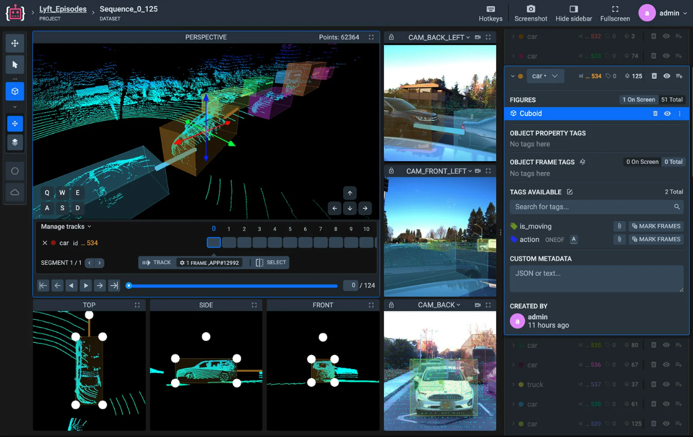
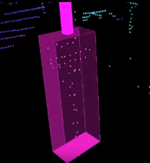

# 3D LABELING TOOLBOX

## **A complete solution for LiDAR annotation**

Label comprehensive 3D scenes from LiDAR or RADAR sensors with additional photo and video context, AI object tracking and point cloud segmentation.

## **Practical tools for point cloud labeling.**
Annotation of point cloud scenes is not an easy task. Inspired by professional software like Blender, Supervisely offers user-friendly instruments to work with thousands of points.

## Point Cloud navigation & annotation
### **3D Object detection and Classification**

Visualization and, especially, labeling of spatial point clouds is not a simple task. Apart from plain and well-understood image labeling, to successfully complete annotation project in 3D space we need to solve three additional challenges and provide:

- User-friendly navigation in three dimensions
- Handy tools for accurate object detection
- Maximum information for correct classification

### **Voyaging the three-dimensional space**
Before you can identify and label an object of interest you need to see it clear from every angle. To let some sunlight into the scene, we have introduced widely known navigation from video games with WASD keyboard controls to move around point cloud and mouse to control the camera angle.

Along with additional viewports with top-side-front perspectives using orthographic projections, it gives accurate representation of what you are dealing with.


You can find more information 
[(here)](https://supervisely.com/labeling-toolbox/3d-lidar-sensor-fusion/)
