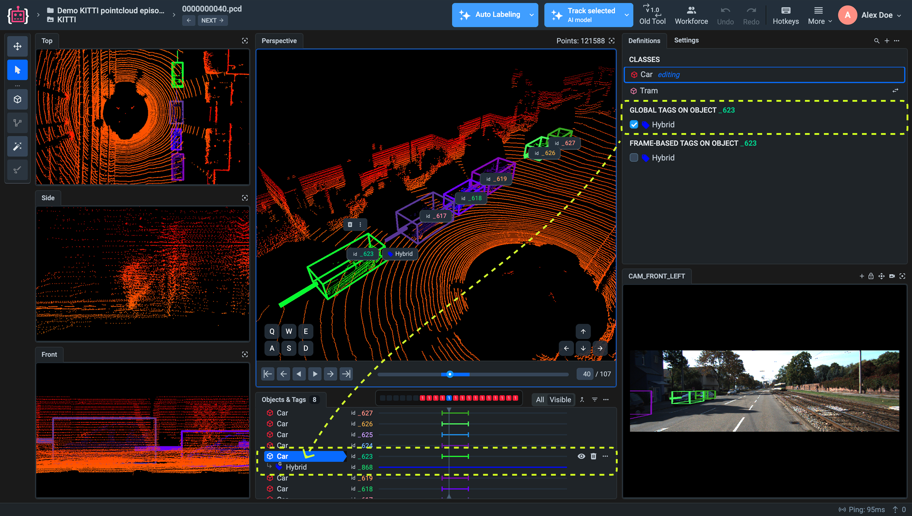

# New 3D Point Cloud and Episodes Labeling Tool

The 3D Point Cloud labeling tool in Supervisely is designed for visualizing, annotating, and managing complex 3D data collected from sensors such as LiDAR and RADAR. It supports key tasks like object detection and segmentation across static scenes and sequential episodes, making it ideal for applications like autonomous driving.

The latest version introduces a completely redesigned interface that unifies both **single-frame** and **episode-based** workflows. It brings a more streamlined and powerful experience with features such as:

- **AI-assisted tools** for faster and more accurate labeling
- **Auto Labeling with Cuboid Tool**
- Interactive **3D Object Detection**
- 3D Point Cloud **Ground Segmentation**
- **Cuboid Tracking**
- **Synchronized 2D–3D annotation** using photo context images  
- **Timeline navigation** for working with sequential frames  
- **Flexible, resizable UI layout** tailored to your workflow
- **Definitions Panel** for convenient class management and quick object editing
- **Advanced settings** for customizing visual styles and display preferences  

Together, these enhancements provide an integrated and efficient workspace for working with large-scale 3D datasets.

Difference between 3D Point Cloud and 3D Point Cloud Episodes:

**3D Point Cloud**: A static representation of a scene captured at a single moment in time.

**3D Point Cloud Episodes**: A dynamic representation consisting of multiple point clouds collected over time, enabling the analysis of movement and change in the scene.

## 3D AI Assistant

Supervisely's 3D AI assistant is a universal tool for automating 3D point cloud labeling. It covers all types of labeling scenarios for 3D point clouds: 3D object detection, ground segmentation, 3D cuboid tracking, transfer of 2D annotations from photo context images to original 3D point clouds. This tool is class-agnostic - it means that it works with any type of objects regardless of their shape and point density.

### Automatic cuboid adjustment

- Automatically adjusts manually created cuboids.

**To use the Auto Labeling, follow these steps:**

1. Open the **Auto Labeling tab**. Toggle the **_Highlight object by click_** option to enable it.

2. Make sure a Point Cloud view panel is active or click on one of the 3D view panels to activate it (Top, Side, Front, Perspective).

3. Select the **Cuboid tool** from the toolbar or press the `3` key on your keyboard to activate the Cuboid tool.

4. Click on a target object in the 3D scene.

5. Let the AI assistant adjust the cuboid for selected object.

- The Auto Labeling tool will detect the full object in the point cloud and fit a cuboid around it using its internal logic.
- This minimizes manual adjustment and ensures accurate object boundaries.

6. Continue labeling more objects.

- The labeled object will now be **selected automatically**.
- The **Select Figure tool** becomes active by default, while the Cuboid auto-labeling tool remains enabled in the background.
- To label the next object, press `Space` to deselect the current object — the **Cuboid tool reattaches** to your cursor and you’re ready to click on the next group of points.

This loop allows for rapid labeling of multiple objects in sequence with minimal effort.



### Interactive 3D Object Detection with Smart Tool

Nowadays interactive data labeling approach is getting more and more recognition. Inspired by success of Meta's Segment Anything Model - interactive model for labeling of images, we decided to develop interactive model for labeling of 3D point clouds. 3D AI assistant proposes simple method of interaction with user: user circles the object - model predicts 3D bounding box for the circled area. Unlike many other 3D object detection models, 3D AI assistant does not require any finetuning in order to perform well on unseen data - it can detect any objects in any environment.

Select **Smart tool** in left side bar and circle target object. It will automatically generate a 3D cuboid around the selected object.



### 3D Point Cloud Ground Segmentation

Ground segmentation is one of the most important parts of 3D environments perception. 3D AI assistant allows to do it in fast and convenient way.

- Detects and annotates the ground level in the 3D scene.
- Fits a horizontal surface through point clusters and creates a flat figure with a `ground` class.
- Useful for scene normalization and filtering.

Click on auto labeling tab and press "Ground segmentation".



3D AI assistant proposes several ground segmentation algorithms: Patchwork++, GndNet, quantile filtering, ground plane fitting, grid-based slope filtering - user can select the one which fits current dataset best.

In order to find out which ground segmentation algorithm fits user's data best, user can preview performance of each algorithm in app UI:



[Patchwork++](https://arxiv.org/pdf/2207.11919.pdf) is a self-adaptive, non-learning-based approach for 3D point cloud ground segmentation. Patchwork++ segments ground points in 3D point clouds by dividing the space into concentric square rings and performing progressive plane fitting from the center outward. It improves upon the original Patchwork by introducing adaptive plane modeling and better handling of non-flat terrain using a hierarchical spatial partitioning and local elevation statistics. Patchwork++ also includes mechanisms to handle sparse or occluded regions and improves computational efficiency, making it suitable for real-time applications in autonomous driving and robotics.

[GndNet](https://inria.hal.science/hal-02927350/document) is a neural network architecture for ground plane estimation which was trained on Semantic KITTI dataset. GndNet firstly performs input point cloud discretization into 2D grid, then converts point cloud into a sparse pseudo-image via pillar encoding feature network and finally processes this pseudo-image via 2D convolutional Encoder-Decoder network and generates high-level representation of the ground elevation per cell.

[Ground plane fitting](https://www.researchgate.net/publication/318325507_Fast_Segmentation_of_3D_Point_Clouds_A_Paradigm_on_LiDAR_Data_for_Autonomous_Vehicle_Applications) divides input points cloud into several segments and detects ground points in each of these segments. To find ground points in each segment, ground plane fitting extracts sets of points with low z coordinate values and then uses these points to estimate the initial plane model of the ground surface. For each point in specific point cloud segment, the distance from the point to its orthogonal projection on the candidate plane is computed. This distance is compared to a user defined threshold, which decides whether the point belongs to the ground surface or not. The points which were selected as belonging to the ground are then used as seeds for the refined estimation of a new plane model. This iteration repeats several times. On the final step ground points detected on each segment of input point cloud are concatenated into entire ground plane.

Quantile filtering is a simple algorithm which divides ground points from non-ground points based on probability distribution of their z coordinates (height). Optimal quantile value can be found based on ground segmentation preview.

Grid-based slope filtering divides point cloud space into grid cells, finds lowest point in each cell, computes local slopes and rejects steep points. If approximate ground level is known, adaptive slope threshold can be used to achieve more accurate ground segmentation.

### 3D Point Cloud Pen

The **Point Cloud Pen** is a versatile tool designed for direct point-level editing in 3D space.

You can use it in two main ways:

As an **editing** tool — to add or remove points from an existing point cloud object.



As a **creation** tool — to define and create a new object.



This makes the **Point Cloud Pen** tool especially useful for refining segmentations, fixing noisy detections, or manually annotating small or complex areas within a scene.

### 3D Cuboid Tracking

The **3D Cuboid Tracking** tool allows you to automatically propagate annotations from one frame to the next. You can choose to track:

- A **single selected object**, or  
- **All objects** in the current scene (if no object is selected)

**Steps to use the tool:**

1. **Select the target(s)**
   - To track **one specific object**, simply **select it** in the scene.
   - To track **all annotated objects**, make sure **no object is selected** in the current frame.

2. **Open tracking settings**
   - Click the **arrow icon** on the **`Track All on Screen`** button (if no object is selected),  
     or on the **`Track Selected`** button (if one or more objects are selected).
   - In the settings popup choose how many frames the annotations should be propagated to. Select the **direction**: forward, backward, or both.

3. **Run the tracking**
   - Click the main **`Track All on Screen`** or **`Track Selected`** button to start tracking.
   - The annotation propagation process will be visualized on the **timeline**.
   - The **progress percentage** will be shown on the button itself.
   - When it reaches **100%**, the tracking is complete.



Unlike learning-based approaches, 3D AI assistant focuses on calculating the offset between neighboring point clouds with the help of point cloud registration algorithms, and does not require any additional training for tracking 3D objects on unseen point cloud sequences.

Point cloud registration algorithms are aimed at finding the transformation that aligns a pair of point clouds lying in defferent coordinate systems into a common coordinate system.

Here is how two neighbouring point clouds look like when visuzalied on one scene - you can clearly see a shift between them:



After applying point cloud registration algorithm we can get a transformation matrix and apply this matrix to source point cloud. After transformation of source point cloud shift between source and target point cloud is reduced to minimum:



### 2D to 3D Projection

The photo context panel is now an interactive part of the 3D labeling workspace.

You can annotate context images directly using standard image labeling tools. These annotations are automatically synchronized with the 3D space and become part of the same object instance.
2D and 3D annotations now coexist at the same level — edits or creation in one view are instantly reflected in the other. This improves labeling precision and scene understanding, especially when certain features are more visible in 2D.

The photo context panel is now an interactive part of the 3D labeling workspace.

You can annotate context images directly using standard image labeling tools. These annotations are automatically synchronized with the 3D space and become part of the same object instance.  
2D and 3D annotations now coexist at the same level — edits or creation in one view are instantly reflected in the other. This improves labeling precision and scene understanding, especially when certain features are more visible in 2D.

Let’s walk through how to use each image annotation tool:

- #### **Bounding Box Tool**

    We’ll start with the **Bounding Box Tool**:

    1. **Activate the image window** by clicking directly on a photo context image.

    2. In the **left sidebar**, select the **Bounding Box Tool**.  
    If you don’t have a class created yet for this geometry type, a modal window will open — configure and create a new class, then close the modal.

    3. **Draw a bounding box** around the desired object in the image window.  
    A rectangular shape (2D mask) will appear and be added to the **Definitions panel** and the **timeline**.

    4. Click the **arrow icon** on the **Auto Labeling** button and select  
    **Create 3D Objects from 2D Objects on Camera**.  
    A new **3D cuboid** will be generated based on your 2D annotation, along with a new 3D class linked to the original 2D class.


**Note**: In the tool settings, you can switch between filled or transparent rectangle display styles.



 

- #### **Polygon Tool**

    The Polygon tool works similarly to other image annotation tools that support 2D-to-3D conversion. You can draw a polygon directly on the photo context image, and later convert it into a 3D object using the **Auto Labeling** option.

    As for the tool itself, you can hover over it in the 3D Point Clouds and Episodes labeling interface to see helpful **tooltips**. For example, you might see tips like...

    > _"When working with polygons, you can also create holes inside shapes. To do this, hold `Shift` and click to start a polygon hole. Holes can be edited just like regular polygons. To delete a hole, hover over it and press `Delete`."_

    <figure><figcaption></figcaption></figure>
 

- #### **Brush Tool**

    The Brush tool includes a variety of settings. You can outline the target object on the image using the brush, and then use the Fill tool, which is nested inside the Brush tool.

    <figure><figcaption></figcaption></figure>

    Instead of manually painting the interior, simply click inside the outlined area — the entire enclosed region will be filled automatically.

    <figure><figcaption></figcaption></figure>

    You can also separate a part of an already drawn mask using the Brush tool. To split off a section of the mask, use the **Split Polygon** tool, which is located inside the Brush tool. This allows you to divide a single mask into separate segments directly on the image.
 

- #### **Smart Tool**

    The steps for using the **Smart Tool** are the same as for the Bounding Box tool:

    1. **Activate the image window** by clicking on a photo context image.

    2. In the **left sidebar**, select the **Smart Tool**.  
    If you don’t have a bitmap class created yet, a modal window will open — configure and create a new class of type bitmap, then close the modal.

    3. **Draw the mask** over the desired object using your mouse.  
    The SmartTool will automatically detect the object shape and generate a **bitmap mask**.  
    The new annotation will appear in the **Definitions panel** and on the **timeline**.

    4. Click the **arrow icon** on the **Auto Labeling** button and select  
    **Create 3D Objects from 2D Objects on Camera**.  
    A new **3D cuboid** will be generated in the point cloud based on the 2D bitmap mask, and a corresponding 3D class will be created.



### 3D Point Cloud Geometric Features Analysis

Supervisely also has algorithms for 3D point cloud geometric features analysis (verticality, planarity, linearity, etc). For some domains, a decent prelabeling can be created based on this features. For example, points of poles and building tend to have high verticality scores, while ground points usually have low verticality scores:




**Note**: AI Assistant features are available only to Enterprise customers with the Point Cloud module enabled.


## Timeline Support

A full timeline component has been added, similar to the one used in video annotation tools:

- Enables navigation across sequential 3D point cloud frames (episodes).
- Supports annotation and review of dynamic scenes (episodes) across frame sequences.
- Provides a comprehensive overview of frame availability, object presence, and annotation density.

## Modular and Resizable UI Layout

The new interface allows full layout customization:

- Panels such as photo context, camera views, and definitions can be moved and docked anywhere.
- Users can arrange the workspace to fit their own workflow and screen space.
- This flexibility improves usability and efficiency during annotation.



## Definitions Panel

The **Definitions** panel is now available in the 3D interface, as in image and video tools:

- Provides quick access to classes, tags, tool settings, and object styles.
- Helps manage large taxonomies and maintain consistency across projects.

### Working with Tags

1. To create a new tag, click the **plus icon** next to the Definitions panel in the top-right corner of the screen.  
From the drop-down menu, select **Create Tag**.
2. A modal window will open where you can configure the tag settings.  
Specify the name, possible values, color, and other options, then click **Create**.

<figure><figcaption></figcaption></figure>

In 3D Point Cloud episodes, tags are associated only with individual **objects**.

To apply a tag to an object:

1. Find the object in the **Objects and Tags** panel.
2. Select it by clicking on it.

<figure><figcaption></figcaption></figure>

3. After selecting the object, two tagging options will appear in the Definitions panel:

- **Global Tags on Object** — if enabled, the tag will apply to this object across all frames/episodes where the object exists.
- **Frame Based Tags on Object** — if enabled, the tag will apply only on the currently active frame (the one open in the selected viewport).

<figure><figcaption></figcaption></figure>

These options allow flexible tagging behavior depending on whether the attribute is persistent or specific to a certain moment in time.

**Editing**

To change the class of a selected object:
1. Click _**Select Figure**_ tool.
2. Select the object in any of the view panels.
3. In the **Definition panel**, in the row of the selected class, click the mini-icon with two arrows to change the class.

<figure><figcaption></figcaption></figure>

## Settings Panel

In addition to repositioning view panels, the Settings panel provides advanced customization options — such as adjusting cuboid thickness, customizing class appearance, controlling point cloud display settings, toggling object IDs, and more.

<figure><figcaption></figcaption></figure>

For example, by default, point clouds are displayed with the smallest point size. However, in some cases, increasing the point size can improve visibility and make labeling easier.

You can adjust the point size in the **Settings** panel. Each Viewpoint can have its own individual point size setting, as shown in the illustration below.

<figure><figcaption></figcaption></figure>

## Navigation Behavior

**When the `Move tool` is activated:**

- **All viewports except Perspective**:
  - Move the scene by holding **left or right mouse button**.

- **Perspective viewport**:
  - **Right mouse button** — pan the scene.
  - **Left mouse button** — rotate the scene.
  - **Mouse scroll** — zoom in/out.

Additionally, navigation inside the **Perspective Viewport** is also available using **keyboard shortcuts**, as shown in the illustration below.

<figure><figcaption></figcaption></figure>

**When the `Select tool` is activated:**

- **All viewports except Perspective**:
  - Move the scene only by holding the **right mouse button**.

- **Perspective viewport**:
  - Navigation works **the same** as in **Move tool** mode:
    - **Right mouse button** — pan.
    - **Left mouse button** — rotate.
    - **Mouse scroll** — zoom.

<figure><figcaption></figcaption></figure>

## Hotkeys

To work faster and more efficiently, explore the list of available **hotkeys** in the labeling tool.

Hotkeys let you:
- Quickly switch between tools (like Select, Move, Cuboid, Brush, etc.)
- Speed up editing actions (copy, paste, delete, undo, redo)
- Add and remove tags, change tag values.

Using keyboard shortcuts helps reduce mouse clicks and saves time during large-scale annotation tasks.

You can always view the full list of hotkeys by clicking the **Hotkeys** button in the top-right corner of the tool interface.

<figure><figcaption></figcaption></figure>

## Summary

The updated interface for 3D Point Cloud annotation combines powerful capabilities:

- Integrated 2D and 3D annotation tools
- Time-based navigation and frame control
- Modular UI layout with dockable panels
- Built-in AI Assistant for autolabeling, tracking, and segmentation

It offers a complete workspace for multi-modal annotation with high accuracy and scalability. Whether working with static point clouds or dynamic 3D sequences, the new tool provides clarity, control, and performance required for modern annotation workflows.


**Note**: The [older version of the 3D Point Cloud tool](https://docs.supervisely.com/labeling/labeling-toolbox/3d-point-clouds-episodes-1) remains available under **legacy** status.

- Users can switch back using the **Switch to Legacy Tool** button.
- Legacy version has a static layout and lacks support for definitions, timeline, and 2D–3D synchronization.
- Further development will focus solely on the new interface.
