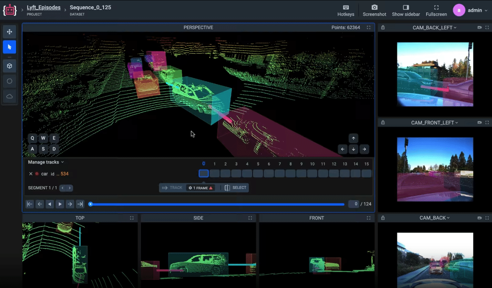
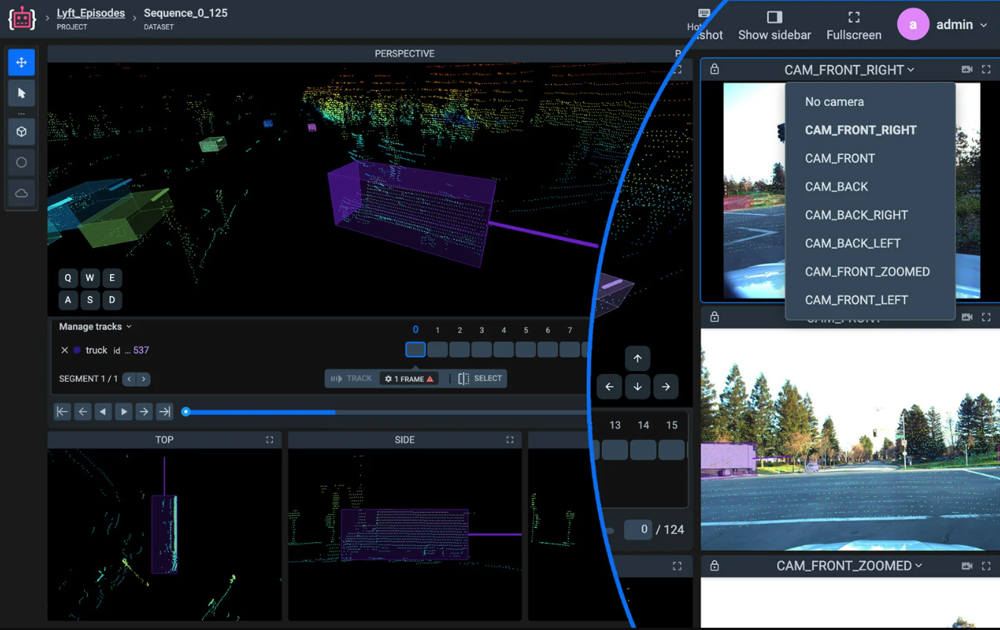

# **Sensor fusion with adding photo & video context**
Provide more information for accurate labeling and identification with photo and video context. Supervisely automatically calculates correlation between 3D space and 2D context and projects your labeled objects on it, letting you achieve unprecedented quality of labeling.


You can find more information 
[(here)](https://supervisely.com/labeling-toolbox/3d-lidar-sensor-fusion/#context) or in the [blog](https://supervisely.com/blog/mbptrack-point-cloud-3d-object-tracking/)


**Object projection on cameras**

**Multiple camera views**

**Move camera to the same position as you see on a photo**

