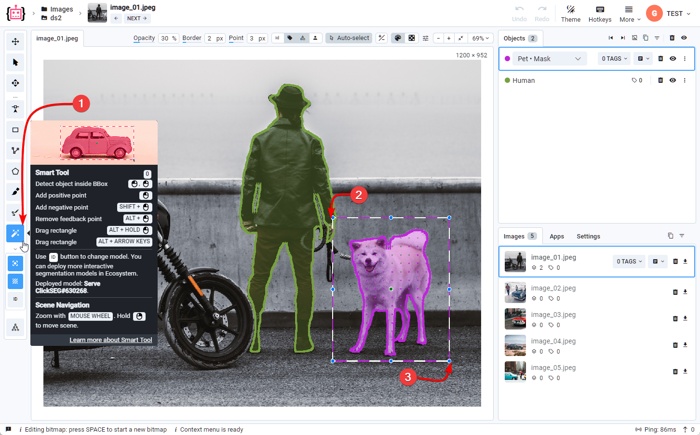
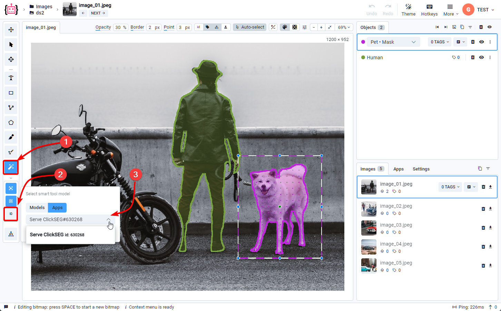

# Interactive AI-Assistance

## What is SmartTool?

SmartTool is an innovative feature integrated into the Labeling Tool within Supervisely. It significantly speeds up and enhances the accuracy of image annotation by employing artificial intelligence to automatically or semi-automatically identify and mark objects within photos.

## Launching SmartTool

To activate SmartTool, access the Labeling Tool and select the SmartTool option. This enables users to begin utilizing the functionalities of SmartTool for efficient data annotation.

## Availability of SmartTool

Access to SmartTool features depends on your Supervisely plan. In the Community version you get access to an already running SmartTool that works with the ClickSEG model.

## Applications for SmartTool

Within our [ecosystem](https://app.supervisely.com/ecosystem/neural-network+images+interactive-segmentation), there are additional models that support SmartTool, expanding its functionality. This allows working with various data types and objects, enabling the concurrent launch of multiple applications and switching between models within the Labeling Tool to utilize SmartTool.

## SmartTool Deployment

To successfully deploy and run SmartTool models on your own server, you must have a GPU-enabled compute agent. This ensures optimal performance and efficiency of the tool.

We also provide detailed guide on [how to deploy your own computer agent](../../getting-started/connect-your-computer/README.md) to make setting up and using SmartTool easier.

_Note: Using a GPU Compute Agent is an important requirement for SmartTool models to function correctly._

## Working with Custom Data

Apart from SmartTool, we have access to a variety of applications tailored for different data handling purposes:

- **SmartTool:** Primarily used for image annotation and labeling.
- [**Apply NN to Images Project:**](https://ecosystem.supervisely.com/apps/nn-image-labeling/project-dataset) Enables the application of neural networks to image projects directly.
- [**NN Image Labeling:**](https://ecosystem.supervisely.com/apps/nn-image-labeling/annotation-tool) Any NN can be integrated into Labeling interface if it has properly implemented serving app (for example: Serve YOLOv5).

**Moreover, we provide various training applications:**

- [Train RITM](https://ecosystem.supervisely.com/apps/ritm-training/supervisely/train)
- [Train YOLOv8](https://ecosystem.supervisely.com/apps/yolov8/train)
- [Train UNet](https://ecosystem.supervisely.com/apps/unet/supervisely/train)
- [Train MMDetection](https://ecosystem.supervisely.com/apps/mmdetection/train)
- [and other](https://ecosystem.supervisely.com/search?q=train)

These tools use training of specific models like RITM, YOLOv8, UNet, and MMDetection, optimizing the image annotation process across diverse data types.

## Different modalities

Another substantial thing about neural networks is that it's easy to adapt it to different modalities. That means, that the Smart Tools not only work on images, but on sequential frames, such as videos or multi-slice medial imaging and even 3D point clouds with more than two dimensions!

<table data-view="cards">
    <thead>
        <tr>
            <th></th>
            <th data-hidden data-card-cover data-type="files"></th>
            <th data-hidden data-card-target data-type="content-ref"></th>
        </tr>
    </thead>
    <tbody>
        <tr>
            <td><strong>Images</strong></td>
            <td><a href="../ai-images.gif">image</a></td>
            <td><a href="images/README.md">https://supervisely.com</a></td>
        </tr>
        <tr>
            <td><strong>Video</strong></td>
            <td><a href="../ai-video.gif">video</a></td>
            <td><a href="videos/README.md">https://supervisely.com</a></td>
        </tr>
            <td><strong>3D Point Cloud</strong></td>
            <td><a href="../ai-pontcloud.gif">video</a></td>
            <td><a href="3D-Point-Clouds/3D-Point-Clouds.md">https://supervisely.com</a></td>
        </tr>
         <tr>
            <td><strong>DICOM</strong></td>
            <td><a href="../ai-dicom.gif">video</a></td>
            <td><a href="DICOM/DICOM.md">https://supervisely.com</a></td>
        </tr>
    </tbody>
</table>



Please check the those awesome tutorials and guides:

- [Automate manual labeling with custom interactive segmentation model for agricultural images](https://supervisely.com/blog/custom-smarttool-wheat/)
- [Segment Anything in High Quality (HQ-SAM): a new Foundation Model for Image Segmentation (Tutorial)](https://supervisely.com/blog/segment-anything-in-high-quality-HQ-SAM/)
- [How to Train Smart Tool for Precise Cracks Segmentation in Industrial Inspection](https://supervisely.com/blog/industrial-inspection-cracks-segmentation/)
- [Complete Guide to Object Tracking: Best AI Models, Tools and Methods in 2023](https://supervisely.com/blog/complete-guide-to-object-tracking-best-ai-models-tools-and-methods-in-2023/)


