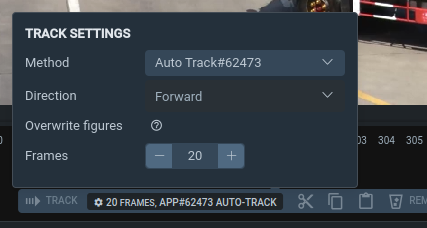

# Automatic Video Object Tracking

Object tracking is a technology that automatically monitors object positions in each video frame. Instead of manually labeling thousands of frames, you can use AI models to automate this process. Auto-tracking reduces labeling time by tens of times, ensuring consistent quality and allowing you to process large volumes of data without proportionally increasing your annotation team.

Supervisely offers two main approaches to auto-tracking, each suited for different scenarios.

## Key Difference Between Approaches

The main difference between these two approaches lies in the starting point. 

Tracking-by-Detection is used when you open a completely unlabeled video - the detector automatically finds all objects of the required classes in each frame, and the tracker links them into tracks. You literally press one button on an empty video and get ready-made annotations. 

Single Object Tracking works differently: first, you manually create an annotation on the specific object you want to track, select this annotation, and only then press the tracking button - the system will track this specific selected object in subsequent frames. 

In other words, tracking-by-detection creates annotations from scratch automatically, while single object tracking continues existing annotation for a specific object.

---

## 1. Tracking-by-Detection

### What It Is

Tracking-by-Detection is an approach where a detector (e.g., YOLO) runs on each video frame to detect objects of predefined classes, and then a tracking algorithm (e.g., BoT-SORT) links these detections between frames and assigns each object a unique ID. The detector finds objects in each frame, the tracker links detections between frames and forms object trajectories, assigning each a unique ID that persists throughout the video.

### When to Use

This method is ideal for scenes with many objects of the same class (streets with cars, crowds of people) when you know which object classes to track. It automatically starts tracking new objects appearing in the frame and handles occlusions (temporary object overlap) and scale changes. Suitable for tasks requiring automatic labeling of multiple objects of predefined classes without manual annotation of each one.

### How to Use

The most convenient way for annotators is to launch tracking-by-detection directly from the labeling tool. 
1. Deploy an object detection or segmentation model ([how to deploy a model](../../neural-networks/inference-and-deployment/supervisely-serving-apps.md#how-to-deploy-a-model))
2. Open the video in the labeling tool and click the blue Track button at the top of the interface. 
3. In the "tracking-by-detection engine" field, select your deployed model and click the "tracking-by-detection" button. 
4. Annotations with tracks will automatically load into your video.

Besides the labeling tool, tracking-by-detection is available through [Predict APP](https://ecosystem.supervisely.com/apps/apply-nn) - a universal application for applying neural networks to video, through [API](../../neural-networks/inference-and-deployment/video-object-tracking.md#option-4-tracking-via-api) for integration into your pipeline, or for [local execution](../../neural-networks/inference-and-deployment/video-object-tracking.md#option-5-run-tracker-locally) in your code via Supervisely SDK.

For a complete guide on tracking-by-detection, parameter configuration, and usage, see the [Video Object Tracking](../../neural-networks/inference-and-deployment/video-object-tracking.md) documentation. Additional information about working in the labeling tool can be found in the [Video Labeling Tool documentation](../labeling-toolbox/videos-3.0.md).

---

## 2. Single Object Tracking

### What It Is

Single Object Tracking in Supervisely is implemented through the [Auto Track app](https://ecosystem.supervisely.com/apps/auto-track), which uses class-agnostic tracking models that can track any object based on an initial annotation.

You annotate an object in the current frame, and the model automatically tracks it in all subsequent frames. The neural network uses your annotation (bbox, mask, skeleton) as a template and finds this object in subsequent frames, automatically creating annotations. Class-agnostic means the model doesn't know what exactly you're tracking (person, car, animal) — it simply follows the visual characteristics of the selected object.

### When to Use

This approach is suitable when you need to track a specific object (for example, not "all cars" but "this particular red car"), for objects without a ready-made detection model, or when the frame contains a small number of objects to track. Also useful for tracking correction — when you need to fix an error and re-track an object from the current frame.

### How to Use

1. Open [Auto Track app](https://ecosystem.supervisely.com/apps/auto-track) from the Supervisely Ecosystem and Click "Run Application" button.
2. Select Neural Network models for the geometries you want to track
2.1. You can also deploy a new model directly from the app UI by clicking "Deploy new model" button, selecting the model, agent, and clicking "Deploy model".

3. Start tracking in Video Labeling Tool:
    - Open your video in Video Labeling Tool
    - Create an annotation on the object you want to track
    - Select "Auto-Track" application in the tracking engine dropdown at the top of the interface
    - The app will automatically track the object when you create or edit it, or click the "track" button to start tracking all objects in the current frame

For detailed information about Auto Track features and settings, see the [Auto Track app documentation](https://ecosystem.supervisely.com/apps/auto-track). Additional information about the annotation workflow is available in the [Video Labeling Tool](../labeling-toolbox/videos-3.0.md) documentation.