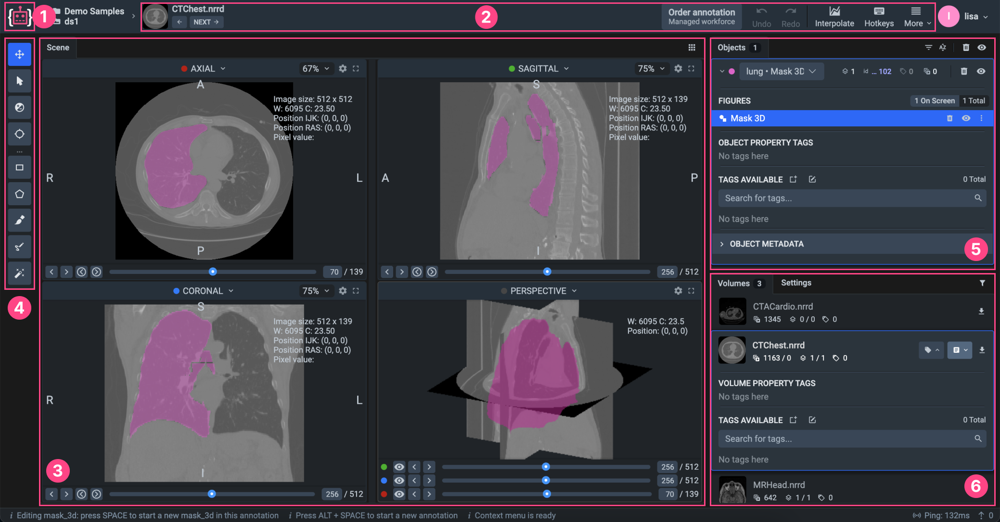
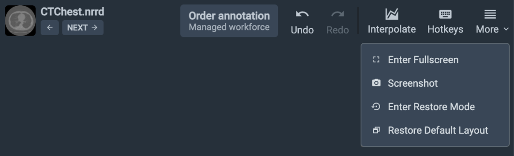
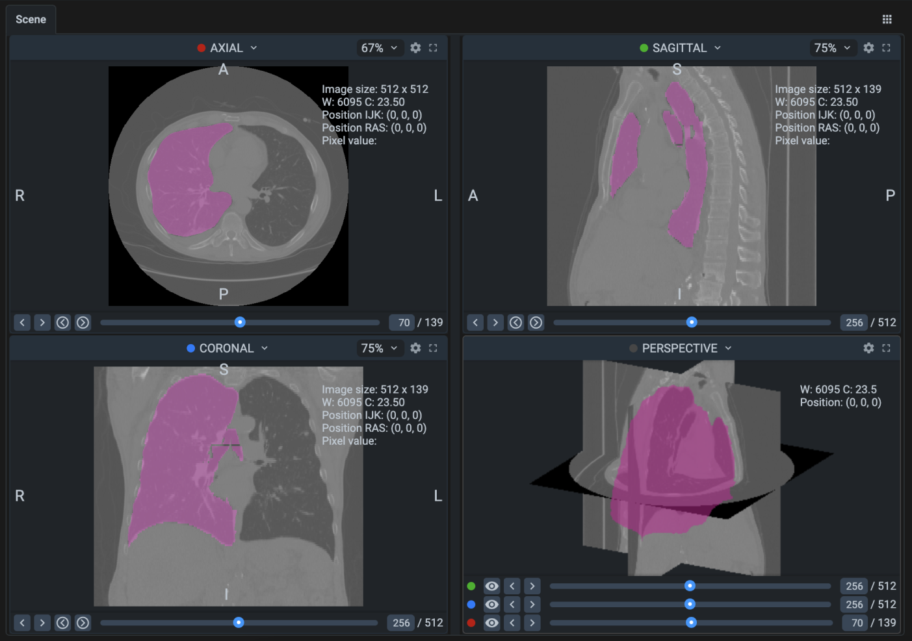
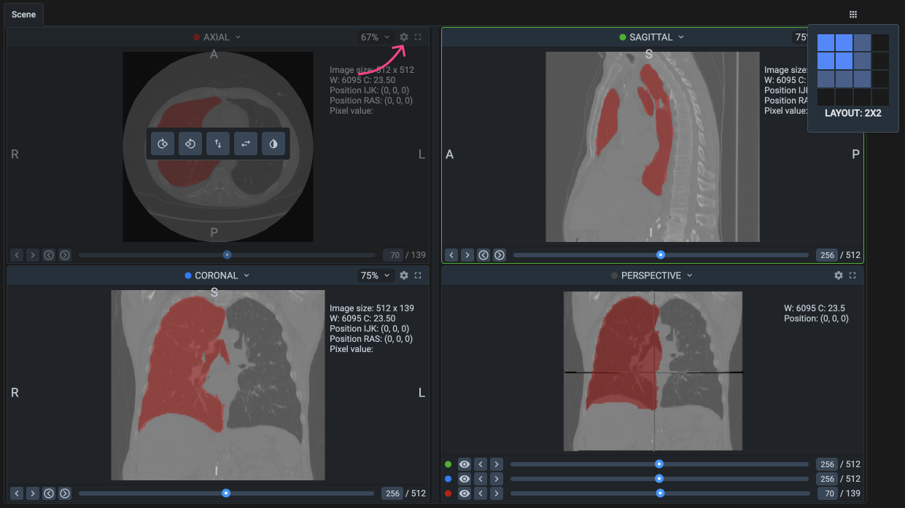

# DICOM

* **Direct DICOM and 3D Object Support:** Work directly with original DICOM files and 3D medical scans such as CT, MRI, and PET, ensuring seamless integration with medical imaging data.
* **Compatibility with Leading Tools:** Fully compatible with ITK Snap, 3D Slicer, and MITK, incorporating best practices from these trusted platforms. The familiar user experience minimizes the learning curve for doctors and medical professionals.
* **Web-Based and Accessible:** The platform operates entirely via a web browser, removing the need for complex software installations and making the tool easily accessible from anywhere.
* **Privacy and Security:** The on-premise solution ensures complete data privacy and meets the highest industry standards, offering peace of mind when dealing with sensitive medical data.
* **Customizable and User-Friendly Interface:** The interface is fully customizable to fit individual needs. Users can rearrange the workspace, adjust the layout, and manage the grid up to a 4x4 configuration, enabling more efficient workflows.
* **Advanced 3D Object Interpolation:** Reduce time spent on labeling by leveraging interpolation algorithms. Manually label key slices, and the tool reconstructs the object across other slices, with the ability to preview and edit in 3D.
* **Interactive AI-Assisted Labeling:** Accelerate annotation with smart tools powered by pre-trained neural network models. Quickly frame objects with a bounding box and let AI assist in labeling across multiple models simultaneously.
* **Windowing and Crosshair Tool for Enhanced Visualization:** Improve contrast and visibility of medical images through the Windowing feature. The Crosshair tool allows for synchronized navigation across all image planes, speeding up the analysis of complex data.
* **Native Support for Mask 3D:** Create and edit volumetric 3D masks across multiple planes, making it the ideal option for detailed and versatile object annotation in volumetric data.
* **Optimized for Healthcare AI:** Designed specifically for healthcare professionals, the platform combines powerful annotation features with an intuitive, familiar interface to maximize productivity in medical AI projects.

<figure><figcaption></figcaption></figure>

1. **Home button** - returns user to the main menu (Projects page)
2. [Basic interface elements](DICOM.md#basic-interface-elements) - highly important "Interpolation" tool, basic settings, such as history of operations, theme, a hotkeys map and more useful features.
3. [Main scene & settings & contols](DICOM.md#main-scene) - workspace with the Volume images at the planes and a 3D perspective.
4. [Instruments panel](DICOM.md#instruments-panel) - toolbar for navigating through planes and working with annotations.
5. [Objects panel](DICOM.md#objects-panel) - list of figures on the current volume with additional information like classes and tags.
6. [Volumes /Settings panel](DICOM.md#volumes-panel) - list of volumes in your dataset, visualization and other settings.

***

## Basic interface elements

The top toolbar contains options for personalizing the interface and managing data and its annotations.

**Image navigation arrows (next, previous):** Allow users to move between images in the dataset. (NRRD files usually contain medical images such as CT or MRI scans).

**Undo and redo buttons:** Undo or redo the most recent annotation action.

**Interpolate button:** runs interpolation tool. The [Volume Interpolation](https://app.supervisely.com/ecosystem/apps/volume-interpolation?) application must be started to enable the interpolation function.

The **Volume Interpolation** app uses an [ITK-based implementation](https://github.com/KitwareMedical/ITKMorphologicalContourInterpolation) of morphological contour interpolation. Interpolation is done by first determining correspondence between shapes on adjacent segmented slices by detecting overlaps, then aligning the corresponding shapes, generating a transition sequence of one-pixel dilations, and taking the median as a result.

**Hotkeys:** A list of hotkeys for quick access to tools.

**More options:**&#x20;

* **Enter fullscreen** - this option allows the user to switch the interface to fullscreen mode, maximizing the workspace area. It hides browser toolbars and other elements
* **Screenshot** - the screenshot function enables users to take a snapshot of the current workspace, including the image and any annotations displayed. This can be useful for documentation, sharing progress, or reviewing annotations with team members.
* **Enter restore mode** - enter restore mode provides tools to recover lost or corrupted annotations. When enabled, it offers options to revert changes to a previous state or repair specific parts of the annotation dataset.
* **Restore default layout** - this function resets the interface layout to its default configuration. It is useful when the layout has been modified (e.g., panels moved or resized) and the user wants to return to the original setup.&#x20;

<figure><figcaption></figcaption></figure>

***

## **Main scene**&#x20;

The DICOM Labeling Tool main stage presents several windows that display different projections of medical images.

<figure><figcaption></figcaption></figure>

### Projections

**Axial (horizontal) view:** A horizontal slice of the patient's body.&#x20;

For example, the image may show a cross-section of the chest with an annotated area that is likely to represent a region of interest (such as a lung or tumor).&#x20;

**Sagittal** **view:** A vertical slice from the front to the back of the body.

**Coronal** **view:** A vertical slice from the left to the right of the body.

**3D Perspective**: A 3D model that shows a volumetric rendering of the chest with the annotated area.

Below the image are controls for toggling the visibility of different layers or components of the 3D view, such as annotations.

In the **PERSPECTIVE** view, colored dots represent the different slices in various planes:

* **Green**: Sagittal slice.
* **Blue**: Coronal slice.
* **Red**: Axial slice.
* You can **toggle the visibility** of these slices by clicking the "eye" button, showing or hiding that specific plane in the 3D view.
* Moving a point along the line adjusts the position of that slice in all views. For example, moving the slider on the green dot line will move the sagittal slice, and the image in the sagittal window will update accordingly to reflect the new position.

#### **Orientation Letters (R, A, P, L, S, I)**

The letters on the images (**R**, **A**, **P**, **L**, **S**, **I**) represent anatomical directions and help orient the viewer:

* **R**: Right side of the body.
* **L**: Left side of the body.
* **A**: Anterior (front) of the body.
* **P**: Posterior (back) of the body.
* **S**: Superior (towards the head).
* **I**: Inferior (towards the feet).

#### **Detailed info**

All image information is displayed in the right corner:

* **Image size:** 512 x 512.&#x20;
* **W and C:** Window Width (W) and Window Center (C), which control the brightness and contrast of the image.&#x20;
* **Position IJK and Position RAS:** These are coordinates in different reference systems (IJK refers to the image index, while RAS is a real anatomical coordinate system).&#x20;
* **Pixel value:** The current pixel value at the annotated location.&#x20;

### Navigation/Controls/Settings

<figure><figcaption></figcaption></figure>

**Layout Customization**: You can customize the **layout** of the scene, allowing for arrangements other than the default **2x2 grid**. You can create layouts up to **4x4** and arrange them as you prefer, such as **3x2** or any combination that suits your annotation workflow.&#x20;

**Changing Views**: If you click on the name of a view, such as **AXIAL**, **SAGITTAL**, or **CORONAL**, you can switch the display to a different representation in that specific window. You can choose any available view (e.g., switching AXIAL to PERSPECTIVE). This allows you to customize what each window shows.

**Fit Settings (Zoom)**: In any of the windows, you can adjust the **fit percentage**, which controls the zoom level of the image, ranging from **25% to 300%**. This allows you to zoom in for a closer look or zoom out to see more of the surrounding anatomy, depending on your needs.

**Fullscreen Mode**: Any of the windows can be expanded to **fullscreen**. This is useful when you need a more detailed view of a particular slice or 3D model. Simply click on the corresponding button to maximize the window.

#### **View Settings**

In every window (AXIAL, SAGITTAL, CORONAL), you can adjust **view settings** to manipulate the displayed image.

* **Rotate 90° CW**: Rotate the image 90 degrees clockwise.
* **Rotate 90° CCW**: Rotate the image 90 degrees counterclockwise.
* **Flip Vertical**: Flips the image vertically, mirroring it along the horizontal axis.
* **Flip Horizontal**: Flips the image horizontally, mirroring it along the vertical axis.
* **Invert Colors**: Inverts the colors in the image, which can help highlight certain structures more clearly.

In the **PERSPECTIVE** view, the only available setting is **Invert Colors**, which allows you to adjust the color scheme of the 3D rendering.

#### **Navigation Controls**

* **Previous Slice** and **Next Slice**: Allows you to move forward or backward through the image slices in a given view (e.g., in AXIAL view, you can browse through the horizontal slices).
* **Select Figure to Copy Back/Next**: This lets you copy and navigate to the previous or next selected figure in the series.
* **Line Indicator**: Displays the current position within the series of slices or frames.
* **Total Frames**: Shows the total number of slices or frames, such as "70/139," indicating you're on the 70th frame of 139.

***

## **Instruments panel**

Full variety of instruments from our best-in-class [image labeling toolbox](../images/) - plus, extra tools for medical imaging, like window adjustments.

[**Pan & Move Scene Tool:**](../labeling-tools/navigation-and-selection-tools.md) Quickly navigate around the image without modifying annotations.

[**Select Figure**:](../labeling-tools/navigation-and-selection-tools.md) Select and modify existing annotations; essential for refining objects.

[**Bounding Box:**](../labeling-tools/bounding-box-rectangle-tool.md) Best for object detection tasks.

[**Polygon Tool:**](../labeling-tools/polygon-tool.md) Ideal for irregular and complex shapes.

[**Brush and Eraser Tool:**](../labeling-tools/brush-tool.md) Flexible for both polygonal and free-form masks.

[**Mask Pen Tool:**](../labeling-tools/mask-pen-tool.md) Great for segmenting diverse objects with varying shapes.

[**Smart Tool:**](../labeling-tools/smart-tool.md) Efficient for quick, AI-assisted segmentation.

### Medical imaging tools

#### **Windowing Tool** 

Medical images usually consist of thousands of levels of gray, while standard computer screens are only capable of displaying 256 levels of gray. Additionally, the human eye has limitations in detecting minimal differences in contrast. Windowing involves selecting a range of pixel values and mapping those values to the full range of display intensities.

This **Windowing feature** adjusts image contrast and offers not only manual adjustment but also various presets and allows you to fine-tune the visualization of medical images, making various tissues and structures more visible and distinguishable.

**Crosshair Tool**

If you need to select a specific image area in all planes, you don't have to do it individually for each plane. The **Crosshair Tool** allows in one click jump to any point of interest on all planes. By holding the selection point and moving the crosshair across the plane, you can observe real-time changes in the other planes and 3D perspective.

***

## Volumes panel

The Volumes Panel provides a comprehensive view of all the images within a selected dataset. Key functionalities include:

* **Tag Management** - Assign new tags or modify existing tags to maintain consistency and organization.
* **Filter and Manage** - View and edit metadata details or filter through images to find exactly what you need.
* **Volumes Operations** - Delete volumes, download them individually, or download annotations for external use.

## Settings panel

The Settings Panel is the control center for personalizing the interface. It houses various options allowing users to tweak the interface to match their workflow, preferences, and project requirements.

