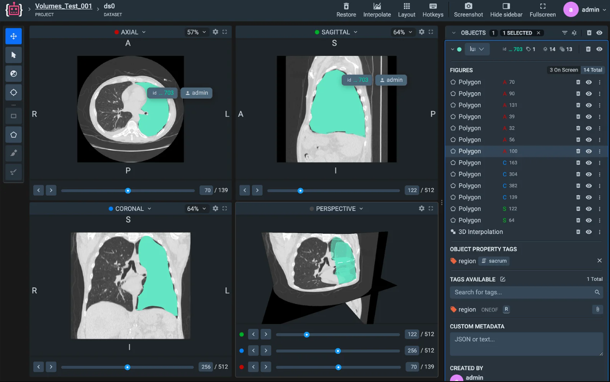

# MEDICAL LABELING TOOLBOX

Label volumetric medical scans from CT and MRI in 2D or 3D with professional viewer, advanced editing tools and AI enhancements.


[Best DICOM & NIfTI annotation tools for Medical Imaging AI](https://supervisely.com/blog/dicom-labeling-toolbox/)


## **Precise tools for medical labeling**
Full variety of instruments from our best-in-class [image labeling toolbox](../images/images.md) — plus, extra tools for medical imaging, like window adjustments.

## **User interface doctors know and love**
Supervisely provides well-known intuitive interface to view and manipulate volumetric medical images in multiple projections and slices with expert features medical professionals are used to.

## **Quick as lightning and easy to use.**
We believe professional tools don't have to be complicated.

- **Works in web-browser.**
Supervisely runs even on old machines because it makes use of hardware acceleration and efficiently loads images into RAM.

- **Quick start.**
Simply drag & drop individual medical images in DICOM format, DICOM directory files or just common graphics like tiff and bmp.

- **Supports medical formats.**
Supervisely can open compressed and lossless studies produced by different medical equipment including CT, MRI, CR, US...

