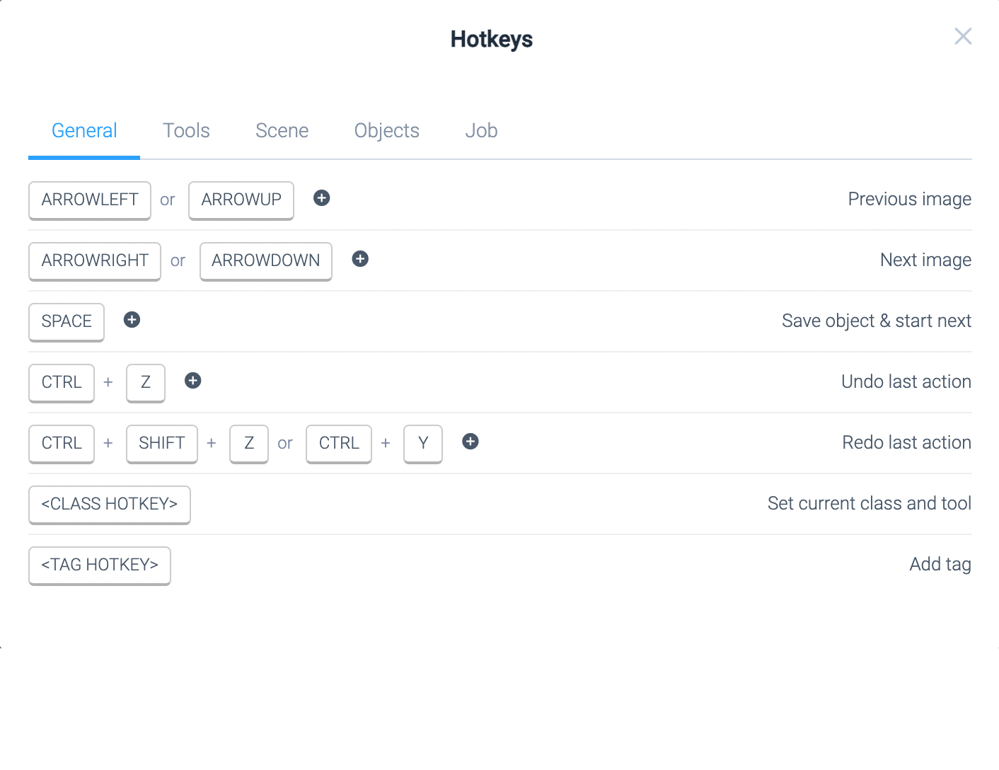
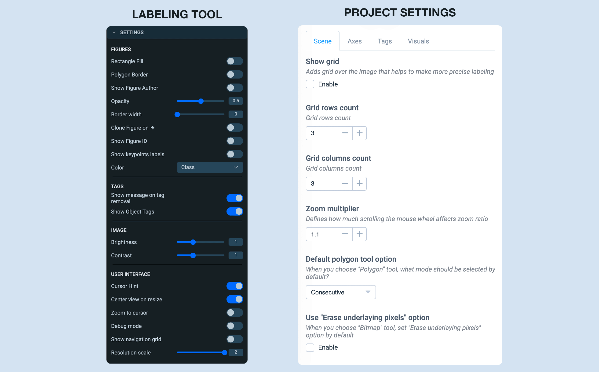
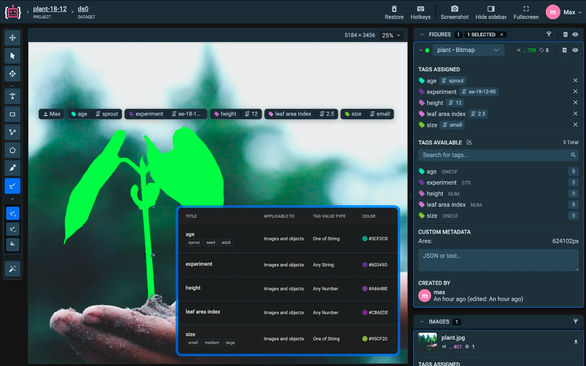

# Labeling Toolboxes

With more than 5 years of constant improvement, proved by hundreds of businesses, our image labeling suite sets the highest industry standard on the market today. 

[Learn more ➡️](https://supervise.ly/labeling-toolbox/images)

## **FOR ANY TYPE OF ANNOTATION**

Packed with advanced labeling tools.
Precise tools for pixel-accurate annotations make any task from object detection to instance segmentations simple and fast. [Learn more ➡️](https://supervise.ly/labeling-toolbox/images)

## **Annotation features for the real work**
Successful image labeling requires much more than just annotation tools like brush or rectangle.
Supervisely has comprehensive set of features that distinguish it from yet another labeling editor.

