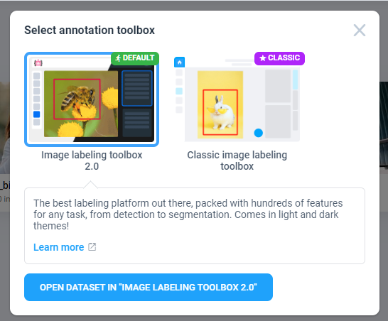

# Overview

 With more than 5 years of constant improvement, proved by hundreds of businesses, Supervisely provides a complete set of labeling toolboxes for various modalities and tasks, starting from images, videos, and including even solutions for 3D point clouds and volumetric data.

## Pre-Requirements

Follow those recommendations for the best results:


Though we support all common web browsers, we strongly recommend using **Google Chrome** or **Mozilla Firefox**, because we use latest technologies to render annotations. We also advise you to use the latest version of web browser.



To work with large images and lots of annotations we recommend to use computer with hardware acceleration available. Check if your browser uses hardware acceleration [here](chrome://gpu).


## Getting Started

First, [import](../data-organization/import/import/import.md) the dataset you would like to annotate. You can upload images, videos, and many other types of data from your computer or import one of our [sample projects](https://ecosystem.supervisely.com/import+images+project) from the Ecosystem.

To open the labeling toolbox, go to the [Projects](../data-organization/project/projects.md) page, select one of the projects and click on a dataset. Depending on the type of your project, you will see a popup where you can select the right toolbox or, if there is one, the labeling toolbox will open automatically. 


When opening a labeling toolbox, you can only annotate a single dataset at a time.



You can also open the labeling toolbox from a [Labeling Job](jobs/README.md) or the [Ecosystem](https://ecosystem.supervisely.com/annotation_tools/image-labeling-tool-v2) page.

