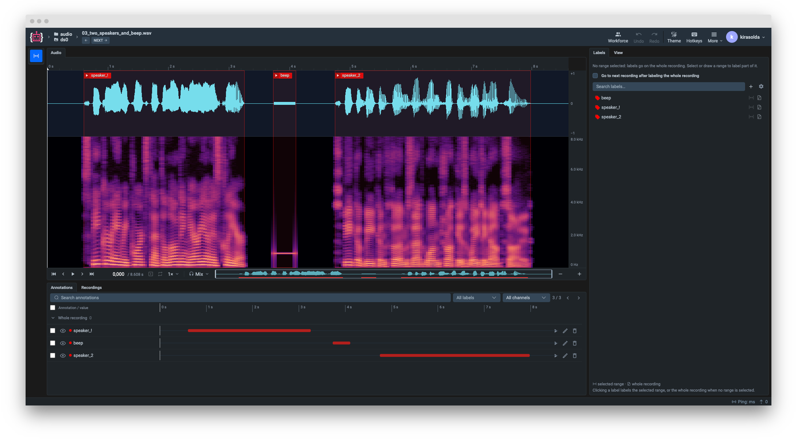
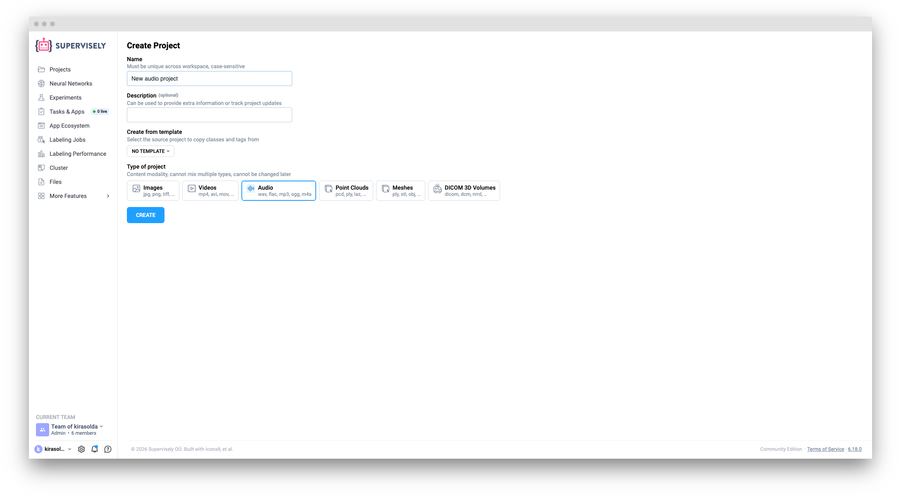
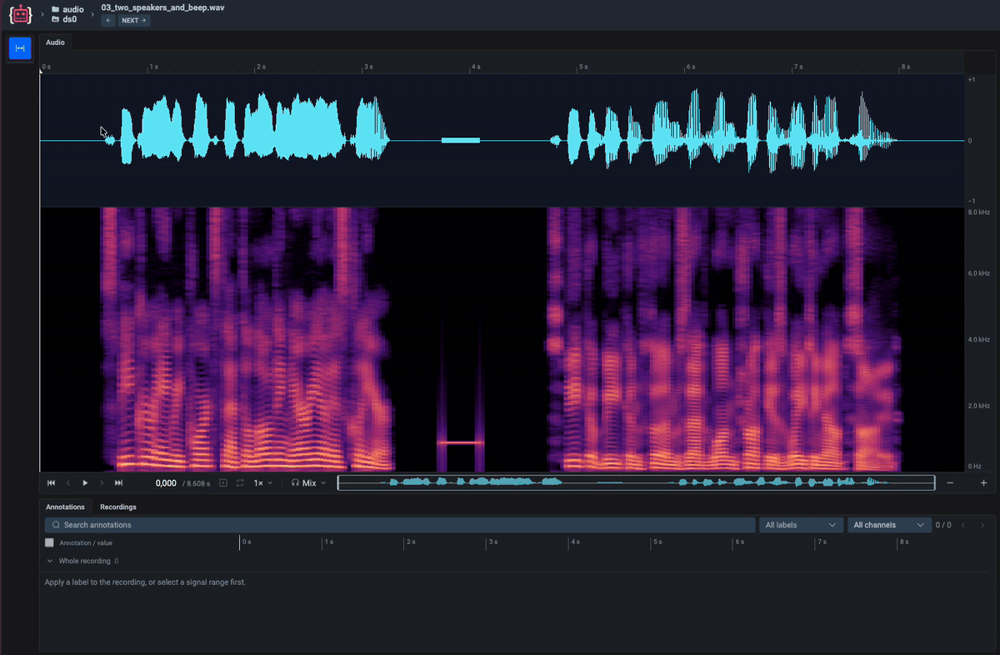
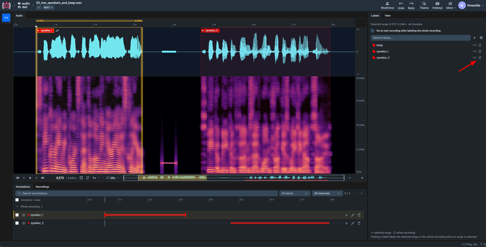
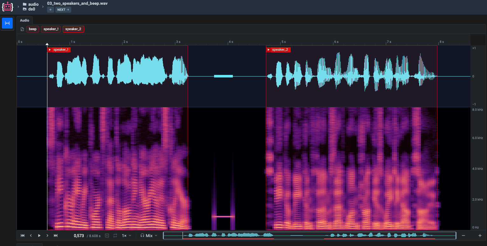
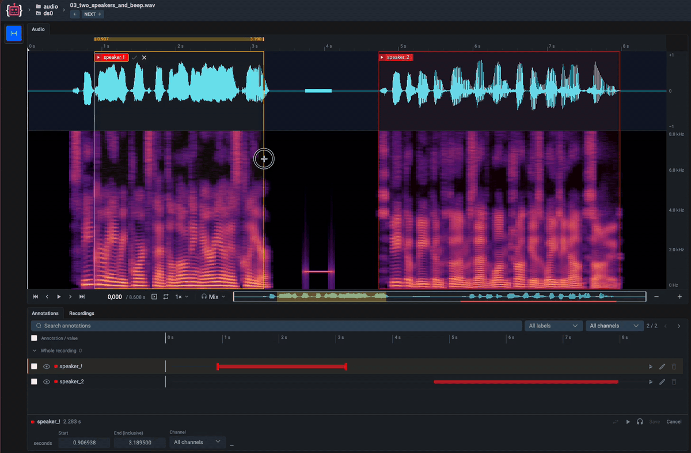
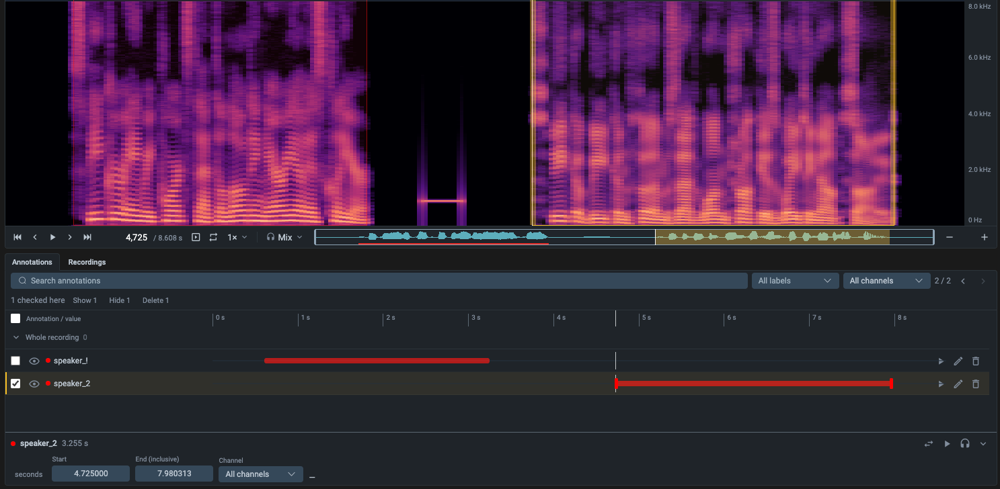
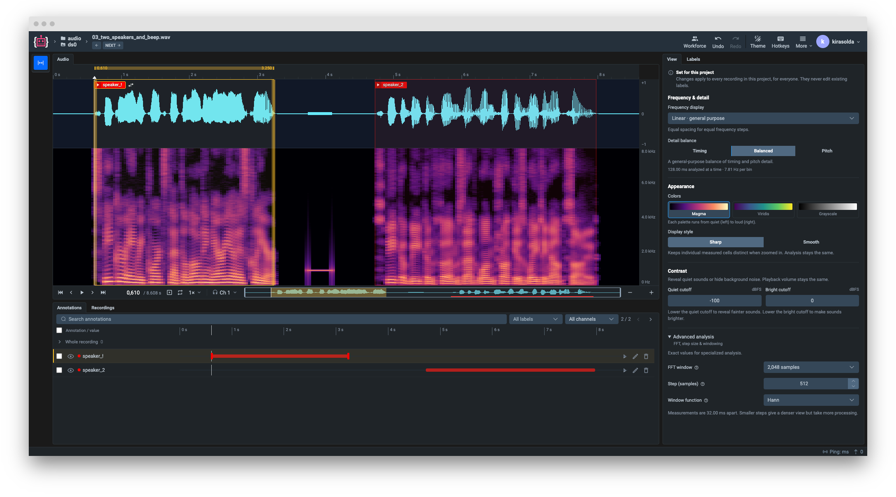
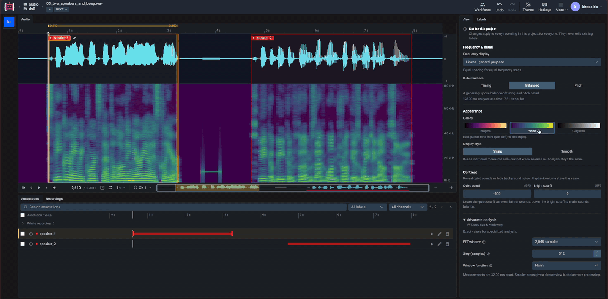

# Audio

The **Audio Labeling Toolbox** is a browser-based interface for labeling recordings with **time segments**: acoustic events, speech, machine noise, anything that has a start and an end. It is built for tasks where the evidence is in the frequency content, such as NVH and acoustic quality inspection, bioacoustics, and sound event detection.

* **Waveform and spectrogram** of the same recording on one playhead
* **Segments** labeled with tags, down to a single sample, on all channels or on one channel
* **Whole-recording tags** for classifying a file as a whole
* **Label where you draw**: pick a label right on the plot, or from the Labels tab with one click or a hotkey
* **Spectrogram settings set once per project**, so every annotator sees the same analysis and the analysis can be reproduced later for training
* **Playback** of the whole recording or of the selection, looped, at 0.25× to 2×

> 🎬 **Demo video** — embed slot.

## Create an Audio project

1. Open **Projects** and click **+ New** → **New project wizard**.
2. Choose **Audio** as the type of project. The type cannot be changed later.
3. Name the project and create it.

Audio projects need a Supervisely license that includes the audio recordings module.

## Import recordings

Supported formats: **WAV, FLAC, MP3, OGG, M4A**.

* **Plain recordings** in any folder structure are uploaded to one dataset, without labels. Files with other extensions are skipped. See [Audio recordings](../../data-organization/import/import/supported-formats-audio/audio.md).
* **Supervisely format** keeps datasets, segments, whole-recording tags and the project's spectrogram settings. See [Supervisely audio format](../../data-organization/import/import/supported-formats-audio/supervisely.md).

Import with the import wizard on the project, or from Team Files or Cloud Storage. Audio is always uploaded; it cannot be added by link.

From Python, install the SDK with the audio extra, `pip install "supervisely[audio]"`, and follow [Audio in the Python SDK](https://developer.supervisely.com/getting-started/python-sdk-tutorials/audio/audio).

## Overview

The toolbox opens when you click a recording in an Audio project.

1. **Top bar** — previous and next recording, undo and redo, theme, the hotkeys reference and **More**.
2. **Toolbar** — the **Label range** tool.
3. **Audio** panel — the time ruler, the waveform and the spectrogram, the overview strip and the transport bar.
4. **Annotations** and **Recordings** tabs.
5. **Labels** and **View** tabs.

## Top bar and layout

* **Undo** / **Redo** step through annotation edits (**Ctrl+Z** / **Ctrl+Shift+Z**).
* **Theme** switches between the dark and the light theme.
* The hotkeys button opens the full list of hotkeys.
* Tabs can be dragged to another column or stacked together. **More** → **Restore Default Layout** puts them back.

## Label a segment

1. Drag across the waveform or the spectrogram to select a range. A plain click only moves the playhead; **Shift**-click selects a single sample.
2. Click **Choose a label** next to the range, and pick a label. Type to search the list.
3. If the label has a value, enter it. For a one-of value, keys **1**–**9** pick an option. **Enter** saves, **Esc** cancels.

The segment is saved at once. It covers the selected samples, both ends included, and it is about the channel you are viewing: **Mix** labels all channels, **Ch N** labels channel N only.

You can also label from the **Labels** tab. The line at the top shows the selected range and its channel. Each label row has two buttons: **selected range** and **whole recording**. Clicking a label, or pressing its hotkey, labels the selected range, or the whole recording when no range is selected.

A label's scope, set in the project's tag settings, decides where it can go: on ranges, on the whole recording, or both. Labels that apply to objects only are not listed.

Click **+** in the Labels tab to create a label without leaving the toolbox, or the gear icon to manage labels in the project settings.

## Whole-recording tags

Use the **whole recording** button on a label row, or click a label when no range is selected. These tags apply to all channels and show as badges above the plots. Click a badge to select it and edit its value. To change its label, use the Annotations tab.

Tick **Go to next recording after labeling the whole recording** to move on as soon as the tag is added.

## Edit and delete

**On the plot.** Click a segment to select it.

* Drag its edges to resize it; **Alt**-drag moves it. Changes stay a draft until you click the check mark (**Save changes**). **Esc** or the cross cancels them.
* **Change label** swaps the label and keeps the range and the channel.

**In the Annotations tab.** Every segment and whole-recording tag of the recording is listed, with a small timeline.

* Search, or filter by label and by channel.
* Each row can be hidden, edited or deleted, and a segment can be played.
* The pencil opens an inline editor under the list: **Start**, **End (inclusive)** in seconds or in samples, **Channel**, and the value. **Save** or **Cancel** it there. **Change label** is there too, for segments and whole-recording tags.
* Tick several rows to show, hide or delete them together. Deleting always asks to confirm.

## Channels

The headphones menu in the transport bar chooses what you see and hear: **Mix all channels**, or a single **Channel N**. The button shows **Mix** or **Ch N**.

When one channel is selected, segments on other channels are hidden. If the selected segment is on another channel, **Show ch N** switches to it.

## Navigation and playback

* **Scroll** to zoom around the pointer, **Shift**-scroll to pan, or drag the time ruler to scrub.
* **Zoom out**, **Fit recording** and **Zoom in** buttons are in the transport bar. **Fit recording** (**Alt+F**) shows the whole file.
* The overview strip shows the whole recording: drag the window to pan, drag its edges to zoom, click to jump.
* **Previous interval** and **Next interval** in the transport bar jump to the neighbouring segment. **Shift+P** / **Shift+N** select it and play it.
* **Play selection** and **Loop selection** (**Shift+L**) play just the selected range.
* Playback speed: 0.25×, 0.5×, 0.75×, 1×, 1.25×, 1.5× or 2×.
* The time field shows the playhead position and accepts a time to jump to. Its tooltip shows the sample rate, channel count and length in samples.

## Hotkeys

| Action | Hotkey |
|---|---|
| Play selection or recording / pause | **Space** |
| Play from playhead / pause | **Shift+Space** |
| Toggle selection loop | **Shift+L** |
| Select and play the previous / next interval | **Shift+P** / **Shift+N** |
| Fit recording | **Alt+F** |
| Undo / redo | **Ctrl+Z** / **Ctrl+Shift+Z** |
| Apply a label | the label's own hotkey |

These work when the plot is focused (click it first):

| Action | Hotkey |
|---|---|
| Move playhead by one sample / one second | **←** **→** / **Shift+←** **Shift+→** |
| Go to start / end | **Home** / **End** |
| Cancel a drag or a draft | **Esc** |

## Spectrogram settings

A spectrogram is one of many possible pictures of the same audio, and the settings decide what is visible: a small FFT window separates events in time but blurs close frequencies together, a narrow contrast range hides quiet events. Labels are only comparable if they were drawn on the same picture. That is why the settings belong to the **project**: every recording is shown with them, for everyone.

They are in the **View** tab. A banner at the top says whether they are set:

* **Not set for this project** — recordings use the default analysis. Click **Save for project**, or change any setting, to fix it for the project.
* **Set for this project** — changes apply to every recording in the project, for everyone. They never edit existing labels.

A change is saved to the project as soon as you make it.

| Setting | Options |
|---|---|
| **Frequency display** | Linear (general purpose), Logarithmic (lower pitches), Mel (speech and hearing) |
| **Detail balance** | Timing, Balanced, Pitch — FFT windows of 512, 2048 and 8192 samples. Any other window shows as **Custom**. |
| **Colors** | Magma, Viridis, Grayscale |
| **Display style** | Sharp, Smooth |
| **Quiet cutoff** / **Bright cutoff** | the dBFS range the colors span; the quiet cutoff must be lower |
| **Advanced analysis** | **FFT window** (32 to 32768 samples), **Step (samples)**, **Window function** (Hann, Hamming, Blackman), **Mel bands** (2 to 512, Mel only) |

The defaults are Linear, a 2048-sample window with a 512-sample step, Hann, 128 mel bands, −100 to 0 dBFS, Magma, Sharp.


Existing labels are not changed when a setting changes, but they were drawn on a picture that no longer matches. Choose the settings before labeling starts.


The settings are saved in the project and exported with it, so the same spectrogram can be computed outside Supervisely — for example as training input in PyTorch or TensorFlow.

## Recordings tab

Lists the recordings of the dataset with their length. Click one to open it. A recording that cannot be decoded is marked **cannot be displayed**.

The row menu downloads the original file, and the metadata panel shows the recording's ID, dates and metadata.

## Export and SDK

* Export a project or a dataset with [Export to Supervisely format](https://ecosystem.supervisely.com/apps/export-to-supervisely-format). The result keeps segments, whole-recording tags and the spectrogram settings. See [Supervisely audio format](../../data-organization/Annotation-JSON-format/10_Supervisely_format_audio.md).
* [Audio in the Python SDK](https://developer.supervisely.com/getting-started/python-sdk-tutorials/audio/audio) covers uploading, labeling, rendering spectrograms and exporting training crops.

## Browser support

The views are drawn on the GPU with WebGPU, or with WebGL2 where WebGPU is not available.

WAV, FLAC and MP3 play in any supported browser. OGG and M4A are decoded by the browser, which needs the instance to be opened over **HTTPS**. If the browser cannot decode a recording, the toolbox shows **Recording cannot be displayed**; re-encode it to WAV or FLAC, or use a browser that supports the codec.
