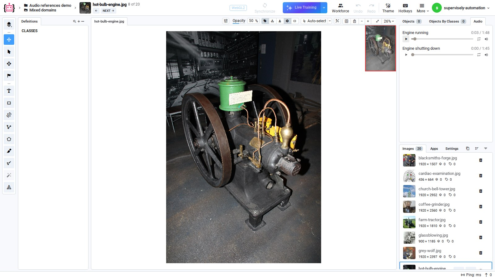
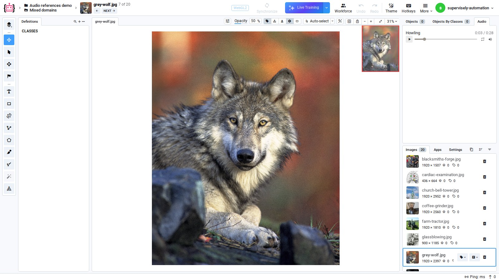
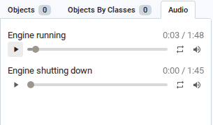
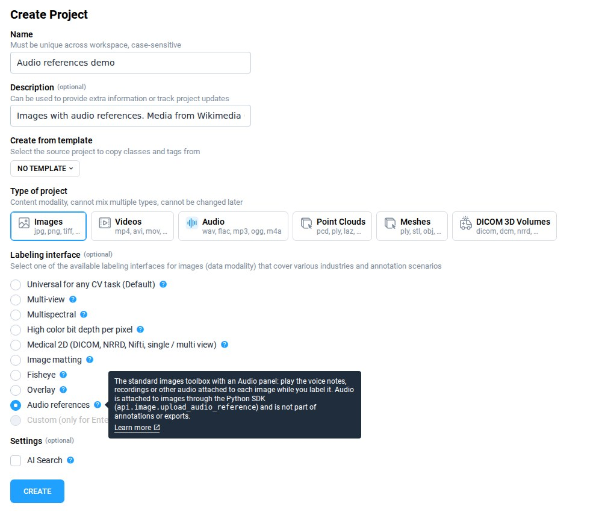

# Audio references

An image can carry one or more **audio files as references** — a dictated description, a voice note taken at capture time, or the recorded call a screenshot came from. Opening the image in the Image Labeling Toolbox shows an **Audio** panel with a player, so an annotator can listen to the recording while labeling instead of chasing it down outside the platform.

This is useful whenever the correct label depends on context that is not in the pixels.

<figure></figure>


Requires a Supervisely instance running `6.17.25` or newer. Attaching audio needs Supervisely Python SDK version `6.74.36` or newer.


## Use cases

Audio references help wherever the sound carries the evidence and the image carries the label.

- **Machine condition inspection** — a photo of a machine shows its parts, a recording of it running shows its condition. Knocking, misfiring or a worn bearing is heard, not seen. With the recording attached, the annotator tags the photo as `normal` or `faulty` with the evidence one click away. The screenshots on this page use recordings from [Work With Sounds](https://commons.wikimedia.org/wiki/Commons:Work_With_Sounds), an EU project in which six European industry museums recorded machines and released the sounds under CC BY 4.0.
- **Wildlife and bird surveys** — species that look alike often sound different. The [SSW60](https://github.com/visipedia/ssw60) benchmark (Van Horn et al., [ECCV 2022](https://arxiv.org/abs/2207.10664)) pairs images, audio and video for 60 bird species, and its authors found that combining the visual and the acoustic signal classifies videos better than either one alone. Attaching the call to the photo lets the annotator confirm the species before labeling it.
- **Field inspection notes** — an inspector photographs a defect and dictates what they found. The voice note stays with the photo, so whoever labels it later hears the inspector's own description.

<figure></figure>


Each recording keeps the licence of its source. Many public datasets, SSW60 among them, allow their media for research only, and CC BY-NC or CC BY-ND recordings cannot be used commercially or modified. Check the licence of every recording before you attach it.


## What audio references are not

Audio references are **reference only**:

- The audio is never annotated — no figures, no tags, no geometry, and nothing is written back to it.
- It is not part of the annotation, and it is not included in annotation exports.
- Audio cannot be attached from inside the labeling tool. References are attached programmatically — see [Attaching audio](#attaching-audio) below.

## Where the audio is stored

Only the **URL** of the recording is stored on the image. The audio file itself lives outside the project, normally in [Team Files](../../../data-organization/team-files/README.md), and the player streams it from there.

Two consequences worth knowing before you plan a workflow around this:

- If the audio file is deleted from Team Files, the player stops working. The reference on the image is just a link.
- Copying or exporting a project carries the links, not the recordings. A project imported into a **different** Supervisely instance keeps pointing at the instance the audio came from.

## The Audio panel

The **Audio** tab sits in the right sidebar of the Image Labeling Toolbox, next to **Objects** and **Objects By Classes**. It lists every recording attached to the current image, labelled with the name the reference was created with, and gives each one a player with its length, a seek bar, loop and volume controls. Images with no audio show an empty panel.

<figure></figure>

Multiple recordings per image are supported — one is simply the common case. The panel always shows the recordings of the image that is open.

## Create a project for audio references

1. Start creating a new project with **New** → **New project wizard** and choose the **Images** project type.
2. In the **Labeling interface** list, select **Audio references**. Hover the `?` icon next to it for a short description.
3. Click **Create**, import your images and attach the recordings as described in [Attaching audio](#attaching-audio).

<figure></figure>

The project opens in the Image Labeling Toolbox, where the Audio panel plays the recordings attached to each image.


**Audio references** opens the standard Image Labeling Toolbox, and the Audio panel is part of it. An existing image project needs no new interface: attach audio to its images and the panel plays it.


## Attaching audio

Audio is attached with the Python SDK, either while importing images or afterwards. In the simplest form, one call uploads a local file to Team Files and attaches it to the image:

```python
import supervisely as sly

api = sly.Api.from_env()

api.image.upload_audio_reference(
    id=3212008,
    team_id=8,
    path="/home/admin/audio/operator-note.mp3",
    name="Operator note",
)
```

You can also attach a recording that is already hosted, read back what is attached, and attach audio at import time. The full walkthrough, including how audio references survive an export and re-import, is in the [\[Supervisely Developer Portal\] Audio references on images](https://developer.supervisely.com/getting-started/python-sdk-tutorials/images/audio-references).

## Summary

- **Audio panel** plays every recording attached to the open image, right next to the labeling tools.
- **Machine inspection, wildlife surveys and field notes** are typical cases where the sound decides the label.
- **Only URLs are stored**: keep the recordings in Team Files, and re-upload them after moving a project to another instance.
- **Attaching is done with the Python SDK**, `6.74.36` or newer, on instance `6.17.25` or newer.

## Media credits

The screenshots on this page show media from Wikimedia Commons:

- `Hot bulb diesel engine Forum Marinum 1.JPG` — MKFI, public domain. Recordings `WWS Hotbulbengineworking.ogg` and `WWS Hotbulbenginestopping.ogg` — Work With Sounds / Torsten Nilsson, CC BY 4.0.
- `Grey Wolf Portrait.jpg` — USFWS / Gary Kramer, public domain. Recording `Wolf howls.ogg` — public domain.
