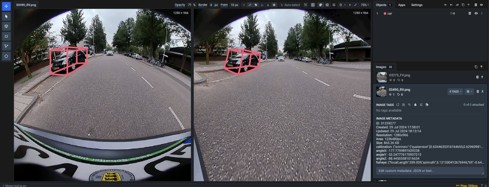

# Fisheye labeling interface

## Overview

Annotate fisheye images with ease using the fisheye labeling interface in Supervisely.



Fisheye images are a special type of images that are captured with an ultra-wide-angle lens (a.k.a. fisheye lens). The fisheye lens produces strong visual distortion intended to create a wide panoramic or hemispherical image. It is a popular choice for many applications, such as surveillance, automotive, and VR/AR.

Challenging to annotate images with fisheye distortion? Activate the fisheye labeling interface in Supervisely to correct the distortion and annotate objects with ease.

To use the fisheye labeling interface, you need to:

1. create a project with the `Fisheye` labeling interface enabled.
2. prepare calibration files with parameters for fisheye images (metadata files). Check out the [Fisheye Lens Metadata](#fisheye-lens-metadata) section for more details.
3. import fisheye images with the calibration parameters and annotations (optional).


**To correctly import fisheye images, all metadata files should be placed in the directory with the `meta` name**.


## Data structure

- **Folder** or **Archive** (`zip`, `tar`)

```
📦 my_project.zip or 📂 my_project
    ┣ 📂 img
    ┃  ┣ 🏞️ car_105.jpg
    ┃  ┗ 🏞️ car_202.jpg
    ┣ 📂 meta
    ┃  ┣ 📄 car_105.jpg.json     ⬅️ calibration parameters
    ┃  ┗ 📄 car_202.jpg.json     ⬅️ calibration parameters
    ┗ 📂 ann
    ┣ 📄 car_105.jpg.json        ⬅️ annotation files (optional)
    ┗ 📄 car_202.jpg.json        ⬅️ annotation files (optional)
```

The `meta` folder contains metadata files for fisheye images with the calibration parameters. Each metadata file should have the same name as the corresponding image file + `.json` extension.

_Optional_: The `ann` folder contains annotation files in the Supervisely format. Each annotation file should have the same name as the corresponding image file + `.json` extension.

## Fisheye Lens Calibration Metadata

It is essential to provide calibration data for fisheye images to allow the fisheye labeling interface to correct the distortion. The calibration data is stored in metadata files in JSON format.

Here are the key points and fields descriptions:

- Extrinsic calibration data is used to describe the coordinate transformation from the camera coordinate system to the vehicle coordinate system.
- The vehicle coordinate system, which follows the ISO 8855 convention, is anchored to the ground below the midpoint of the rear axle. The X-axis points in the driving direction, the Y-axis points to the left side of the vehicle and the Z-axis points up from the ground.
- The camera sensor's coordinate system is based on OpenCV. The X axis points to the right along the horizontal sensor axis, the Y axis points downwards along the vertical sensor axis and the Z-axis points in viewing direction along the optical axis to maintain the right-handed system.
- The values of the translation are given in meters and the rotation is given as a quaternion.
- The intrinsic calibration is given in a calibration model that describes the radial distortion using an Nth-order polynomial. The radial distortion is given by the formula: `rho(theta) = k1 * theta + k2 * theta ** 2 + ... + kN * theta ** N`

  - `theta` is the angle of incidence with respect to the optical axis and rho is the distance between the image center and projected point - focal distance.

- Offsets (cx, cy) of the principal point are given in pixels.

- `VFov` is the vertical field of view of the camera in degrees and the aspect ratio is the ratio of the width to the height of the image.

<details>

<summary><strong>Metadata file example</strong></summary>

```
{
  "calibration": {
    "extrinsic": {
      "quaternion": [
        0.39492483984846793,
        -0.5928584556321699,
        -0.5854007522749839,
        0.3871164962798451
      ],
      "translation": [
        -3.819498356,
        -0.070724798,
        0.730674159
      ]
    },
    "intrinsic": {
      "vfov": 97.9998472,
      "cxOffset": 0.59267,
      "cyOffset": -7.22379,
      "lensCoeffs": {
        "k1": 466.35917211,
        "k2": 32.48178784,
        "k3": -52.1509689,
        "k4": 73.79780387,
        "k5": -30.12830986,
        "k6": -0.37231277
      },
      "aspectRatio": 1.0,
      "cameraModel": "radial_poly"
    }
  }
}
```

</details>

## Special Tool for Fisheye Images: Cuboid

The `Fisheye` labeling interface includes a new 2D `Cuboid` tool that allows you to annotate objects with a cuboid shape. The `Cuboid` tool is designed to annotate objects in fisheye images with a 3D-like shape, such as cars, buildings, or other objects.

On the left (original) side of the interface, you can see the fisheye image with the distortion. On the right (corrected) side, you can see the image with the distortion corrected. The `Cuboid` shape objects also appear in 3D-like form on the corrected side.

Check out the [Cuboid](../../../data-organization/Annotation-JSON-format/04_Supervisely_Format_objects.md#cuboids-2d-annotation) section of the documentation to learn more about the `Cuboid` tool.


