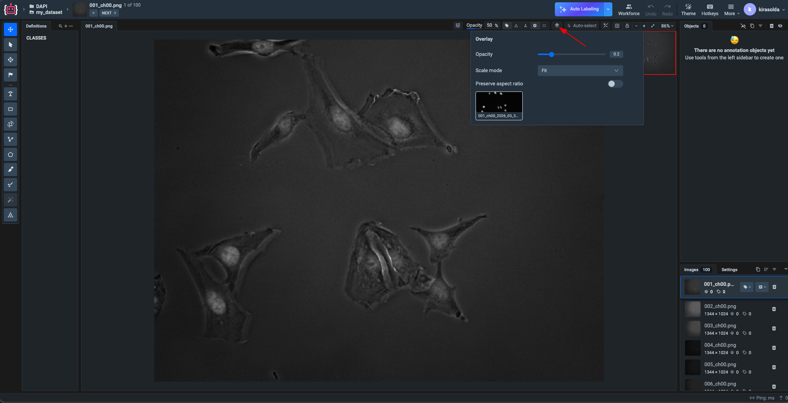

# Overlay

The `Overlay` labeling interface is designed for image projects where a base image is displayed together with one or more linked overlay layers. It allows users to inspect aligned layers in a single viewer and adjust overlay opacity in real time.

This interface is especially useful for microscopy and similar imaging workflows where one channel acts as a visual reference and additional layers need to be compared directly on top of it.

## Example: DAPI Microscope Images

One typical use case is a DAPI Microscope Image project consisting of a base image and one or more linked overlay layers with adjustable opacity — useful for inspecting microscope images, comparing channels, and reviewing weak or partially overlapping structures without switching between separate files.

[Overlay Sample Project on GitHub](https://github.com/supervisely-ecosystem/overlay-sample-project)

### What is DAPI Data?

DAPI (4′,6-diamidino-2-phenylindole) is a fluorescent stain that binds strongly to DNA and is commonly used in microscopy to highlight cell nuclei. In practice, DAPI data usually appears as grayscale or blue-channel images where nuclei are bright and easy to localize.

This makes DAPI an important reference layer for:

* Detecting and counting nuclei;
* Checking cell distribution and density;
* Aligning and comparing other microscopy channels.

## How the Overlay Interface Helps

The `Overlay` labeling interface helps users review microscopy data faster and with better visual clarity by providing:

* Linked base image and overlay layers for direct visual comparison;
* Adjustable overlay opacity for inspecting faint or partially overlapping structures;
* Simple workspace focused on quality control, analysis, and interpretation of microscopy results.

## Interface Controls

The overlay panel includes the following controls:

* **Opacity slider** — changes overlay transparency for clearer comparison with the base image.
* **Scale mode dropdown** — selects how the overlay is fitted to the viewer area.
* **Preserve aspect ratio toggle** — keeps the original image proportions during scaling.
* **Overlay layer preview / selector** — shows the active overlay and allows quick switching between linked overlays.

## Getting Started

To start working with the `Overlay` labeling interface:

1. Create a `Images` project.
2. Select the `Overlay` labeling interface in project settings or during project creation.
3. Upload the base images together with their linked overlay layers.
4. Open the dataset in the labeling toolbox and use the overlay controls to compare layers.

The standard image annotation workflow remains available, while the overlay panel adds a dedicated way to inspect linked layers in the same scene.

You can also open and explore a sample [Overlay](https://app.supervisely.com/ecosystem/projects/overlay-sample-project?id=452) project in Supervisely to see how this interface works in practice.
