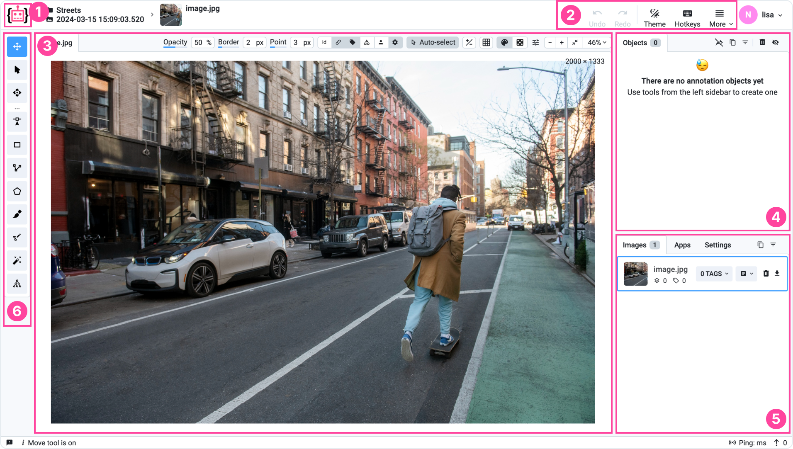

# Images

The image labeling toolbox allows you to annotate one image at a time, such as .jpg, .png, .tiff, and many more formats you can [import](broken-reference) to Supervisely.

### Classic vs Version 2.0

We have two versions of the image labeling toolbox: the time proven classic version and it’s successor: the most advanced image labeling toolbox 2.0. By default, we suggest annotating the version 2.0 which has much more functionality and provides better performance and only consider the classic version in case you have a valid reason for that, such as your team got used to it and loves it so much 🙂

### Overview

<figure><figcaption></figcaption></figure>

1. **Home button** — returns user to the main menu (`Projects` page)
2. **Additional controls** — basic settings, such as history of operations, theme, a hotkeys map and more useful features.
3. **Main scene** — annotation area for current image and its labels.
4. **Objects panel** — list of figures on the current image with additional information like classes and tags.
5. **Images/Apps/Settings panel** — list of images in your dataset, list of additional apps you can embed into the labeling toolbox, visualization and other settings.
6. **Instruments panel** — annotation tools used to create annotations.

The **Instruments panel** offering essential tools for completing different annotation tasks:

* [Bounding Box](https://supervisely.com/blog/bounding-box-annotation-for-object-detection/)
* [Polygon Tool](https://supervisely.com/blog/how-to-use-polygon-anotation-tool-for-image-segmentation/)
* [Brush and Eraser Tool](https://supervisely.com/blog/brush/)
* [Mask Pen Tool](https://supervisely.com/blog/mask-pen-tool/)
* [Smart Tool](https://supervisely.com/blog/smarttool-annotation/)
* [Graph (Keypoins) Tool](https://supervisely.com/blog/human-pose-estimation/)

Learn more about the updates to our new i**mage annotation tool** in this comprehensive blog post:



### **Key features of Image Labeling Toolbox Version 2.0**

1. Web-based interfaces — you just need a browser.
2. Fully customizable interface with easy-to-tune visualization settings: light and dark theme, flexible layout, multiple image view modes, multi-spectral view and grid.
3. Supports complex image formats: high-resolution images, high-color depth images with 16-bit per pixel or more, customizable image visualization settings, filter images with conditions, additional image metadata, restore mode and undo/redo functionality.
4. Advanced labeling capabilities: multiple annotation tools - [Bounding Box](https://supervisely.com/blog/bounding-box-annotation-for-object-detection/), [Polygon Tool](https://supervisely.com/blog/how-to-use-polygon-anotation-tool-for-image-segmentation/), [Brush and Eraser Tool](https://supervisely.com/blog/brush/), [Mask Pen Tool](https://supervisely.com/blog/mask-pen-tool/), [Smart Tool](https://supervisely.com/blog/smarttool-annotation/), [Graph (Keypoins) Tool](https://supervisely.com/blog/animal-pose-estimation/), effectively supports 1000+ objects per image, image and object tags and attributes, customizable hotkeys.
5. Collaboration and workflow management features for large annotation teams.
6. Integration with various Neural Networks and AI-assisted annotation tools.
7. Effortless data import and export for seamless sharing across platforms.
8. Compatible with medical, NRRD, NiFTI data.

... and many other cool futures described in [this](https://supervisely.com/blog/releasing-new-image-annotation-tool/#foreword) post!
