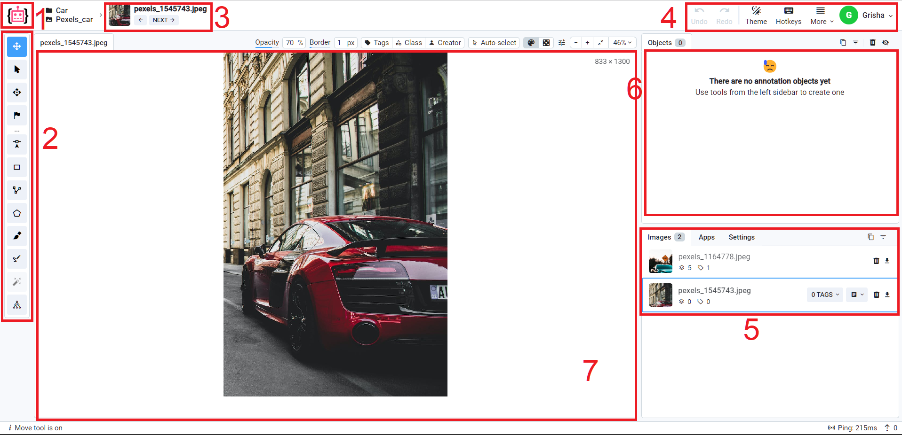

Annotation module is a web application that runs in your browser with the help of javascript and can be accessed from anywhere. 

## Pre-Requirements

Follow those recommendations for the best results:


Though we support all common web browsers, we strongly recommend using **Google Chrome** or **Mozilla Firefox**, because we use latest technologies to render annotations. We also advise you to use the latest version of web browser.



To work with large images and lots of annotations we recommend to use computer with hardware acceleration available. Check if your browser uses hardware acceleration [here](chrome://gpu).


## Getting Started

Annotation module supports working with only one `Dataset` at once.

To start annotation you should open a `Project` and click on the relevant `Dataset` from the [dashboard](../../data-organization/projects.md). You can also choose `Start annotation` from the `Dataset` context menu.

## Overview

Please use this reference of annotation application interface to quickly navigate to the relevant documentation section:

1. Home button — returns user to the main menu (`Projects` page)
2. [Instruments panel](instruments.md) — tools used to create annotations
3. [Navigation panel](navigation.md) — current image and dataset
4. Additional controls — quick links and application view settings
5. [Images panel](images.md) — list of images in the dataset
6. [Figures panel](figures.md) — list of figures on the current image
7. [Main scene](scene.md) — current image and annotations

## Simultaneous editing

You cannot use annotation module under the same account from different computers at the same time.

