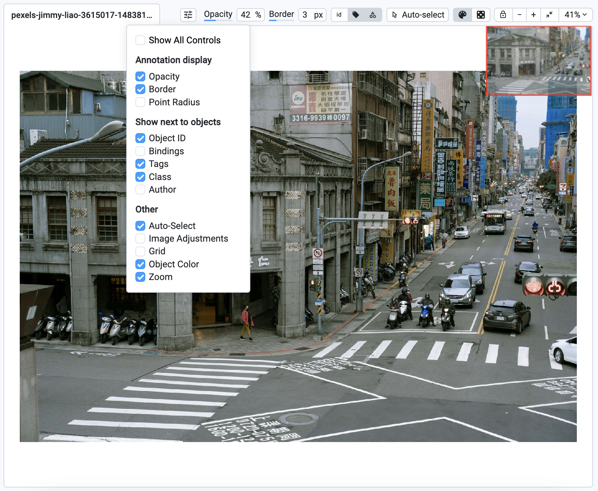
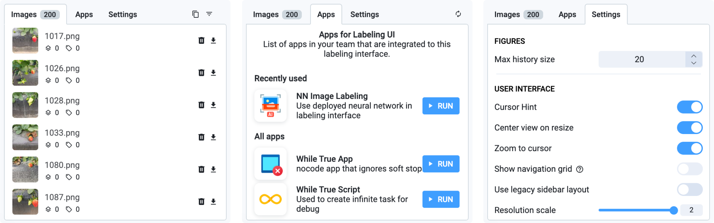

# Images

The Supervisely Image Annotation Tool is a web-based image annotation toolbox specifically developed to address the needs of computer vision projects. It is fully web-based, allowing users to access and use the tool from any browser without the need for local installations. The platform provides powerful tools for annotating different types of images, supports different formats, and integrates neural networks to increase the speed and accuracy of annotation tasks.

1. Web-based interfaces — you just need a browser.
2. Fully customizable interface with easy-to-tune visualization settings: light and dark theme, flexible layout, multiple image view modes, multi-spectral view and grid.
3. Supports complex image formats: high-resolution images, high-color depth images with 16-bit per pixel or more, customizable image visualization settings, filter images with conditions, additional image metadata, restore mode and undo/redo functionality.
4. Advanced labeling capabilities: multiple annotation tools -[ Bounding Box](https://supervisely.com/blog/bounding-box-annotation-for-object-detection/),[ Polygon Tool](https://supervisely.com/blog/how-to-use-polygon-anotation-tool-for-image-segmentation/),[ Brush and Eraser Tool](https://supervisely.com/blog/brush/),[ Mask Pen Tool](https://supervisely.com/blog/mask-pen-tool/),[ Smart Tool](https://supervisely.com/blog/smarttool-annotation/),[ Graph (Keypoins) Tool](https://supervisely.com/blog/animal-pose-estimation/), effectively supports 1000+ objects per image, image and object tags and attributes, customizable hotkeys.
5. Collaboration and workflow management features for large annotation teams.
6. Integration with various Neural Networks and AI-assisted annotation tools.
7. Effortless data import and export for seamless sharing across platforms.
8. Compatible with medical, NRRD, NiFTI data.

## Overview

<figure><figcaption></figcaption></figure>

1. **Home button** — returns user to the main menu (`Projects` page)
2. [**Basic interface elements**](./#explore-basic-interface-elements) — basic settings, such as history of operations, theme, a hotkeys map and more useful features.
3. [**Main scene & labeling scene settings**](./#main-scene-and-labeling-scene-settings)— annotation area for current image and its labels.
4. [**Definitions panel**](./#definitions-panel) — make it easy to create and manage classes and tags.
5. [**Instruments panel**](./#instruments-panel) — annotation tools used to create annotations.
6. [**Objects panel**](./#objects-panel) — list of figures on the current image with additional information like classes and tags.
7. [**Images/Apps/Settings panel**](./#images-panel) — list of images in your dataset, list of additional apps you can embed into the labeling toolbox, visualization and other settings.

***

## Basic interface elements 

The top toolbar contains options for personalizing the interface and managing data and its annotations.

<figure><figcaption></figcaption></figure>

**Image navigation arrows (next, previous):** Allow users to move between images in the dataset.

**Undo and redo buttons:** Undo or redo the most recent annotation action.

**Select theme (dark or light):** Ability to switch between light and dark interface themes, especially useful for those who prefer to work at night.

**Hotkeys:** A list of hotkeys for quick access to tools.

**More options:**&#x20;

* **Enter fullscreen** - this option allows the user to switch the interface to fullscreen mode, maximizing the workspace area. It hides browser toolbars and other elements
* **Screenshot** - the screenshot function enables users to take a snapshot of the current workspace, including the image and any annotations displayed. This can be useful for documentation, sharing progress, or reviewing annotations with team members.
* **Enter restore mode** - enter restore mode provides tools to recover lost or corrupted annotations. When enabled, it offers options to revert changes to a previous state or repair specific parts of the annotation dataset.
* **Restore default layout** - this function resets the interface layout to its default configuration. It is useful when the layout has been modified (e.g., panels moved or resized) and the user wants to return to the original setup.&#x20;
* **Multiple image views mode** - multiple image views mode allows users to view and annotate multiple images simultaneously. This feature is particularly useful for comparing images side-by-side, annotating similar objects across different images, or analyzing changes in a sequence of images. Users can customize the arrangement and number of views according to their needs.

***

## **Main scene & display toolbar** settings

This is the central area. It displays the image to be annotated, with various display controls that the user can hide or show in the panel as needed. It contains:

**Current image view:** shows the image currently being worked on. Users can interact directly with this area using the annotation tools from the sidebar.

**Mini-map (top-right corner):** Displays a smaller version of the entire image to help navigate quickly, especially when zoomed in on specific areas.

<figure><figcaption></figcaption></figure>

### Annotation display settings 

**Opacity:** To modify the transparency of objects, hold and drag the cursor left or right. This allows for a more nuanced view of the objects' layers. Additionally, you can hold the `SHIFT` key and scroll the mouse wheel to adjust the opacity conveniently from anywhere on the screen.

**Border:** Enhance the visibility of object boundaries by holding and dragging the cursor left or right. This action changes the width of the objects' borders, allowing for clearer demarcation. Useful when working with huge resolutions or with large number of small objects

**Point:** Adjust the radius of object points by holding and dragging the cursor left or right.

**Default color:** Paint objects with their original colors as defined in class settings. This is the default setting and helps maintain consistency and recognition. So the objects of different classes are visually distinguishable.

**Randomize color:** Randomize object colors to distinguish between objects of the same class. A simple click, followed by `SHIFT+H`, randomizes the object's colors. Can be used in Instance Segmentation Computer Vision task to highlight visual distinction of all objects of the same class on an image.

<figure><figcaption></figcaption></figure>

### Attribute display settings for clearer context 

**ID:** Toggle the visibility of object IDs near the objects on the scene. This is essential for identifying and referring to specific objects.

**Bindings:** Show or hide bindings near objects to understand how various elements are connected to each other. [Objects can be combined into groups](https://developer.supervisely.com/advanced-user-guide/objects-binding).

**Tags:** Display tags near objects to provide additional context or categorization.

**Classes:** Enable visibility of the classes assigned to each object, helping in the classification and organization of scene elements.

**Author:** Display the creator's name near the objects to acknowledge object authorship.

**Change Visibility Mode:** This option allows users to switch between different visibility modes, optimizing the scene display as per the user's preference. You can choose how to show the attributes:

* **Always** | Users can select full tag display, which means that the information will be visible directly on Objects or Images in the project.
* **Show on hover** | Tags are only displayed when the cursor is hovered over the annotated object.
* **Show when selected** | The ability to hide Tags until the Object is selected provides a cleaner look and feel to the interface and prevents information overload when working with a project.

<figure><figcaption></figcaption></figure>

### Advanced interaction with scene objects 

**Auto-select:** Automatically select objects of the current shape when hovering the cursor over them.

<figure><figcaption></figcaption></figure>

### Customizing image display settings 

**Scene display settings:** Adjust scene display settings like brightness or contrast to suit different viewing conditions or preferences. For example, you can use them while annotation dark or low-contrast images.

**Grid:** A grid helps organize the navigation on the images with high resolutions and large number of small objects.

<figure><figcaption></figcaption></figure>

### Visibility and image sizing 

The ability to hide annotation settings declutters the workspace, focusing attention on the task at hand.

Real-time image resizing adapts to various project needs, ensuring optimal viewing and editing conditions. Just zoom-in or out on the images to see object details and perform precise labeling of object boundaries.

<figure><figcaption></figcaption></figure>

***

## Definitions panel

The Definitions panel provides a simple interface for creating and managing classes and tags in a project. It helps users organize and control annotations.&#x20;

Instead of choosing a tool first, you can now click on the desired class from the Definitions Panel. The associated tool will be automatically selected, allowing you to start labeling immediately. To start a new label, simply click on any class (including the currently selected one) in the Definitions Panel.

If you want to change the class of the selected object, you can click the small icon on the right, which appears only if the new class shape matches the currently selected object. Tags are also present on the same panel. If no object is selected, image tags are shown. You can check the desired tag or hover the cursor and start typing a tag value or select it from a dropdown, which will automatically assign it.

**Improved Search:** To find classes or tags more easily in a long list, click the magnifying glass icon in the top right corner of the panel. Type your query and select the desired class or tag to continue your workflow

<figure><figcaption></figcaption></figure>

### Classes

Class may be assigned only to an object and represent a clear category to which the object in the image belongs. For example, a classification of vehicles in an image might include the classes "car", "truck", and "bus".

Definitions panel displays the list of annotation classes (e.g., "person", "road sign", "vehicle"). Each class has a unique name, color and shape to identify between different types of objects.

* Add new class definitions using the **add new class definition** option.
* **Organize classes** in the definitions list to improve navigation.&#x20;

### Tags

Tags are used to add additional information to images, objects, or other data. Tags can describe context, object properties, or other parameters that can be useful for data analysis and model training.

<figure><figcaption></figcaption></figure>

Definitions panel shows tags associated with the current image. Tags are metadata that help to categorize or add additional information to images (e.g., weather conditions, time of day).

* Use the **add project tags definitions** feature to create and manage tags at the project level.
* **Tag removal:** You can configure the system to ask for confirmation when tags are removed.
* **Attaching a single tag multiple times:** You can enable or disable the ability to attach a single tag multiple times to an object. This setting can be adjusted by editing `Project → Settings → Tags → Multiple Tags Mode` in the Dashboard.
* **Removing tags with hotkeys:** You can enable or disable the feature that allows a tag to be removed when pressing the corresponding hotkey again. For the classic version of the toolbox (number `1` on the screenshot), these settings are configured through the `Settings` panel - `Tags` tab at the bottom `Toggle tags` section. For the advanced version of the toolbox (number `2` on the screenshot), you need to open the context menu (the three dots ...) in `Definitions` and activate the Toggle Tag on Hotkey option. 

<figure><figcaption></figcaption></figure>

Learn more about the definitions panel from our [blog post](https://supervisely.com/blog/definitions-panel/):



***

## **Instruments panel**

**Pan & Move Scene Tool:** Quickly navigate around the image without modifying annotations.

**Select Figure**: Select and modify existing annotations; essential for refining objects.

**Drag Figure:** Reposition annotations without altering their size or shape.

**Issues:** Manage and report issues related to annotations; improves collaboration.

**Point Tool:** Label specific points or small objects precisely.

[**Bounding Box:**](../labeling-tools/bounding-box-rectangle-tool.md) Best for object detection tasks.

**Polyline Tool:** Annotate linear objects or edges with multiple connected line segments.

[**Polygon Tool:**](../labeling-tools/polygon-tool.md) Ideal for irregular and complex shapes.

[**Brush and Eraser Tool:**](../labeling-tools/brush-tool.md) Flexible for both polygonal and free-form masks.

[**Mask Pen Tool:**](../labeling-tools/mask-pen-tool.md) Great for segmenting diverse objects with varying shapes.

[**Smart Tool:**](../labeling-tools/smart-tool.md) Efficient for quick, AI-assisted segmentation.

[**Graph (Keypoins) Tool:**](../labeling-tools/graph-keypoints-tool.md) For pose-estimation tasks.

<figure><figcaption></figcaption></figure>

***

## Objects panel

The Objects Panel is a dynamic space dedicated to showcasing and managing objects tags, attributes and metadata. Here are some of the features it offers:

* **Clone Objects** - Easily replicate selected objects to the next image with a simple right arrow key press or bring objects from the previous image.
* **Filter and Manage** - Quickly filter objects, remove all from the image, or toggle their visibility according to your needs. For example you can hide all objects except of the specific class.
* **Advanced Interactions** - Select, delete, hide, merge objects, or adjust their layering. Additionally, you can modify metadata and assign or manage tags right from this window, enhancing the object's data with minimal effort.

<figure><figcaption></figcaption></figure>

***

## Images panel

The Images Panel provides a comprehensive view of all the images within a selected dataset. Key functionalities include:

* **Tag Management** - Clone tags from the previous image, assign new ones, or modify existing tags to maintain consistency and organization.
* **Filter and Manage** - View and edit metadata details or filter through images to find exactly what you need.
* **Image Operations** - Delete images, download them individually, or download annotations for external use.

***

## Apps panel: expand your capabilities

In an ever-evolving ML landscape, the Apps Panel serves as a portal to a wide range of applications from the [Computer Vision Ecosystem](https://ecosystem.supervisely.com/), enhancing the functionality of your workspace. This window allows you to run and open the public or private apps and extend the Labeling Toolbox with custom UI and functionality.

***

## Settings panel

The Settings Panel is the control center for personalizing the interface. It houses various options allowing users to tweak the interface to match their workflow, preferences, and project requirements.\

<figure><figcaption></figcaption></figure>
