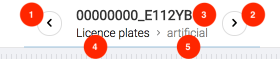

Shows current dataset and selected image.

## Overview

1. Previous image in current dataset (`Left Arrow` shortcut)
2. Next image in current dataset (`Right Arrow` shortcut)
3. Current image file name
4. Project of current dataset. Click to navigate.
5. Current dataset name. Click to navigate.

## Progress bar

Blue progress bar at the bottom of navigation panel shows numeric position of current image in current dataset. It can be useful in scenario, when the goal is to annotate whole dataset: use that progress bar to estimate remaining work.
