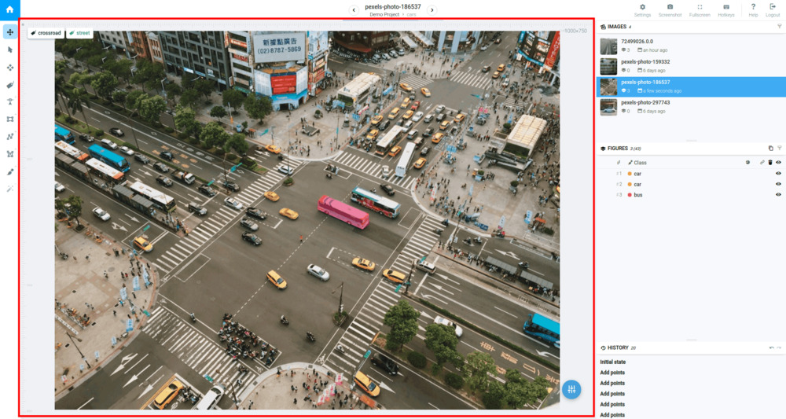
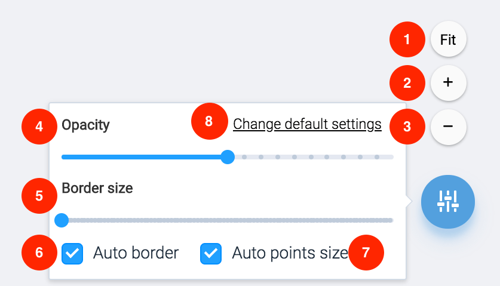

Main scene takes the largest portion of the screen and is used to display current image, it's annotations and manipulate with them.


You can control how large portion of the screen main scene use by dragging border between main scene and right sidebar.


## Controls

Use blue button at the bottom right corner to control view settings of annotations on the main scene.

Hover mouse cursor over the button to show zoom controls.

Press the button to open popup with display settings.

The following options are available:

1. Press `Fit` to adjusting current image size to fit the scene. Press `1:1` again to resize image to it's original size.
2. Zoom image
3. Zoom out image
4. Control opacity of every annotation on the scene.
5. Control size of the border of of every annotation on the scene
6. Tags show mode when "Move scene" tool is selected.
7. Show / hide grid on top of the image.
8. Automatically choose border size of annotations depending on the zoom level
