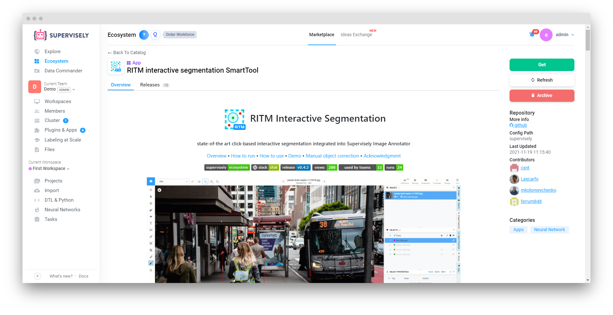
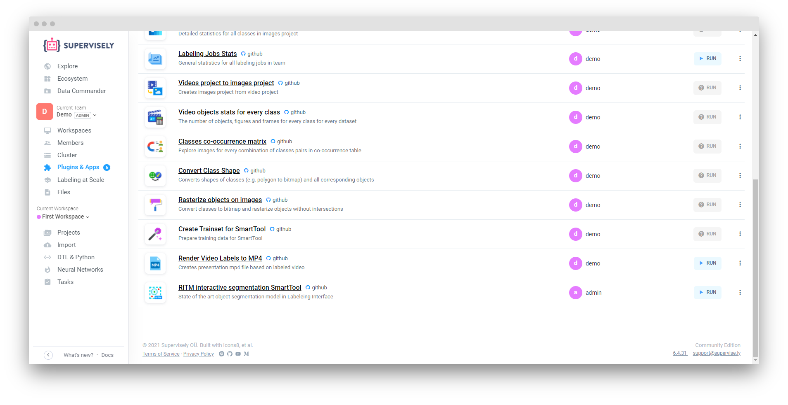
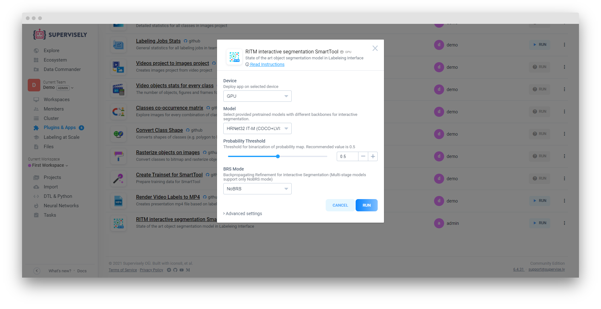
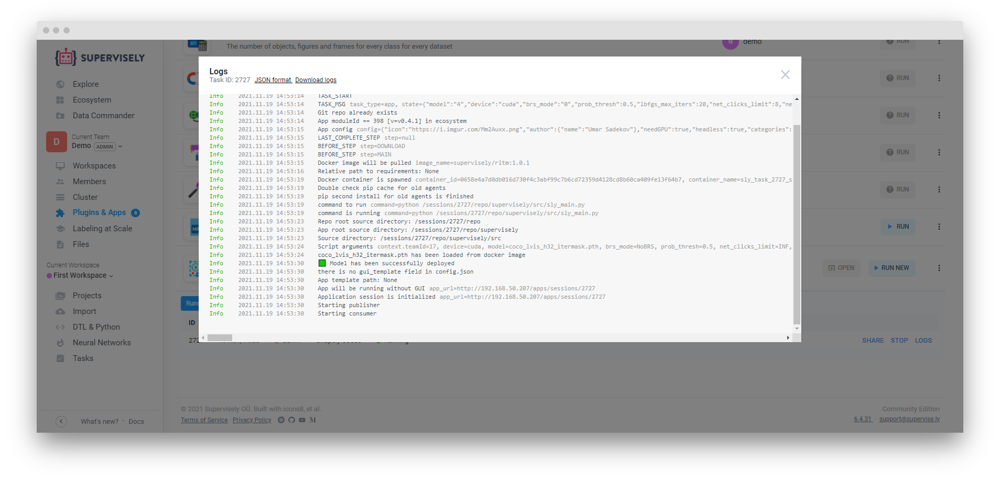
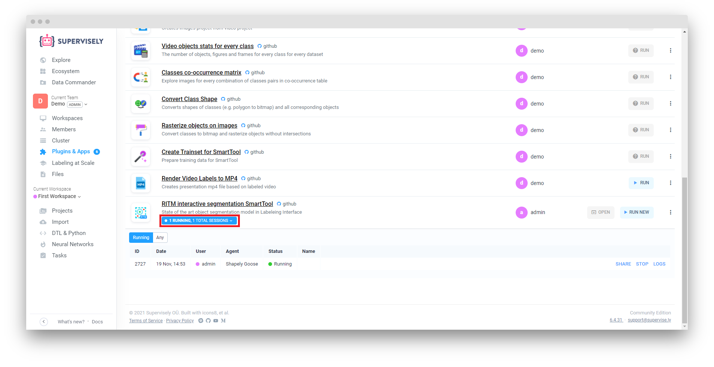

## Step 1. Add an app from the Ecosystem
Go to `Ecosystem` page → select `Smarttool` category and choose app you want to add. On app page click `Get` button.

## Step 2. Run smart tool app
Selected app has been added to `Plugins & Apps` page. Find this app and click `Run`.

## Step 3. App settings

Popup window will appear. In `Advanced settings` choose Agent that you want smart tool app to be deployed on (because smart tool is a neural network, it must be deployed on a machine with GPU device).


You can deploy multiple smart tool app on one agent. Just make sure you have enough memory.


Click "Run" and wait for application to start

## Step 4. Try smart tool app!

Go to the Project section and click on any dataset to open annotation tool. Click "magic wand" icon in toolset menu to select smart tool.


If more than one smart tool model or app is deployed you can select which one you want to use


Now place two points to form rectangle over any object and see results. That's it!

## How to stop smart tool app

If don't really need smart tool app session anymore, you can stop it by going to "Plugins & Apps" page. Find app which session you want to stop and click "Sessions" button.

 Find session that you want to stop and click "Stop". Click "Stop" again in popup window.

## Share smart tool app session for all users on instance

To share app session go to  "Plugins & Apps" page. Find app you want to share. Click "Sessions" button. You will see app sessions list

Find session you want to share and click "share" button

